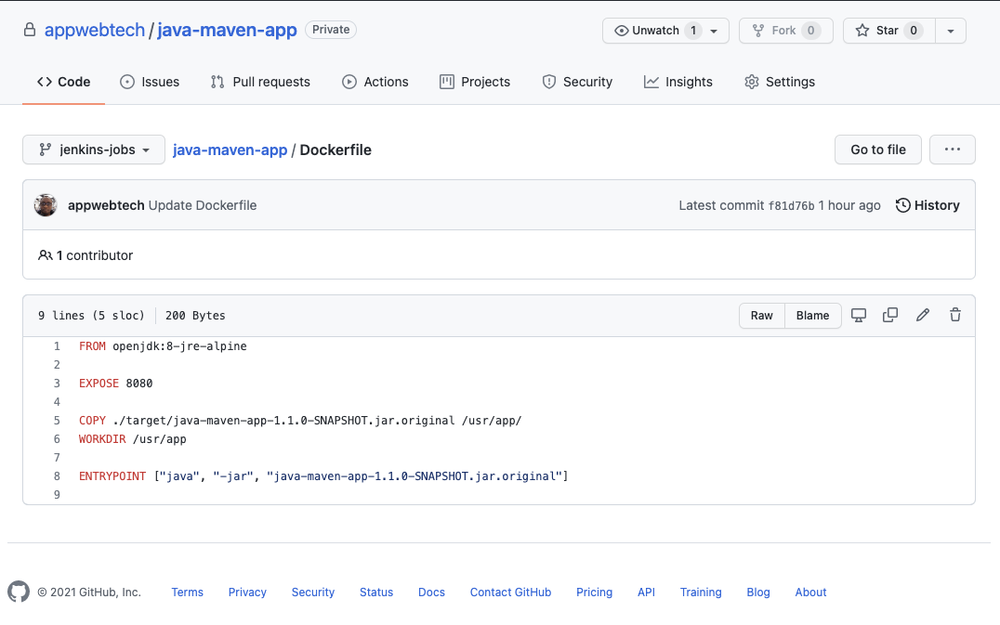
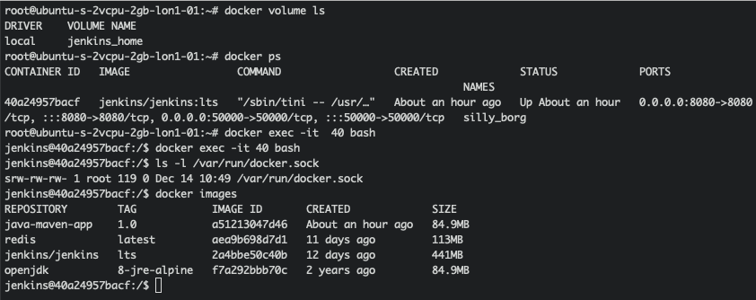

# Automating AWS Infra with Terraform and Docker App Deployment

## Dev Setup

I will create a server in DigitalOcean and install Jenkins in a Docker container. I will access the Jenkins server via the servers IP and install all the plugins necessary, subsequent to which I'll connect my github repository which houses the Java Maven app, to my Jenkins server.


I have installed Maven via the Jenkins plugins and executed the build which was successful with all the binaries and dependencies. I will need Nodejs and npm package managers installed inside the Jenkins container but I will run the installations directly inside the Jenkins container.


For complete console output logs, see below

<details>

  <summary>Click to expand and view logs</summary>
  
  ### Console Output

```shell
Skipping 402 KB.. Full Log
Progress (2): 193/208 kB | 226 kB
Progress (2): 197/208 kB | 226 kB
Progress (2): 201/208 kB | 226 kB
Progress (2): 205/208 kB | 226 kB
Progress (2): 208 kB | 226 kB    
                             
Downloaded from central: https://repo.maven.apache.org/maven2/org/codehaus/plexus/plexus-utils/3.0/plexus-utils-3.0.jar (226 kB at 805 kB/s)
Downloaded from central: https://repo.maven.apache.org/maven2/commons-lang/commons-lang/2.1/commons-lang-2.1.jar (208 kB at 734 kB/s)
[INFO] Building jar: /var/jenkins_home/workspace/java-maven-build/target/java-maven-app-1.1.0-SNAPSHOT.jar
[INFO] 
[INFO] --- spring-boot-maven-plugin:2.3.5.RELEASE:repackage (default) @ java-maven-app ---
Downloading from central: https://repo.maven.apache.org/maven2/org/springframework/boot/spring-boot-buildpack-platform/2.3.5.RELEASE/spring-boot-buildpack-platform-2.3.5.RELEASE.pom
Progress (1): 3.1 kB
                    
Downloaded from central: https://repo.maven.apache.org/maven2/org/springframework/boot/spring-boot-buildpack-platform/2.3.5.RELEASE/spring-boot-buildpack-platform-2.3.5.RELEASE.pom (3.1 kB at 205 kB/s)
Downloading from central: https://repo.maven.apache.org/maven2/com/fasterxml/jackson/core/jackson-databind/2.11.3/jackson-databind-2.11.3.pom
Progress (1): 4.1/7.4 kB
Progress (1): 7.4 kB    
                    
Downloaded from central: https://repo.maven.apache.org/maven2/com/fasterxml/jackson/core/jackson-databind/2.11.3/jackson-databind-2.11.3.pom (7.4 kB at 434 kB/s)
Downloading from central: https://repo.maven.apache.org/maven2/com/fasterxml/jackson/jackson-base/2.11.3/jackson-base-2.11.3.pom
Progress (1): 4.1/7.5 kB
Progress (1): 7.5 kB    
                    
Downloaded from central: https://repo.maven.apache.org/maven2/com/fasterxml/jackson/jackson-base/2.11.3/jackson-base-2.11.3.pom (7.5 kB at 623 kB/s)
Downloading from central: https://repo.maven.apache.org/maven2/com/fasterxml/jackson/jackson-bom/2.11.3/jackson-bom-2.11.3.pom
Progress (1): 4.1/14 kB
Progress (1): 8.2/14 kB
Progress (1): 12/14 kB 
Progress (1): 14 kB   
                   
Downloaded from central: https://repo.maven.apache.org/maven2/com/fasterxml/jackson/jackson-bom/2.11.3/jackson-bom-2.11.3.pom (14 kB at 1.3 MB/s)
Downloading from central: https://repo.maven.apache.org/maven2/com/fasterxml/jackson/core/jackson-annotations/2.11.3/jackson-annotations-2.11.3.pom
Progress (1): 3.8 kB
                    
Downloaded from central: https://repo.maven.apache.org/maven2/com/fasterxml/jackson/core/jackson-annotations/2.11.3/jackson-annotations-2.11.3.pom (3.8 kB at 319 kB/s)
Downloading from central: https://repo.maven.apache.org/maven2/com/fasterxml/jackson/core/jackson-core/2.11.3/jackson-core-2.11.3.pom
Progress (1): 4.1/4.9 kB
Progress (1): 4.9 kB    
                    
Downloaded from central: https://repo.maven.apache.org/maven2/com/fasterxml/jackson/core/jackson-core/2.11.3/jackson-core-2.11.3.pom (4.9 kB at 540 kB/s)
Downloading from central: https://repo.maven.apache.org/maven2/com/fasterxml/jackson/module/jackson-module-parameter-names/2.11.3/jackson-module-parameter-names-2.11.3.pom
Progress (1): 4.0 kB
                    
Downloaded from central: https://repo.maven.apache.org/maven2/com/fasterxml/jackson/module/jackson-module-parameter-names/2.11.3/jackson-module-parameter-names-2.11.3.pom (4.0 kB at 364 kB/s)
Downloading from central: https://repo.maven.apache.org/maven2/com/fasterxml/jackson/module/jackson-modules-java8/2.11.3/jackson-modules-java8-2.11.3.pom
Progress (1): 3.2 kB
                    
Downloaded from central: https://repo.maven.apache.org/maven2/com/fasterxml/jackson/module/jackson-modules-java8/2.11.3/jackson-modules-java8-2.11.3.pom (3.2 kB at 247 kB/s)
Downloading from central: https://repo.maven.apache.org/maven2/net/java/dev/jna/jna-platform/5.5.0/jna-platform-5.5.0.pom
Progress (1): 1.8 kB
                    
Downloaded from central: https://repo.maven.apache.org/maven2/net/java/dev/jna/jna-platform/5.5.0/jna-platform-5.5.0.pom (1.8 kB at 138 kB/s)
Downloading from central: https://repo.maven.apache.org/maven2/net/java/dev/jna/jna/5.5.0/jna-5.5.0.pom
Progress (1): 1.6 kB
                    
Downloaded from central: https://repo.maven.apache.org/maven2/net/java/dev/jna/jna/5.5.0/jna-5.5.0.pom (1.6 kB at 122 kB/s)
Downloading from central: https://repo.maven.apache.org/maven2/org/apache/commons/commons-compress/1.19/commons-compress-1.19.pom
Progress (1): 4.1/18 kB
Progress (1): 8.2/18 kB
Progress (1): 12/18 kB 
Progress (1): 16/18 kB
Progress (1): 18 kB   
                   
Downloaded from central: https://repo.maven.apache.org/maven2/org/apache/commons/commons-compress/1.19/commons-compress-1.19.pom (18 kB at 1.3 MB/s)
Downloading from central: https://repo.maven.apache.org/maven2/org/apache/commons/commons-parent/48/commons-parent-48.pom
Progress (1): 4.1/72 kB
Progress (1): 8.2/72 kB
Progress (1): 12/72 kB 
Progress (1): 16/72 kB
Progress (1): 20/72 kB
Progress (1): 25/72 kB
Progress (1): 29/72 kB
Progress (1): 33/72 kB
Progress (1): 37/72 kB
Progress (1): 41/72 kB
Progress (1): 45/72 kB
Progress (1): 49/72 kB
Progress (1): 53/72 kB
Progress (1): 57/72 kB
Progress (1): 61/72 kB
Progress (1): 66/72 kB
Progress (1): 70/72 kB
Progress (1): 72 kB   
                   
Downloaded from central: https://repo.maven.apache.org/maven2/org/apache/commons/commons-parent/48/commons-parent-48.pom (72 kB at 4.2 MB/s)
Downloading from central: https://repo.maven.apache.org/maven2/org/apache/httpcomponents/httpclient/4.5.13/httpclient-4.5.13.pom
Progress (1): 4.1/6.6 kB
Progress (1): 6.6 kB    
                    
Downloaded from central: https://repo.maven.apache.org/maven2/org/apache/httpcomponents/httpclient/4.5.13/httpclient-4.5.13.pom (6.6 kB at 601 kB/s)
Downloading from central: https://repo.maven.apache.org/maven2/org/apache/httpcomponents/httpcomponents-client/4.5.13/httpcomponents-client-4.5.13.pom
Progress (1): 4.1/16 kB
Progress (1): 8.2/16 kB
Progress (1): 12/16 kB 
Progress (1): 16 kB   
                   
Downloaded from central: https://repo.maven.apache.org/maven2/org/apache/httpcomponents/httpcomponents-client/4.5.13/httpcomponents-client-4.5.13.pom (16 kB at 1.2 MB/s)
Downloading from central: https://repo.maven.apache.org/maven2/org/apache/httpcomponents/httpcomponents-parent/11/httpcomponents-parent-11.pom
Progress (1): 4.1/35 kB
Progress (1): 8.2/35 kB
Progress (1): 12/35 kB 
Progress (1): 16/35 kB
Progress (1): 20/35 kB
Progress (1): 25/35 kB
Progress (1): 29/35 kB
Progress (1): 33/35 kB
Progress (1): 35 kB   
                   
Downloaded from central: https://repo.maven.apache.org/maven2/org/apache/httpcomponents/httpcomponents-parent/11/httpcomponents-parent-11.pom (35 kB at 3.2 MB/s)
Downloading from central: https://repo.maven.apache.org/maven2/org/apache/httpcomponents/httpcore/4.4.13/httpcore-4.4.13.pom
Progress (1): 4.1/5.0 kB
Progress (1): 5.0 kB    
                    
Downloaded from central: https://repo.maven.apache.org/maven2/org/apache/httpcomponents/httpcore/4.4.13/httpcore-4.4.13.pom (5.0 kB at 621 kB/s)
Downloading from central: https://repo.maven.apache.org/maven2/org/apache/httpcomponents/httpcomponents-core/4.4.13/httpcomponents-core-4.4.13.pom
Progress (1): 4.1/13 kB
Progress (1): 8.2/13 kB
Progress (1): 12/13 kB 
Progress (1): 13 kB   
                   
Downloaded from central: https://repo.maven.apache.org/maven2/org/apache/httpcomponents/httpcomponents-core/4.4.13/httpcomponents-core-4.4.13.pom (13 kB at 940 kB/s)
Downloading from central: https://repo.maven.apache.org/maven2/commons-logging/commons-logging/1.2/commons-logging-1.2.pom
Progress (1): 4.1/19 kB
Progress (1): 8.2/19 kB
Progress (1): 12/19 kB 
Progress (1): 16/19 kB
Progress (1): 19 kB   
                   
Downloaded from central: https://repo.maven.apache.org/maven2/commons-logging/commons-logging/1.2/commons-logging-1.2.pom (19 kB at 1.9 MB/s)
Downloading from central: https://repo.maven.apache.org/maven2/org/apache/commons/commons-parent/34/commons-parent-34.pom
Progress (1): 4.1/56 kB
Progress (1): 8.2/56 kB
Progress (1): 12/56 kB 
Progress (1): 16/56 kB
Progress (1): 20/56 kB
Progress (1): 25/56 kB
Progress (1): 29/56 kB
Progress (1): 33/56 kB
Progress (1): 37/56 kB
Progress (1): 41/56 kB
Progress (1): 45/56 kB
Progress (1): 49/56 kB
Progress (1): 53/56 kB
Progress (1): 56 kB   
                   
Downloaded from central: https://repo.maven.apache.org/maven2/org/apache/commons/commons-parent/34/commons-parent-34.pom (56 kB at 4.3 MB/s)
Downloading from central: https://repo.maven.apache.org/maven2/commons-codec/commons-codec/1.11/commons-codec-1.11.pom
Progress (1): 4.1/14 kB
Progress (1): 8.2/14 kB
Progress (1): 12/14 kB 
Progress (1): 14 kB   
                   
Downloaded from central: https://repo.maven.apache.org/maven2/commons-codec/commons-codec/1.11/commons-codec-1.11.pom (14 kB at 1.2 MB/s)
Downloading from central: https://repo.maven.apache.org/maven2/org/apache/commons/commons-parent/42/commons-parent-42.pom
Progress (1): 4.1/68 kB
Progress (1): 8.2/68 kB
Progress (1): 12/68 kB 
Progress (1): 16/68 kB
Progress (1): 20/68 kB
Progress (1): 25/68 kB
Progress (1): 29/68 kB
Progress (1): 33/68 kB
Progress (1): 37/68 kB
Progress (1): 41/68 kB
Progress (1): 45/68 kB
Progress (1): 49/68 kB
Progress (1): 53/68 kB
Progress (1): 57/68 kB
Progress (1): 61/68 kB
Progress (1): 66/68 kB
Progress (1): 68 kB   
                   
Downloaded from central: https://repo.maven.apache.org/maven2/org/apache/commons/commons-parent/42/commons-parent-42.pom (68 kB at 2.8 MB/s)
Downloading from central: https://repo.maven.apache.org/maven2/org/springframework/spring-core/5.2.10.RELEASE/spring-core-5.2.10.RELEASE.pom
Progress (1): 1.7 kB
                    
Downloaded from central: https://repo.maven.apache.org/maven2/org/springframework/spring-core/5.2.10.RELEASE/spring-core-5.2.10.RELEASE.pom (1.7 kB at 105 kB/s)
Downloading from central: https://repo.maven.apache.org/maven2/org/springframework/spring-jcl/5.2.10.RELEASE/spring-jcl-5.2.10.RELEASE.pom
Progress (1): 1.5 kB
                    
Downloaded from central: https://repo.maven.apache.org/maven2/org/springframework/spring-jcl/5.2.10.RELEASE/spring-jcl-5.2.10.RELEASE.pom (1.5 kB at 165 kB/s)
Downloading from central: https://repo.maven.apache.org/maven2/org/springframework/boot/spring-boot-loader-tools/2.3.5.RELEASE/spring-boot-loader-tools-2.3.5.RELEASE.pom
Progress (1): 2.3 kB
                    
Downloaded from central: https://repo.maven.apache.org/maven2/org/springframework/boot/spring-boot-loader-tools/2.3.5.RELEASE/spring-boot-loader-tools-2.3.5.RELEASE.pom (2.3 kB at 126 kB/s)
Downloading from central: https://repo.maven.apache.org/maven2/org/apache/maven/shared/maven-common-artifact-filters/3.1.0/maven-common-artifact-filters-3.1.0.pom
Progress (1): 4.1/5.3 kB
Progress (1): 5.3 kB    
                    
Downloaded from central: https://repo.maven.apache.org/maven2/org/apache/maven/shared/maven-common-artifact-filters/3.1.0/maven-common-artifact-filters-3.1.0.pom (5.3 kB at 440 kB/s)
Downloading from central: https://repo.maven.apache.org/maven2/org/apache/maven/shared/maven-shared-components/33/maven-shared-components-33.pom
Progress (1): 4.1/5.1 kB
Progress (1): 5.1 kB    
                    
Downloaded from central: https://repo.maven.apache.org/maven2/org/apache/maven/shared/maven-shared-components/33/maven-shared-components-33.pom (5.1 kB at 318 kB/s)
Downloading from central: https://repo.maven.apache.org/maven2/org/apache/maven/maven-parent/33/maven-parent-33.pom
Progress (1): 4.1/44 kB
Progress (1): 8.2/44 kB
Progress (1): 12/44 kB 
Progress (1): 16/44 kB
Progress (1): 20/44 kB
Progress (1): 25/44 kB
Progress (1): 29/44 kB
Progress (1): 33/44 kB
Progress (1): 37/44 kB
Progress (1): 41/44 kB
Progress (1): 44 kB   
                   
Downloaded from central: https://repo.maven.apache.org/maven2/org/apache/maven/maven-parent/33/maven-parent-33.pom (44 kB at 2.2 MB/s)
Downloading from central: https://repo.maven.apache.org/maven2/org/codehaus/plexus/plexus-component-annotations/1.5.5/plexus-component-annotations-1.5.5.pom
Progress (1): 815 B
                   
Downloaded from central: https://repo.maven.apache.org/maven2/org/codehaus/plexus/plexus-component-annotations/1.5.5/plexus-component-annotations-1.5.5.pom (815 B at 91 kB/s)
Downloading from central: https://repo.maven.apache.org/maven2/org/codehaus/plexus/plexus-containers/1.5.5/plexus-containers-1.5.5.pom
Progress (1): 4.1/4.2 kB
Progress (1): 4.2 kB    
                    
Downloaded from central: https://repo.maven.apache.org/maven2/org/codehaus/plexus/plexus-containers/1.5.5/plexus-containers-1.5.5.pom (4.2 kB at 424 kB/s)
Downloading from central: https://repo.maven.apache.org/maven2/org/codehaus/plexus/plexus-component-annotations/1.5.4/plexus-component-annotations-1.5.4.pom
Progress (1): 815 B
                   
Downloaded from central: https://repo.maven.apache.org/maven2/org/codehaus/plexus/plexus-component-annotations/1.5.4/plexus-component-annotations-1.5.4.pom (815 B at 116 kB/s)
Downloading from central: https://repo.maven.apache.org/maven2/org/codehaus/plexus/plexus-containers/1.5.4/plexus-containers-1.5.4.pom
Progress (1): 4.1/4.2 kB
Progress (1): 4.2 kB    
                    
Downloaded from central: https://repo.maven.apache.org/maven2/org/codehaus/plexus/plexus-containers/1.5.4/plexus-containers-1.5.4.pom (4.2 kB at 385 kB/s)
Downloading from central: https://repo.maven.apache.org/maven2/org/codehaus/plexus/plexus/2.0.5/plexus-2.0.5.pom
Progress (1): 4.1/17 kB
Progress (1): 8.2/17 kB
Progress (1): 12/17 kB 
Progress (1): 16/17 kB
Progress (1): 17 kB   
                   
Downloaded from central: https://repo.maven.apache.org/maven2/org/codehaus/plexus/plexus/2.0.5/plexus-2.0.5.pom (17 kB at 1.0 MB/s)
Downloading from central: https://repo.maven.apache.org/maven2/org/apache/maven/maven-plugin-api/3.6.3/maven-plugin-api-3.6.3.pom
Progress (1): 3.0 kB
                    
Downloaded from central: https://repo.maven.apache.org/maven2/org/apache/maven/maven-plugin-api/3.6.3/maven-plugin-api-3.6.3.pom (3.0 kB at 276 kB/s)
Downloading from central: https://repo.maven.apache.org/maven2/org/apache/maven/maven/3.6.3/maven-3.6.3.pom
Progress (1): 4.1/26 kB
Progress (1): 8.2/26 kB
Progress (1): 12/26 kB 
Progress (1): 16/26 kB
Progress (1): 20/26 kB
Progress (1): 25/26 kB
Progress (1): 26 kB   
                   
Downloaded from central: https://repo.maven.apache.org/maven2/org/apache/maven/maven/3.6.3/maven-3.6.3.pom (26 kB at 1.7 MB/s)
Downloading from central: https://repo.maven.apache.org/maven2/org/apache/maven/maven-model/3.6.3/maven-model-3.6.3.pom
Progress (1): 4.1 kB
                    
Downloaded from central: https://repo.maven.apache.org/maven2/org/apache/maven/maven-model/3.6.3/maven-model-3.6.3.pom (4.1 kB at 227 kB/s)
Downloading from central: https://repo.maven.apache.org/maven2/org/codehaus/plexus/plexus-utils/3.2.1/plexus-utils-3.2.1.pom
Progress (1): 4.1/5.3 kB
Progress (1): 5.3 kB    
                    
Downloaded from central: https://repo.maven.apache.org/maven2/org/codehaus/plexus/plexus-utils/3.2.1/plexus-utils-3.2.1.pom (5.3 kB at 486 kB/s)
Downloading from central: https://repo.maven.apache.org/maven2/org/codehaus/plexus/plexus/5.1/plexus-5.1.pom
Progress (1): 4.1/23 kB
Progress (1): 8.2/23 kB
Progress (1): 12/23 kB 
Progress (1): 16/23 kB
Progress (1): 20/23 kB
Progress (1): 23 kB   
                   
Downloaded from central: https://repo.maven.apache.org/maven2/org/codehaus/plexus/plexus/5.1/plexus-5.1.pom (23 kB at 1.3 MB/s)
Downloading from central: https://repo.maven.apache.org/maven2/org/apache/maven/maven-artifact/3.6.3/maven-artifact-3.6.3.pom
Progress (1): 2.4 kB
                    
Downloaded from central: https://repo.maven.apache.org/maven2/org/apache/maven/maven-artifact/3.6.3/maven-artifact-3.6.3.pom (2.4 kB at 141 kB/s)
Downloading from central: https://repo.maven.apache.org/maven2/org/apache/commons/commons-lang3/3.8.1/commons-lang3-3.8.1.pom
Progress (1): 4.1/28 kB
Progress (1): 8.2/28 kB
Progress (1): 12/28 kB 
Progress (1): 16/28 kB
Progress (1): 20/28 kB
Progress (1): 25/28 kB
Progress (1): 28 kB   
                   
Downloaded from central: https://repo.maven.apache.org/maven2/org/apache/commons/commons-lang3/3.8.1/commons-lang3-3.8.1.pom (28 kB at 1.5 MB/s)
Downloading from central: https://repo.maven.apache.org/maven2/org/apache/commons/commons-parent/47/commons-parent-47.pom
Progress (1): 4.1/78 kB
Progress (1): 8.2/78 kB
Progress (1): 12/78 kB 
Progress (1): 16/78 kB
Progress (1): 20/78 kB
Progress (1): 25/78 kB
Progress (1): 29/78 kB
Progress (1): 33/78 kB
Progress (1): 37/78 kB
Progress (1): 41/78 kB
Progress (1): 45/78 kB
Progress (1): 49/78 kB
Progress (1): 53/78 kB
Progress (1): 57/78 kB
Progress (1): 61/78 kB
Progress (1): 66/78 kB
Progress (1): 70/78 kB
Progress (1): 74/78 kB
Progress (1): 78 kB   
                   
Downloaded from central: https://repo.maven.apache.org/maven2/org/apache/commons/commons-parent/47/commons-parent-47.pom (78 kB at 3.1 MB/s)
Downloading from central: https://repo.maven.apache.org/maven2/org/apache/apache/19/apache-19.pom
Progress (1): 4.1/15 kB
Progress (1): 8.2/15 kB
Progress (1): 12/15 kB 
Progress (1): 15 kB   
                   
Downloaded from central: https://repo.maven.apache.org/maven2/org/apache/apache/19/apache-19.pom (15 kB at 1.5 MB/s)
Downloading from central: https://repo.maven.apache.org/maven2/org/eclipse/sisu/org.eclipse.sisu.plexus/0.3.4/org.eclipse.sisu.plexus-0.3.4.pom
Progress (1): 4.1/4.2 kB
Progress (1): 4.2 kB    
                    
Downloaded from central: https://repo.maven.apache.org/maven2/org/eclipse/sisu/org.eclipse.sisu.plexus/0.3.4/org.eclipse.sisu.plexus-0.3.4.pom (4.2 kB at 298 kB/s)
Downloading from central: https://repo.maven.apache.org/maven2/org/eclipse/sisu/sisu-plexus/0.3.4/sisu-plexus-0.3.4.pom
Progress (1): 4.1/14 kB
Progress (1): 8.2/14 kB
Progress (1): 12/14 kB 
Progress (1): 14 kB   
                   
Downloaded from central: https://repo.maven.apache.org/maven2/org/eclipse/sisu/sisu-plexus/0.3.4/sisu-plexus-0.3.4.pom (14 kB at 1.2 MB/s)
Downloading from central: https://repo.maven.apache.org/maven2/org/sonatype/oss/oss-parent/9/oss-parent-9.pom
Progress (1): 4.1/6.6 kB
Progress (1): 6.6 kB    
                    
Downloaded from central: https://repo.maven.apache.org/maven2/org/sonatype/oss/oss-parent/9/oss-parent-9.pom (6.6 kB at 346 kB/s)
Downloading from central: https://repo.maven.apache.org/maven2/javax/enterprise/cdi-api/1.0/cdi-api-1.0.pom
Progress (1): 1.4 kB
                    
Downloaded from central: https://repo.maven.apache.org/maven2/javax/enterprise/cdi-api/1.0/cdi-api-1.0.pom (1.4 kB at 110 kB/s)
Downloading from central: https://repo.maven.apache.org/maven2/org/jboss/weld/weld-api-parent/1.0/weld-api-parent-1.0.pom
Progress (1): 2.4 kB
                    
Downloaded from central: https://repo.maven.apache.org/maven2/org/jboss/weld/weld-api-parent/1.0/weld-api-parent-1.0.pom (2.4 kB at 294 kB/s)
Downloading from central: https://repo.maven.apache.org/maven2/org/jboss/weld/weld-api-bom/1.0/weld-api-bom-1.0.pom
Progress (1): 4.1/7.9 kB
Progress (1): 7.9 kB    
                    
Downloaded from central: https://repo.maven.apache.org/maven2/org/jboss/weld/weld-api-bom/1.0/weld-api-bom-1.0.pom (7.9 kB at 791 kB/s)
Downloading from central: https://repo.maven.apache.org/maven2/org/jboss/weld/weld-parent/6/weld-parent-6.pom
Progress (1): 4.1/21 kB
Progress (1): 8.2/21 kB
Progress (1): 12/21 kB 
Progress (1): 16/21 kB
Progress (1): 20/21 kB
Progress (1): 21 kB   
                   
Downloaded from central: https://repo.maven.apache.org/maven2/org/jboss/weld/weld-parent/6/weld-parent-6.pom (21 kB at 2.3 MB/s)
Downloading from central: https://repo.maven.apache.org/maven2/javax/annotation/jsr250-api/1.0/jsr250-api-1.0.pom
Progress (1): 1.0 kB
                    
Downloaded from central: https://repo.maven.apache.org/maven2/javax/annotation/jsr250-api/1.0/jsr250-api-1.0.pom (1.0 kB at 146 kB/s)
Downloading from central: https://repo.maven.apache.org/maven2/javax/inject/javax.inject/1/javax.inject-1.pom
Progress (1): 612 B
                   
Downloaded from central: https://repo.maven.apache.org/maven2/javax/inject/javax.inject/1/javax.inject-1.pom (612 B at 87 kB/s)
Downloading from central: https://repo.maven.apache.org/maven2/org/eclipse/sisu/org.eclipse.sisu.inject/0.3.4/org.eclipse.sisu.inject-0.3.4.pom
Progress (1): 2.6 kB
                    
Downloaded from central: https://repo.maven.apache.org/maven2/org/eclipse/sisu/org.eclipse.sisu.inject/0.3.4/org.eclipse.sisu.inject-0.3.4.pom (2.6 kB at 262 kB/s)
Downloading from central: https://repo.maven.apache.org/maven2/org/eclipse/sisu/sisu-inject/0.3.4/sisu-inject-0.3.4.pom
Progress (1): 4.1/14 kB
Progress (1): 8.2/14 kB
Progress (1): 12/14 kB 
Progress (1): 14 kB   
                   
Downloaded from central: https://repo.maven.apache.org/maven2/org/eclipse/sisu/sisu-inject/0.3.4/sisu-inject-0.3.4.pom (14 kB at 1.4 MB/s)
Downloading from central: https://repo.maven.apache.org/maven2/org/codehaus/plexus/plexus-classworlds/2.5.2/plexus-classworlds-2.5.2.pom
Progress (1): 4.1/7.3 kB
Progress (1): 7.3 kB    
                    
Downloaded from central: https://repo.maven.apache.org/maven2/org/codehaus/plexus/plexus-classworlds/2.5.2/plexus-classworlds-2.5.2.pom (7.3 kB at 812 kB/s)
Downloading from central: https://repo.maven.apache.org/maven2/org/codehaus/plexus/plexus-utils/3.0.17/plexus-utils-3.0.17.pom
Progress (1): 3.4 kB
                    
Downloaded from central: https://repo.maven.apache.org/maven2/org/codehaus/plexus/plexus-utils/3.0.17/plexus-utils-3.0.17.pom (3.4 kB at 261 kB/s)
Downloading from central: https://repo.maven.apache.org/maven2/org/codehaus/plexus/plexus-classworlds/2.6.0/plexus-classworlds-2.6.0.pom
Progress (1): 4.1/7.9 kB
Progress (1): 7.9 kB    
                    
Downloaded from central: https://repo.maven.apache.org/maven2/org/codehaus/plexus/plexus-classworlds/2.6.0/plexus-classworlds-2.6.0.pom (7.9 kB at 659 kB/s)
Downloading from central: https://repo.maven.apache.org/maven2/org/sonatype/plexus/plexus-build-api/0.0.7/plexus-build-api-0.0.7.pom
Progress (1): 3.2 kB
                    
Downloaded from central: https://repo.maven.apache.org/maven2/org/sonatype/plexus/plexus-build-api/0.0.7/plexus-build-api-0.0.7.pom (3.2 kB at 400 kB/s)
Downloading from central: https://repo.maven.apache.org/maven2/org/sonatype/spice/spice-parent/15/spice-parent-15.pom
Progress (1): 4.1/8.4 kB
Progress (1): 8.2/8.4 kB
Progress (1): 8.4 kB    
                    
Downloaded from central: https://repo.maven.apache.org/maven2/org/sonatype/spice/spice-parent/15/spice-parent-15.pom (8.4 kB at 464 kB/s)
Downloading from central: https://repo.maven.apache.org/maven2/org/springframework/boot/spring-boot-buildpack-platform/2.3.5.RELEASE/spring-boot-buildpack-platform-2.3.5.RELEASE.jar
Downloading from central: https://repo.maven.apache.org/maven2/com/fasterxml/jackson/core/jackson-databind/2.11.3/jackson-databind-2.11.3.jar
Downloading from central: https://repo.maven.apache.org/maven2/com/fasterxml/jackson/core/jackson-annotations/2.11.3/jackson-annotations-2.11.3.jar
Progress (1): 4.1/183 kB
Progress (1): 8.2/183 kB
Progress (1): 12/183 kB 
Progress (1): 16/183 kB
Progress (1): 20/183 kB
Progress (1): 25/183 kB
Progress (1): 29/183 kB
Progress (1): 33/183 kB
Progress (1): 37/183 kB
Progress (1): 41/183 kB
Progress (1): 45/183 kB
Progress (1): 49/183 kB
                       
Downloading from central: https://repo.maven.apache.org/maven2/com/fasterxml/jackson/core/jackson-core/2.11.3/jackson-core-2.11.3.jar
Progress (1): 53/183 kB
Progress (1): 57/183 kB
Progress (1): 61/183 kB
Progress (1): 66/183 kB
Progress (1): 70/183 kB
Progress (1): 74/183 kB
Progress (1): 78/183 kB
Progress (1): 82/183 kB
Progress (1): 86/183 kB
Progress (1): 90/183 kB
                       
Downloading from central: https://repo.maven.apache.org/maven2/com/fasterxml/jackson/module/jackson-module-parameter-names/2.11.3/jackson-module-parameter-names-2.11.3.jar
Progress (1): 94/183 kB
Progress (2): 94/183 kB | 4.1/351 kB
Progress (2): 94/183 kB | 8.2/351 kB
Progress (2): 94/183 kB | 12/351 kB 
Progress (2): 94/183 kB | 16/351 kB
Progress (2): 94/183 kB | 20/351 kB
Progress (3): 94/183 kB | 20/351 kB | 0/1.4 MB
Progress (3): 94/183 kB | 25/351 kB | 0/1.4 MB
Progress (3): 94/183 kB | 29/351 kB | 0/1.4 MB
Progress (3): 94/183 kB | 33/351 kB | 0/1.4 MB
Progress (3): 94/183 kB | 33/351 kB | 0/1.4 MB
Progress (3): 94/183 kB | 37/351 kB | 0/1.4 MB
Progress (3): 94/183 kB | 41/351 kB | 0/1.4 MB
Progress (3): 94/183 kB | 45/351 kB | 0/1.4 MB
Progress (3): 94/183 kB | 49/351 kB | 0/1.4 MB
Progress (3): 94/183 kB | 49/351 kB | 0/1.4 MB
Progress (3): 98/183 kB | 49/351 kB | 0/1.4 MB
Progress (3): 98/183 kB | 49/351 kB | 0/1.4 MB
Progress (3): 102/183 kB | 49/351 kB | 0/1.4 MB
Progress (3): 106/183 kB | 49/351 kB | 0/1.4 MB
Progress (3): 111/183 kB | 49/351 kB | 0/1.4 MB
Progress (3): 115/183 kB | 49/351 kB | 0/1.4 MB
Progress (3): 119/183 kB | 49/351 kB | 0/1.4 MB
Progress (3): 123/183 kB | 49/351 kB | 0/1.4 MB
Progress (3): 123/183 kB | 49/351 kB | 0/1.4 MB
Progress (3): 123/183 kB | 49/351 kB | 0/1.4 MB
Progress (3): 123/183 kB | 49/351 kB | 0.1/1.4 MB
Progress (3): 123/183 kB | 49/351 kB | 0.1/1.4 MB
Progress (3): 123/183 kB | 53/351 kB | 0.1/1.4 MB
Progress (4): 123/183 kB | 53/351 kB | 0.1/1.4 MB | 2.7/9.3 kB
Progress (5): 123/183 kB | 53/351 kB | 0.1/1.4 MB | 2.7/9.3 kB | 4.1/68 kB
Progress (5): 123/183 kB | 53/351 kB | 0.1/1.4 MB | 2.7/9.3 kB | 8.2/68 kB
Progress (5): 123/183 kB | 53/351 kB | 0.1/1.4 MB | 2.7/9.3 kB | 12/68 kB 
Progress (5): 123/183 kB | 53/351 kB | 0.1/1.4 MB | 6.8/9.3 kB | 12/68 kB
Progress (5): 123/183 kB | 53/351 kB | 0.1/1.4 MB | 9.3 kB | 12/68 kB    
Progress (5): 123/183 kB | 53/351 kB | 0.1/1.4 MB | 9.3 kB | 12/68 kB
Progress (5): 123/183 kB | 53/351 kB | 0.1/1.4 MB | 9.3 kB | 12/68 kB
Progress (5): 123/183 kB | 57/351 kB | 0.1/1.4 MB | 9.3 kB | 12/68 kB
Progress (5): 123/183 kB | 57/351 kB | 0.1/1.4 MB | 9.3 kB | 12/68 kB
Progress (5): 123/183 kB | 57/351 kB | 0.1/1.4 MB | 9.3 kB | 12/68 kB
Progress (5): 123/183 kB | 57/351 kB | 0.1/1.4 MB | 9.3 kB | 12/68 kB
Progress (5): 123/183 kB | 57/351 kB | 0.1/1.4 MB | 9.3 kB | 12/68 kB
Progress (5): 127/183 kB | 57/351 kB | 0.1/1.4 MB | 9.3 kB | 12/68 kB
Progress (5): 131/183 kB | 57/351 kB | 0.1/1.4 MB | 9.3 kB | 12/68 kB
Progress (5): 131/183 kB | 57/351 kB | 0.1/1.4 MB | 9.3 kB | 12/68 kB
Progress (5): 131/183 kB | 57/351 kB | 0.1/1.4 MB | 9.3 kB | 12/68 kB
Progress (5): 135/183 kB | 57/351 kB | 0.1/1.4 MB | 9.3 kB | 12/68 kB
Progress (5): 139/183 kB | 57/351 kB | 0.1/1.4 MB | 9.3 kB | 12/68 kB
Progress (5): 143/183 kB | 57/351 kB | 0.1/1.4 MB | 9.3 kB | 12/68 kB
Progress (5): 147/183 kB | 57/351 kB | 0.1/1.4 MB | 9.3 kB | 12/68 kB
Progress (5): 147/183 kB | 57/351 kB | 0.1/1.4 MB | 9.3 kB | 12/68 kB
Progress (5): 147/183 kB | 57/351 kB | 0.1/1.4 MB | 9.3 kB | 12/68 kB
Progress (5): 147/183 kB | 61/351 kB | 0.1/1.4 MB | 9.3 kB | 12/68 kB
Progress (5): 147/183 kB | 61/351 kB | 0.1/1.4 MB | 9.3 kB | 16/68 kB
Progress (5): 147/183 kB | 66/351 kB | 0.1/1.4 MB | 9.3 kB | 16/68 kB
Progress (5): 147/183 kB | 66/351 kB | 0.1/1.4 MB | 9.3 kB | 20/68 kB
Progress (5): 147/183 kB | 66/351 kB | 0.1/1.4 MB | 9.3 kB | 25/68 kB
Progress (5): 147/183 kB | 66/351 kB | 0.1/1.4 MB | 9.3 kB | 29/68 kB
Progress (5): 147/183 kB | 66/351 kB | 0.1/1.4 MB | 9.3 kB | 33/68 kB
Progress (5): 147/183 kB | 66/351 kB | 0.1/1.4 MB | 9.3 kB | 37/68 kB
Progress (5): 147/183 kB | 66/351 kB | 0.1/1.4 MB | 9.3 kB | 41/68 kB
Progress (5): 147/183 kB | 66/351 kB | 0.1/1.4 MB | 9.3 kB | 45/68 kB
Progress (5): 147/183 kB | 66/351 kB | 0.1/1.4 MB | 9.3 kB | 49/68 kB
                                                                     
Downloaded from central: https://repo.maven.apache.org/maven2/com/fasterxml/jackson/module/jackson-module-parameter-names/2.11.3/jackson-module-parameter-names-2.11.3.jar (9.3 kB at 206 kB/s)
Downloading from central: https://repo.maven.apache.org/maven2/net/java/dev/jna/jna-platform/5.5.0/jna-platform-5.5.0.jar
Progress (4): 152/183 kB | 66/351 kB | 0.1/1.4 MB | 49/68 kB
Progress (4): 152/183 kB | 66/351 kB | 0.1/1.4 MB | 53/68 kB
Progress (4): 152/183 kB | 70/351 kB | 0.1/1.4 MB | 53/68 kB
Progress (4): 152/183 kB | 70/351 kB | 0.1/1.4 MB | 57/68 kB
Progress (4): 152/183 kB | 70/351 kB | 0.1/1.4 MB | 61/68 kB
Progress (4): 152/183 kB | 70/351 kB | 0.1/1.4 MB | 66/68 kB
Progress (4): 152/183 kB | 70/351 kB | 0.1/1.4 MB | 68 kB   
Progress (4): 156/183 kB | 70/351 kB | 0.1/1.4 MB | 68 kB
Progress (4): 156/183 kB | 74/351 kB | 0.1/1.4 MB | 68 kB
Progress (4): 156/183 kB | 78/351 kB | 0.1/1.4 MB | 68 kB
Progress (4): 156/183 kB | 82/351 kB | 0.1/1.4 MB | 68 kB
Progress (4): 156/183 kB | 82/351 kB | 0.2/1.4 MB | 68 kB
Progress (4): 156/183 kB | 82/351 kB | 0.2/1.4 MB | 68 kB
Progress (4): 156/183 kB | 86/351 kB | 0.2/1.4 MB | 68 kB
Progress (4): 156/183 kB | 90/351 kB | 0.2/1.4 MB | 68 kB
Progress (4): 156/183 kB | 94/351 kB | 0.2/1.4 MB | 68 kB
Progress (4): 156/183 kB | 98/351 kB | 0.2/1.4 MB | 68 kB
Progress (4): 156/183 kB | 98/351 kB | 0.2/1.4 MB | 68 kB
Progress (4): 156/183 kB | 102/351 kB | 0.2/1.4 MB | 68 kB
                                                          
Downloaded from central: https://repo.maven.apache.org/maven2/com/fasterxml/jackson/core/jackson-annotations/2.11.3/jackson-annotations-2.11.3.jar (68 kB at 1.0 MB/s)
Progress (3): 160/183 kB | 102/351 kB | 0.2/1.4 MB
                                                  
Downloading from central: https://repo.maven.apache.org/maven2/net/java/dev/jna/jna/5.5.0/jna-5.5.0.jar
Progress (3): 160/183 kB | 106/351 kB | 0.2/1.4 MB
Progress (3): 160/183 kB | 111/351 kB | 0.2/1.4 MB
Progress (3): 160/183 kB | 115/351 kB | 0.2/1.4 MB
Progress (3): 160/183 kB | 119/351 kB | 0.2/1.4 MB
Progress (3): 160/183 kB | 123/351 kB | 0.2/1.4 MB
Progress (3): 160/183 kB | 123/351 kB | 0.2/1.4 MB
Progress (3): 160/183 kB | 123/351 kB | 0.2/1.4 MB
Progress (3): 160/183 kB | 123/351 kB | 0.2/1.4 MB
Progress (3): 160/183 kB | 123/351 kB | 0.2/1.4 MB
Progress (3): 160/183 kB | 123/351 kB | 0.2/1.4 MB
Progress (3): 160/183 kB | 123/351 kB | 0.2/1.4 MB
Progress (3): 160/183 kB | 123/351 kB | 0.2/1.4 MB
Progress (3): 160/183 kB | 123/351 kB | 0.2/1.4 MB
Progress (4): 160/183 kB | 123/351 kB | 0.2/1.4 MB | 0/1.5 MB
Progress (5): 160/183 kB | 123/351 kB | 0.2/1.4 MB | 0/1.5 MB | 0/2.7 MB
Progress (5): 160/183 kB | 123/351 kB | 0.2/1.4 MB | 0/1.5 MB | 0/2.7 MB
Progress (5): 160/183 kB | 123/351 kB | 0.2/1.4 MB | 0/1.5 MB | 0/2.7 MB
Progress (5): 160/183 kB | 127/351 kB | 0.2/1.4 MB | 0/1.5 MB | 0/2.7 MB
Progress (5): 160/183 kB | 131/351 kB | 0.2/1.4 MB | 0/1.5 MB | 0/2.7 MB
Progress (5): 160/183 kB | 131/351 kB | 0.2/1.4 MB | 0/1.5 MB | 0/2.7 MB
Progress (5): 160/183 kB | 135/351 kB | 0.2/1.4 MB | 0/1.5 MB | 0/2.7 MB
Progress (5): 160/183 kB | 139/351 kB | 0.2/1.4 MB | 0/1.5 MB | 0/2.7 MB
Progress (5): 160/183 kB | 143/351 kB | 0.2/1.4 MB | 0/1.5 MB | 0/2.7 MB
Progress (5): 160/183 kB | 147/351 kB | 0.2/1.4 MB | 0/1.5 MB | 0/2.7 MB
Progress (5): 160/183 kB | 147/351 kB | 0.2/1.4 MB | 0/1.5 MB | 0/2.7 MB
Progress (5): 160/183 kB | 147/351 kB | 0.2/1.4 MB | 0/1.5 MB | 0/2.7 MB
Progress (5): 160/183 kB | 147/351 kB | 0.2/1.4 MB | 0.1/1.5 MB | 0/2.7 MB
Progress (5): 160/183 kB | 147/351 kB | 0.2/1.4 MB | 0.1/1.5 MB | 0/2.7 MB
Progress (5): 164/183 kB | 147/351 kB | 0.2/1.4 MB | 0.1/1.5 MB | 0/2.7 MB
Progress (5): 164/183 kB | 147/351 kB | 0.2/1.4 MB | 0.1/1.5 MB | 0/2.7 MB
Progress (5): 168/183 kB | 147/351 kB | 0.2/1.4 MB | 0.1/1.5 MB | 0/2.7 MB
Progress (5): 172/183 kB | 147/351 kB | 0.2/1.4 MB | 0.1/1.5 MB | 0/2.7 MB
Progress (5): 176/183 kB | 147/351 kB | 0.2/1.4 MB | 0.1/1.5 MB | 0/2.7 MB
Progress (5): 176/183 kB | 147/351 kB | 0.3/1.4 MB | 0.1/1.5 MB | 0/2.7 MB
Progress (5): 176/183 kB | 147/351 kB | 0.3/1.4 MB | 0.1/1.5 MB | 0/2.7 MB
Progress (5): 176/183 kB | 147/351 kB | 0.3/1.4 MB | 0.1/1.5 MB | 0/2.7 MB
Progress (5): 176/183 kB | 147/351 kB | 0.3/1.4 MB | 0.1/1.5 MB | 0/2.7 MB
Progress (5): 176/183 kB | 147/351 kB | 0.3/1.4 MB | 0.1/1.5 MB | 0/2.7 MB
Progress (5): 176/183 kB | 147/351 kB | 0.3/1.4 MB | 0.1/1.5 MB | 0/2.7 MB
Progress (5): 176/183 kB | 147/351 kB | 0.3/1.4 MB | 0.1/1.5 MB | 0/2.7 MB
Progress (5): 176/183 kB | 147/351 kB | 0.3/1.4 MB | 0.1/1.5 MB | 0/2.7 MB
Progress (5): 176/183 kB | 147/351 kB | 0.3/1.4 MB | 0.1/1.5 MB | 0/2.7 MB
Progress (5): 176/183 kB | 147/351 kB | 0.3/1.4 MB | 0.1/1.5 MB | 0/2.7 MB
Progress (5): 176/183 kB | 152/351 kB | 0.3/1.4 MB | 0.1/1.5 MB | 0/2.7 MB
Progress (5): 176/183 kB | 156/351 kB | 0.3/1.4 MB | 0.1/1.5 MB | 0/2.7 MB
Progress (5): 176/183 kB | 160/351 kB | 0.3/1.4 MB | 0.1/1.5 MB | 0/2.7 MB
Progress (5): 176/183 kB | 164/351 kB | 0.3/1.4 MB | 0.1/1.5 MB | 0/2.7 MB
Progress (5): 176/183 kB | 164/351 kB | 0.3/1.4 MB | 0.1/1.5 MB | 0/2.7 MB
Progress (5): 176/183 kB | 164/351 kB | 0.3/1.4 MB | 0.1/1.5 MB | 0/2.7 MB
Progress (5): 176/183 kB | 164/351 kB | 0.3/1.4 MB | 0.1/1.5 MB | 0/2.7 MB
Progress (5): 180/183 kB | 164/351 kB | 0.3/1.4 MB | 0.1/1.5 MB | 0/2.7 MB
Progress (5): 180/183 kB | 164/351 kB | 0.3/1.4 MB | 0.1/1.5 MB | 0/2.7 MB
Progress (5): 183 kB | 164/351 kB | 0.3/1.4 MB | 0.1/1.5 MB | 0/2.7 MB    
Progress (5): 183 kB | 164/351 kB | 0.3/1.4 MB | 0.1/1.5 MB | 0/2.7 MB
Progress (5): 183 kB | 164/351 kB | 0.3/1.4 MB | 0.1/1.5 MB | 0/2.7 MB
Progress (5): 183 kB | 168/351 kB | 0.3/1.4 MB | 0.1/1.5 MB | 0/2.7 MB
Progress (5): 183 kB | 172/351 kB | 0.3/1.4 MB | 0.1/1.5 MB | 0/2.7 MB
Progress (5): 183 kB | 172/351 kB | 0.3/1.4 MB | 0.1/1.5 MB | 0/2.7 MB
Progress (5): 183 kB | 172/351 kB | 0.3/1.4 MB | 0.1/1.5 MB | 0/2.7 MB
                                                                      
Downloaded from central: https://repo.maven.apache.org/maven2/org/springframework/boot/spring-boot-buildpack-platform/2.3.5.RELEASE/spring-boot-buildpack-platform-2.3.5.RELEASE.jar (183 kB at 1.6 MB/s)
Downloading from central: https://repo.maven.apache.org/maven2/org/apache/commons/commons-compress/1.19/commons-compress-1.19.jar
Progress (4): 172/351 kB | 0.3/1.4 MB | 0.1/1.5 MB | 0/2.7 MB
Progress (4): 172/351 kB | 0.3/1.4 MB | 0.1/1.5 MB | 0/2.7 MB
Progress (4): 172/351 kB | 0.3/1.4 MB | 0.1/1.5 MB | 0/2.7 MB
Progress (4): 172/351 kB | 0.3/1.4 MB | 0.1/1.5 MB | 0/2.7 MB
Progress (4): 172/351 kB | 0.3/1.4 MB | 0.2/1.5 MB | 0/2.7 MB
Progress (4): 172/351 kB | 0.3/1.4 MB | 0.2/1.5 MB | 0/2.7 MB
Progress (4): 172/351 kB | 0.3/1.4 MB | 0.2/1.5 MB | 0/2.7 MB
Progress (4): 172/351 kB | 0.3/1.4 MB | 0.2/1.5 MB | 0/2.7 MB
Progress (4): 172/351 kB | 0.3/1.4 MB | 0.2/1.5 MB | 0/2.7 MB
Progress (4): 172/351 kB | 0.3/1.4 MB | 0.2/1.5 MB | 0/2.7 MB
Progress (4): 172/351 kB | 0.3/1.4 MB | 0.2/1.5 MB | 0/2.7 MB
Progress (4): 172/351 kB | 0.3/1.4 MB | 0.2/1.5 MB | 0.1/2.7 MB
Progress (4): 172/351 kB | 0.3/1.4 MB | 0.2/1.5 MB | 0.1/2.7 MB
Progress (4): 172/351 kB | 0.3/1.4 MB | 0.2/1.5 MB | 0.1/2.7 MB
Progress (4): 172/351 kB | 0.3/1.4 MB | 0.2/1.5 MB | 0.1/2.7 MB
Progress (4): 172/351 kB | 0.3/1.4 MB | 0.2/1.5 MB | 0.1/2.7 MB
Progress (4): 172/351 kB | 0.3/1.4 MB | 0.2/1.5 MB | 0.1/2.7 MB
Progress (4): 172/351 kB | 0.3/1.4 MB | 0.2/1.5 MB | 0.1/2.7 MB
Progress (4): 172/351 kB | 0.3/1.4 MB | 0.2/1.5 MB | 0.1/2.7 MB
Progress (4): 172/351 kB | 0.4/1.4 MB | 0.2/1.5 MB | 0.1/2.7 MB
Progress (4): 172/351 kB | 0.4/1.4 MB | 0.2/1.5 MB | 0.1/2.7 MB
Progress (4): 172/351 kB | 0.4/1.4 MB | 0.2/1.5 MB | 0.1/2.7 MB
Progress (4): 172/351 kB | 0.4/1.4 MB | 0.2/1.5 MB | 0.1/2.7 MB
Progress (4): 172/351 kB | 0.4/1.4 MB | 0.2/1.5 MB | 0.1/2.7 MB
Progress (4): 172/351 kB | 0.4/1.4 MB | 0.2/1.5 MB | 0.1/2.7 MB
Progress (4): 172/351 kB | 0.4/1.4 MB | 0.3/1.5 MB | 0.1/2.7 MB
Progress (4): 172/351 kB | 0.4/1.4 MB | 0.3/1.5 MB | 0.1/2.7 MB
Progress (4): 172/351 kB | 0.4/1.4 MB | 0.3/1.5 MB | 0.1/2.7 MB
Progress (4): 176/351 kB | 0.4/1.4 MB | 0.3/1.5 MB | 0.1/2.7 MB
Progress (4): 180/351 kB | 0.4/1.4 MB | 0.3/1.5 MB | 0.1/2.7 MB
Progress (4): 184/351 kB | 0.4/1.4 MB | 0.3/1.5 MB | 0.1/2.7 MB
Progress (4): 188/351 kB | 0.4/1.4 MB | 0.3/1.5 MB | 0.1/2.7 MB
Progress (4): 193/351 kB | 0.4/1.4 MB | 0.3/1.5 MB | 0.1/2.7 MB
Progress (4): 197/351 kB | 0.4/1.4 MB | 0.3/1.5 MB | 0.1/2.7 MB
Progress (4): 201/351 kB | 0.4/1.4 MB | 0.3/1.5 MB | 0.1/2.7 MB
Progress (4): 205/351 kB | 0.4/1.4 MB | 0.3/1.5 MB | 0.1/2.7 MB
Progress (4): 209/351 kB | 0.4/1.4 MB | 0.3/1.5 MB | 0.1/2.7 MB
Progress (4): 213/351 kB | 0.4/1.4 MB | 0.3/1.5 MB | 0.1/2.7 MB
Progress (4): 217/351 kB | 0.4/1.4 MB | 0.3/1.5 MB | 0.1/2.7 MB
Progress (4): 221/351 kB | 0.4/1.4 MB | 0.3/1.5 MB | 0.1/2.7 MB
Progress (4): 225/351 kB | 0.4/1.4 MB | 0.3/1.5 MB | 0.1/2.7 MB
Progress (4): 229/351 kB | 0.4/1.4 MB | 0.3/1.5 MB | 0.1/2.7 MB
Progress (4): 233/351 kB | 0.4/1.4 MB | 0.3/1.5 MB | 0.1/2.7 MB
Progress (4): 238/351 kB | 0.4/1.4 MB | 0.3/1.5 MB | 0.1/2.7 MB
Progress (4): 242/351 kB | 0.4/1.4 MB | 0.3/1.5 MB | 0.1/2.7 MB
Progress (4): 246/351 kB | 0.4/1.4 MB | 0.3/1.5 MB | 0.1/2.7 MB
Progress (4): 250/351 kB | 0.4/1.4 MB | 0.3/1.5 MB | 0.1/2.7 MB
Progress (4): 254/351 kB | 0.4/1.4 MB | 0.3/1.5 MB | 0.1/2.7 MB
Progress (4): 258/351 kB | 0.4/1.4 MB | 0.3/1.5 MB | 0.1/2.7 MB
Progress (4): 262/351 kB | 0.4/1.4 MB | 0.3/1.5 MB | 0.1/2.7 MB
Progress (4): 266/351 kB | 0.4/1.4 MB | 0.3/1.5 MB | 0.1/2.7 MB
Progress (4): 266/351 kB | 0.4/1.4 MB | 0.3/1.5 MB | 0.1/2.7 MB
Progress (4): 266/351 kB | 0.4/1.4 MB | 0.3/1.5 MB | 0.1/2.7 MB
Progress (4): 266/351 kB | 0.4/1.4 MB | 0.3/1.5 MB | 0.1/2.7 MB
Progress (4): 266/351 kB | 0.4/1.4 MB | 0.3/1.5 MB | 0.1/2.7 MB
Progress (4): 266/351 kB | 0.4/1.4 MB | 0.3/1.5 MB | 0.1/2.7 MB
Progress (4): 266/351 kB | 0.4/1.4 MB | 0.3/1.5 MB | 0.1/2.7 MB
Progress (4): 266/351 kB | 0.4/1.4 MB | 0.3/1.5 MB | 0.1/2.7 MB
Progress (4): 266/351 kB | 0.5/1.4 MB | 0.3/1.5 MB | 0.1/2.7 MB
Progress (4): 266/351 kB | 0.5/1.4 MB | 0.3/1.5 MB | 0.1/2.7 MB
Progress (5): 266/351 kB | 0.5/1.4 MB | 0.3/1.5 MB | 0.1/2.7 MB | 4.1/615 kB
Progress (5): 266/351 kB | 0.5/1.4 MB | 0.3/1.5 MB | 0.1/2.7 MB | 4.1/615 kB
Progress (5): 266/351 kB | 0.5/1.4 MB | 0.3/1.5 MB | 0.1/2.7 MB | 8.2/615 kB
Progress (5): 266/351 kB | 0.5/1.4 MB | 0.3/1.5 MB | 0.1/2.7 MB | 12/615 kB 
Progress (5): 266/351 kB | 0.5/1.4 MB | 0.3/1.5 MB | 0.1/2.7 MB | 16/615 kB
Progress (5): 266/351 kB | 0.5/1.4 MB | 0.3/1.5 MB | 0.1/2.7 MB | 16/615 kB
Progress (5): 266/351 kB | 0.5/1.4 MB | 0.3/1.5 MB | 0.1/2.7 MB | 20/615 kB
Progress (5): 266/351 kB | 0.5/1.4 MB | 0.3/1.5 MB | 0.1/2.7 MB | 25/615 kB
Progress (5): 266/351 kB | 0.5/1.4 MB | 0.3/1.5 MB | 0.1/2.7 MB | 29/615 kB
Progress (5): 266/351 kB | 0.5/1.4 MB | 0.3/1.5 MB | 0.1/2.7 MB | 33/615 kB
Progress (5): 266/351 kB | 0.5/1.4 MB | 0.3/1.5 MB | 0.1/2.7 MB | 33/615 kB
Progress (5): 266/351 kB | 0.5/1.4 MB | 0.3/1.5 MB | 0.1/2.7 MB | 37/615 kB
Progress (5): 266/351 kB | 0.5/1.4 MB | 0.3/1.5 MB | 0.1/2.7 MB | 41/615 kB
Progress (5): 266/351 kB | 0.5/1.4 MB | 0.3/1.5 MB | 0.1/2.7 MB | 45/615 kB
Progress (5): 266/351 kB | 0.5/1.4 MB | 0.3/1.5 MB | 0.1/2.7 MB | 49/615 kB
Progress (5): 266/351 kB | 0.5/1.4 MB | 0.3/1.5 MB | 0.1/2.7 MB | 53/615 kB
Progress (5): 266/351 kB | 0.5/1.4 MB | 0.3/1.5 MB | 0.1/2.7 MB | 57/615 kB
Progress (5): 266/351 kB | 0.5/1.4 MB | 0.3/1.5 MB | 0.1/2.7 MB | 61/615 kB
Progress (5): 266/351 kB | 0.5/1.4 MB | 0.3/1.5 MB | 0.2/2.7 MB | 61/615 kB
Progress (5): 266/351 kB | 0.5/1.4 MB | 0.3/1.5 MB | 0.2/2.7 MB | 61/615 kB
Progress (5): 266/351 kB | 0.5/1.4 MB | 0.3/1.5 MB | 0.2/2.7 MB | 61/615 kB
Progress (5): 266/351 kB | 0.5/1.4 MB | 0.3/1.5 MB | 0.2/2.7 MB | 61/615 kB
Progress (5): 266/351 kB | 0.5/1.4 MB | 0.3/1.5 MB | 0.2/2.7 MB | 61/615 kB
Progress (5): 266/351 kB | 0.5/1.4 MB | 0.3/1.5 MB | 0.2/2.7 MB | 61/615 kB
Progress (5): 270/351 kB | 0.5/1.4 MB | 0.3/1.5 MB | 0.2/2.7 MB | 61/615 kB
Progress (5): 274/351 kB | 0.5/1.4 MB | 0.3/1.5 MB | 0.2/2.7 MB | 61/615 kB
Progress (5): 279/351 kB | 0.5/1.4 MB | 0.3/1.5 MB | 0.2/2.7 MB | 61/615 kB
Progress (5): 283/351 kB | 0.5/1.4 MB | 0.3/1.5 MB | 0.2/2.7 MB | 61/615 kB
Progress (5): 287/351 kB | 0.5/1.4 MB | 0.3/1.5 MB | 0.2/2.7 MB | 61/615 kB
Progress (5): 291/351 kB | 0.5/1.4 MB | 0.3/1.5 MB | 0.2/2.7 MB | 61/615 kB
Progress (5): 295/351 kB | 0.5/1.4 MB | 0.3/1.5 MB | 0.2/2.7 MB | 61/615 kB
Progress (5): 295/351 kB | 0.5/1.4 MB | 0.3/1.5 MB | 0.2/2.7 MB | 61/615 kB
Progress (5): 295/351 kB | 0.5/1.4 MB | 0.3/1.5 MB | 0.2/2.7 MB | 66/615 kB
Progress (5): 295/351 kB | 0.5/1.4 MB | 0.3/1.5 MB | 0.2/2.7 MB | 66/615 kB
Progress (5): 295/351 kB | 0.5/1.4 MB | 0.3/1.5 MB | 0.2/2.7 MB | 66/615 kB
Progress (5): 295/351 kB | 0.5/1.4 MB | 0.3/1.5 MB | 0.2/2.7 MB | 70/615 kB
Progress (5): 295/351 kB | 0.5/1.4 MB | 0.3/1.5 MB | 0.2/2.7 MB | 74/615 kB
Progress (5): 295/351 kB | 0.5/1.4 MB | 0.3/1.5 MB | 0.2/2.7 MB | 78/615 kB
Progress (5): 295/351 kB | 0.5/1.4 MB | 0.3/1.5 MB | 0.2/2.7 MB | 82/615 kB
Progress (5): 295/351 kB | 0.5/1.4 MB | 0.3/1.5 MB | 0.2/2.7 MB | 82/615 kB
Progress (5): 295/351 kB | 0.5/1.4 MB | 0.3/1.5 MB | 0.2/2.7 MB | 82/615 kB
Progress (5): 299/351 kB | 0.5/1.4 MB | 0.3/1.5 MB | 0.2/2.7 MB | 82/615 kB
Progress (5): 303/351 kB | 0.5/1.4 MB | 0.3/1.5 MB | 0.2/2.7 MB | 82/615 kB
Progress (5): 307/351 kB | 0.5/1.4 MB | 0.3/1.5 MB | 0.2/2.7 MB | 82/615 kB
Progress (5): 311/351 kB | 0.5/1.4 MB | 0.3/1.5 MB | 0.2/2.7 MB | 82/615 kB
Progress (5): 311/351 kB | 0.5/1.4 MB | 0.3/1.5 MB | 0.2/2.7 MB | 82/615 kB
Progress (5): 311/351 kB | 0.5/1.4 MB | 0.3/1.5 MB | 0.2/2.7 MB | 82/615 kB
Progress (5): 315/351 kB | 0.5/1.4 MB | 0.3/1.5 MB | 0.2/2.7 MB | 82/615 kB
Progress (5): 319/351 kB | 0.5/1.4 MB | 0.3/1.5 MB | 0.2/2.7 MB | 82/615 kB
Progress (5): 324/351 kB | 0.5/1.4 MB | 0.3/1.5 MB | 0.2/2.7 MB | 82/615 kB
Progress (5): 328/351 kB | 0.5/1.4 MB | 0.3/1.5 MB | 0.2/2.7 MB | 82/615 kB
Progress (5): 328/351 kB | 0.5/1.4 MB | 0.3/1.5 MB | 0.2/2.7 MB | 82/615 kB
Progress (5): 328/351 kB | 0.5/1.4 MB | 0.3/1.5 MB | 0.2/2.7 MB | 82/615 kB
Progress (5): 332/351 kB | 0.5/1.4 MB | 0.3/1.5 MB | 0.2/2.7 MB | 82/615 kB
Progress (5): 336/351 kB | 0.5/1.4 MB | 0.3/1.5 MB | 0.2/2.7 MB | 82/615 kB
Progress (5): 340/351 kB | 0.5/1.4 MB | 0.3/1.5 MB | 0.2/2.7 MB | 82/615 kB
Progress (5): 344/351 kB | 0.5/1.4 MB | 0.3/1.5 MB | 0.2/2.7 MB | 82/615 kB
Progress (5): 344/351 kB | 0.5/1.4 MB | 0.3/1.5 MB | 0.2/2.7 MB | 82/615 kB
Progress (5): 344/351 kB | 0.5/1.4 MB | 0.3/1.5 MB | 0.2/2.7 MB | 82/615 kB
Progress (5): 348/351 kB | 0.5/1.4 MB | 0.3/1.5 MB | 0.2/2.7 MB | 82/615 kB
Progress (5): 351 kB | 0.5/1.4 MB | 0.3/1.5 MB | 0.2/2.7 MB | 82/615 kB    
Progress (5): 351 kB | 0.5/1.4 MB | 0.4/1.5 MB | 0.2/2.7 MB | 82/615 kB
Progress (5): 351 kB | 0.5/1.4 MB | 0.4/1.5 MB | 0.2/2.7 MB | 82/615 kB
Progress (5): 351 kB | 0.5/1.4 MB | 0.4/1.5 MB | 0.2/2.7 MB | 82/615 kB
Progress (5): 351 kB | 0.5/1.4 MB | 0.4/1.5 MB | 0.2/2.7 MB | 82/615 kB
Progress (5): 351 kB | 0.5/1.4 MB | 0.4/1.5 MB | 0.2/2.7 MB | 86/615 kB
Progress (5): 351 kB | 0.5/1.4 MB | 0.4/1.5 MB | 0.2/2.7 MB | 90/615 kB
Progress (5): 351 kB | 0.5/1.4 MB | 0.4/1.5 MB | 0.2/2.7 MB | 94/615 kB
Progress (5): 351 kB | 0.5/1.4 MB | 0.4/1.5 MB | 0.2/2.7 MB | 98/615 kB
Progress (5): 351 kB | 0.5/1.4 MB | 0.4/1.5 MB | 0.2/2.7 MB | 98/615 kB
Progress (5): 351 kB | 0.5/1.4 MB | 0.4/1.5 MB | 0.2/2.7 MB | 102/615 kB
Progress (5): 351 kB | 0.5/1.4 MB | 0.4/1.5 MB | 0.2/2.7 MB | 106/615 kB
Progress (5): 351 kB | 0.5/1.4 MB | 0.4/1.5 MB | 0.2/2.7 MB | 111/615 kB
Progress (5): 351 kB | 0.5/1.4 MB | 0.4/1.5 MB | 0.2/2.7 MB | 115/615 kB
Progress (5): 351 kB | 0.5/1.4 MB | 0.4/1.5 MB | 0.2/2.7 MB | 115/615 kB
Progress (5): 351 kB | 0.5/1.4 MB | 0.4/1.5 MB | 0.2/2.7 MB | 115/615 kB
Progress (5): 351 kB | 0.5/1.4 MB | 0.4/1.5 MB | 0.3/2.7 MB | 115/615 kB
Progress (5): 351 kB | 0.5/1.4 MB | 0.4/1.5 MB | 0.3/2.7 MB | 115/615 kB
Progress (5): 351 kB | 0.5/1.4 MB | 0.4/1.5 MB | 0.3/2.7 MB | 115/615 kB
Progress (5): 351 kB | 0.5/1.4 MB | 0.4/1.5 MB | 0.3/2.7 MB | 115/615 kB
Progress (5): 351 kB | 0.5/1.4 MB | 0.4/1.5 MB | 0.3/2.7 MB | 115/615 kB
Progress (5): 351 kB | 0.5/1.4 MB | 0.4/1.5 MB | 0.3/2.7 MB | 115/615 kB
Progress (5): 351 kB | 0.5/1.4 MB | 0.4/1.5 MB | 0.3/2.7 MB | 115/615 kB
Progress (5): 351 kB | 0.5/1.4 MB | 0.4/1.5 MB | 0.3/2.7 MB | 115/615 kB
Progress (5): 351 kB | 0.5/1.4 MB | 0.4/1.5 MB | 0.3/2.7 MB | 119/615 kB
Progress (5): 351 kB | 0.5/1.4 MB | 0.4/1.5 MB | 0.3/2.7 MB | 123/615 kB
Progress (5): 351 kB | 0.5/1.4 MB | 0.4/1.5 MB | 0.3/2.7 MB | 127/615 kB
Progress (5): 351 kB | 0.5/1.4 MB | 0.4/1.5 MB | 0.3/2.7 MB | 131/615 kB
Progress (5): 351 kB | 0.5/1.4 MB | 0.4/1.5 MB | 0.3/2.7 MB | 131/615 kB
Progress (5): 351 kB | 0.5/1.4 MB | 0.4/1.5 MB | 0.3/2.7 MB | 131/615 kB
Progress (5): 351 kB | 0.5/1.4 MB | 0.4/1.5 MB | 0.3/2.7 MB | 131/615 kB
Progress (5): 351 kB | 0.5/1.4 MB | 0.4/1.5 MB | 0.3/2.7 MB | 131/615 kB
Progress (5): 351 kB | 0.5/1.4 MB | 0.4/1.5 MB | 0.3/2.7 MB | 131/615 kB
Progress (5): 351 kB | 0.5/1.4 MB | 0.4/1.5 MB | 0.3/2.7 MB | 131/615 kB
Progress (5): 351 kB | 0.5/1.4 MB | 0.4/1.5 MB | 0.3/2.7 MB | 131/615 kB
Progress (5): 351 kB | 0.5/1.4 MB | 0.4/1.5 MB | 0.3/2.7 MB | 131/615 kB
                                                                        
Downloaded from central: https://repo.maven.apache.org/maven2/com/fasterxml/jackson/core/jackson-core/2.11.3/jackson-core-2.11.3.jar (351 kB at 2.0 MB/s)
Downloading from central: https://repo.maven.apache.org/maven2/org/apache/httpcomponents/httpclient/4.5.13/httpclient-4.5.13.jar
Progress (4): 0.5/1.4 MB | 0.4/1.5 MB | 0.3/2.7 MB | 131/615 kB
Progress (4): 0.5/1.4 MB | 0.4/1.5 MB | 0.3/2.7 MB | 131/615 kB
Progress (4): 0.5/1.4 MB | 0.4/1.5 MB | 0.3/2.7 MB | 131/615 kB
Progress (4): 0.6/1.4 MB | 0.4/1.5 MB | 0.3/2.7 MB | 131/615 kB
Progress (4): 0.6/1.4 MB | 0.4/1.5 MB | 0.3/2.7 MB | 135/615 kB
Progress (4): 0.6/1.4 MB | 0.4/1.5 MB | 0.3/2.7 MB | 139/615 kB
Progress (4): 0.6/1.4 MB | 0.4/1.5 MB | 0.3/2.7 MB | 143/615 kB
Progress (4): 0.6/1.4 MB | 0.4/1.5 MB | 0.3/2.7 MB | 147/615 kB
Progress (4): 0.6/1.4 MB | 0.4/1.5 MB | 0.3/2.7 MB | 147/615 kB
Progress (4): 0.6/1.4 MB | 0.4/1.5 MB | 0.3/2.7 MB | 147/615 kB
Progress (4): 0.6/1.4 MB | 0.4/1.5 MB | 0.3/2.7 MB | 152/615 kB
Progress (4): 0.6/1.4 MB | 0.4/1.5 MB | 0.3/2.7 MB | 156/615 kB
Progress (4): 0.6/1.4 MB | 0.4/1.5 MB | 0.3/2.7 MB | 160/615 kB
Progress (4): 0.6/1.4 MB | 0.4/1.5 MB | 0.3/2.7 MB | 164/615 kB
Progress (4): 0.6/1.4 MB | 0.4/1.5 MB | 0.3/2.7 MB | 164/615 kB
Progress (4): 0.6/1.4 MB | 0.4/1.5 MB | 0.3/2.7 MB | 168/615 kB
Progress (4): 0.6/1.4 MB | 0.4/1.5 MB | 0.3/2.7 MB | 168/615 kB
Progress (4): 0.6/1.4 MB | 0.4/1.5 MB | 0.3/2.7 MB | 172/615 kB
Progress (4): 0.6/1.4 MB | 0.4/1.5 MB | 0.3/2.7 MB | 176/615 kB
Progress (4): 0.6/1.4 MB | 0.4/1.5 MB | 0.3/2.7 MB | 180/615 kB
Progress (4): 0.6/1.4 MB | 0.4/1.5 MB | 0.3/2.7 MB | 184/615 kB
Progress (4): 0.6/1.4 MB | 0.4/1.5 MB | 0.3/2.7 MB | 188/615 kB
Progress (4): 0.6/1.4 MB | 0.4/1.5 MB | 0.3/2.7 MB | 193/615 kB
Progress (4): 0.6/1.4 MB | 0.4/1.5 MB | 0.3/2.7 MB | 197/615 kB
Progress (4): 0.6/1.4 MB | 0.4/1.5 MB | 0.3/2.7 MB | 197/615 kB
Progress (4): 0.6/1.4 MB | 0.4/1.5 MB | 0.3/2.7 MB | 201/615 kB
Progress (4): 0.6/1.4 MB | 0.5/1.5 MB | 0.3/2.7 MB | 201/615 kB
Progress (4): 0.6/1.4 MB | 0.5/1.5 MB | 0.3/2.7 MB | 201/615 kB
Progress (4): 0.6/1.4 MB | 0.5/1.5 MB | 0.3/2.7 MB | 201/615 kB
Progress (4): 0.6/1.4 MB | 0.5/1.5 MB | 0.3/2.7 MB | 201/615 kB
Progress (4): 0.6/1.4 MB | 0.5/1.5 MB | 0.3/2.7 MB | 201/615 kB
Progress (4): 0.6/1.4 MB | 0.5/1.5 MB | 0.3/2.7 MB | 201/615 kB
Progress (4): 0.6/1.4 MB | 0.5/1.5 MB | 0.3/2.7 MB | 201/615 kB
Progress (4): 0.6/1.4 MB | 0.5/1.5 MB | 0.3/2.7 MB | 201/615 kB
Progress (4): 0.6/1.4 MB | 0.5/1.5 MB | 0.3/2.7 MB | 201/615 kB
Progress (4): 0.6/1.4 MB | 0.5/1.5 MB | 0.3/2.7 MB | 201/615 kB
Progress (4): 0.6/1.4 MB | 0.5/1.5 MB | 0.3/2.7 MB | 205/615 kB
Progress (4): 0.6/1.4 MB | 0.5/1.5 MB | 0.3/2.7 MB | 205/615 kB
Progress (4): 0.6/1.4 MB | 0.5/1.5 MB | 0.3/2.7 MB | 209/615 kB
Progress (4): 0.6/1.4 MB | 0.5/1.5 MB | 0.3/2.7 MB | 213/615 kB
Progress (4): 0.6/1.4 MB | 0.5/1.5 MB | 0.3/2.7 MB | 213/615 kB
Progress (4): 0.6/1.4 MB | 0.5/1.5 MB | 0.3/2.7 MB | 217/615 kB
Progress (4): 0.6/1.4 MB | 0.5/1.5 MB | 0.3/2.7 MB | 217/615 kB
Progress (4): 0.6/1.4 MB | 0.5/1.5 MB | 0.3/2.7 MB | 217/615 kB
Progress (5): 0.6/1.4 MB | 0.5/1.5 MB | 0.3/2.7 MB | 217/615 kB | 4.1/780 kB
Progress (5): 0.6/1.4 MB | 0.5/1.5 MB | 0.3/2.7 MB | 217/615 kB | 8.2/780 kB
Progress (5): 0.6/1.4 MB | 0.5/1.5 MB | 0.3/2.7 MB | 217/615 kB | 12/780 kB 
Progress (5): 0.6/1.4 MB | 0.5/1.5 MB | 0.3/2.7 MB | 217/615 kB | 16/780 kB
Progress (5): 0.6/1.4 MB | 0.5/1.5 MB | 0.4/2.7 MB | 217/615 kB | 16/780 kB
Progress (5): 0.6/1.4 MB | 0.5/1.5 MB | 0.4/2.7 MB | 217/615 kB | 20/780 kB
Progress (5): 0.6/1.4 MB | 0.5/1.5 MB | 0.4/2.7 MB | 217/615 kB | 25/780 kB
Progress (5): 0.6/1.4 MB | 0.5/1.5 MB | 0.4/2.7 MB | 217/615 kB | 29/780 kB
Progress (5): 0.6/1.4 MB | 0.5/1.5 MB | 0.4/2.7 MB | 217/615 kB | 33/780 kB
Progress (5): 0.6/1.4 MB | 0.5/1.5 MB | 0.4/2.7 MB | 217/615 kB | 33/780 kB
Progress (5): 0.6/1.4 MB | 0.5/1.5 MB | 0.4/2.7 MB | 217/615 kB | 33/780 kB
Progress (5): 0.6/1.4 MB | 0.5/1.5 MB | 0.4/2.7 MB | 217/615 kB | 33/780 kB
Progress (5): 0.6/1.4 MB | 0.6/1.5 MB | 0.4/2.7 MB | 217/615 kB | 33/780 kB
Progress (5): 0.6/1.4 MB | 0.6/1.5 MB | 0.4/2.7 MB | 217/615 kB | 33/780 kB
Progress (5): 0.6/1.4 MB | 0.6/1.5 MB | 0.4/2.7 MB | 221/615 kB | 33/780 kB
Progress (5): 0.6/1.4 MB | 0.6/1.5 MB | 0.4/2.7 MB | 221/615 kB | 33/780 kB
Progress (5): 0.6/1.4 MB | 0.6/1.5 MB | 0.4/2.7 MB | 225/615 kB | 33/780 kB
Progress (5): 0.6/1.4 MB | 0.6/1.5 MB | 0.4/2.7 MB | 229/615 kB | 33/780 kB
Progress (5): 0.6/1.4 MB | 0.6/1.5 MB | 0.4/2.7 MB | 229/615 kB | 33/780 kB
Progress (5): 0.6/1.4 MB | 0.6/1.5 MB | 0.4/2.7 MB | 229/615 kB | 33/780 kB
Progress (5): 0.6/1.4 MB | 0.6/1.5 MB | 0.4/2.7 MB | 229/615 kB | 37/780 kB
Progress (5): 0.6/1.4 MB | 0.6/1.5 MB | 0.4/2.7 MB | 229/615 kB | 41/780 kB
Progress (5): 0.6/1.4 MB | 0.6/1.5 MB | 0.4/2.7 MB | 229/615 kB | 45/780 kB
Progress (5): 0.6/1.4 MB | 0.6/1.5 MB | 0.4/2.7 MB | 229/615 kB | 49/780 kB
Progress (5): 0.6/1.4 MB | 0.6/1.5 MB | 0.4/2.7 MB | 229/615 kB | 49/780 kB
Progress (5): 0.7/1.4 MB | 0.6/1.5 MB | 0.4/2.7 MB | 229/615 kB | 49/780 kB
Progress (5): 0.7/1.4 MB | 0.6/1.5 MB | 0.4/2.7 MB | 229/615 kB | 53/780 kB
Progress (5): 0.7/1.4 MB | 0.6/1.5 MB | 0.4/2.7 MB | 229/615 kB | 57/780 kB
Progress (5): 0.7/1.4 MB | 0.6/1.5 MB | 0.4/2.7 MB | 229/615 kB | 61/780 kB
Progress (5): 0.7/1.4 MB | 0.6/1.5 MB | 0.4/2.7 MB | 229/615 kB | 61/780 kB
Progress (5): 0.7/1.4 MB | 0.6/1.5 MB | 0.4/2.7 MB | 229/615 kB | 61/780 kB
Progress (5): 0.7/1.4 MB | 0.6/1.5 MB | 0.4/2.7 MB | 229/615 kB | 61/780 kB
Progress (5): 0.7/1.4 MB | 0.6/1.5 MB | 0.4/2.7 MB | 229/615 kB | 66/780 kB
Progress (5): 0.7/1.4 MB | 0.6/1.5 MB | 0.4/2.7 MB | 229/615 kB | 66/780 kB
Progress (5): 0.7/1.4 MB | 0.6/1.5 MB | 0.4/2.7 MB | 233/615 kB | 66/780 kB
Progress (5): 0.7/1.4 MB | 0.6/1.5 MB | 0.4/2.7 MB | 238/615 kB | 66/780 kB
Progress (5): 0.7/1.4 MB | 0.6/1.5 MB | 0.4/2.7 MB | 242/615 kB | 66/780 kB
Progress (5): 0.7/1.4 MB | 0.6/1.5 MB | 0.4/2.7 MB | 246/615 kB | 66/780 kB
Progress (5): 0.7/1.4 MB | 0.6/1.5 MB | 0.4/2.7 MB | 246/615 kB | 66/780 kB
Progress (5): 0.7/1.4 MB | 0.6/1.5 MB | 0.4/2.7 MB | 250/615 kB | 66/780 kB
Progress (5): 0.7/1.4 MB | 0.6/1.5 MB | 0.4/2.7 MB | 254/615 kB | 66/780 kB
Progress (5): 0.7/1.4 MB | 0.6/1.5 MB | 0.4/2.7 MB | 258/615 kB | 66/780 kB
Progress (5): 0.7/1.4 MB | 0.6/1.5 MB | 0.4/2.7 MB | 262/615 kB | 66/780 kB
Progress (5): 0.7/1.4 MB | 0.6/1.5 MB | 0.4/2.7 MB | 262/615 kB | 66/780 kB
Progress (5): 0.7/1.4 MB | 0.6/1.5 MB | 0.4/2.7 MB | 266/615 kB | 66/780 kB
Progress (5): 0.7/1.4 MB | 0.6/1.5 MB | 0.4/2.7 MB | 270/615 kB | 66/780 kB
Progress (5): 0.7/1.4 MB | 0.6/1.5 MB | 0.4/2.7 MB | 274/615 kB | 66/780 kB
Progress (5): 0.7/1.4 MB | 0.6/1.5 MB | 0.4/2.7 MB | 279/615 kB | 66/780 kB
Progress (5): 0.7/1.4 MB | 0.6/1.5 MB | 0.4/2.7 MB | 279/615 kB | 66/780 kB
Progress (5): 0.7/1.4 MB | 0.6/1.5 MB | 0.4/2.7 MB | 283/615 kB | 66/780 kB
Progress (5): 0.7/1.4 MB | 0.6/1.5 MB | 0.4/2.7 MB | 287/615 kB | 66/780 kB
Progress (5): 0.7/1.4 MB | 0.6/1.5 MB | 0.4/2.7 MB | 287/615 kB | 66/780 kB
Progress (5): 0.7/1.4 MB | 0.6/1.5 MB | 0.4/2.7 MB | 287/615 kB | 70/780 kB
Progress (5): 0.7/1.4 MB | 0.6/1.5 MB | 0.4/2.7 MB | 287/615 kB | 74/780 kB
Progress (5): 0.7/1.4 MB | 0.6/1.5 MB | 0.4/2.7 MB | 287/615 kB | 78/780 kB
Progress (5): 0.7/1.4 MB | 0.6/1.5 MB | 0.4/2.7 MB | 287/615 kB | 82/780 kB
Progress (5): 0.7/1.4 MB | 0.6/1.5 MB | 0.5/2.7 MB | 287/615 kB | 82/780 kB
Progress (5): 0.7/1.4 MB | 0.6/1.5 MB | 0.5/2.7 MB | 287/615 kB | 86/780 kB
Progress (5): 0.7/1.4 MB | 0.6/1.5 MB | 0.5/2.7 MB | 287/615 kB | 90/780 kB
Progress (5): 0.7/1.4 MB | 0.6/1.5 MB | 0.5/2.7 MB | 287/615 kB | 94/780 kB
Progress (5): 0.7/1.4 MB | 0.6/1.5 MB | 0.5/2.7 MB | 287/615 kB | 98/780 kB
Progress (5): 0.7/1.4 MB | 0.6/1.5 MB | 0.5/2.7 MB | 287/615 kB | 98/780 kB
Progress (5): 0.7/1.4 MB | 0.6/1.5 MB | 0.5/2.7 MB | 287/615 kB | 102/780 kB
Progress (5): 0.7/1.4 MB | 0.6/1.5 MB | 0.5/2.7 MB | 287/615 kB | 106/780 kB
Progress (5): 0.7/1.4 MB | 0.6/1.5 MB | 0.5/2.7 MB | 287/615 kB | 111/780 kB
Progress (5): 0.7/1.4 MB | 0.6/1.5 MB | 0.5/2.7 MB | 287/615 kB | 115/780 kB
Progress (5): 0.7/1.4 MB | 0.6/1.5 MB | 0.5/2.7 MB | 287/615 kB | 119/780 kB
Progress (5): 0.7/1.4 MB | 0.6/1.5 MB | 0.5/2.7 MB | 287/615 kB | 123/780 kB
Progress (5): 0.7/1.4 MB | 0.6/1.5 MB | 0.5/2.7 MB | 287/615 kB | 127/780 kB
Progress (5): 0.7/1.4 MB | 0.6/1.5 MB | 0.5/2.7 MB | 287/615 kB | 127/780 kB
Progress (5): 0.7/1.4 MB | 0.6/1.5 MB | 0.5/2.7 MB | 287/615 kB | 127/780 kB
Progress (5): 0.7/1.4 MB | 0.6/1.5 MB | 0.5/2.7 MB | 291/615 kB | 127/780 kB
Progress (5): 0.7/1.4 MB | 0.6/1.5 MB | 0.5/2.7 MB | 291/615 kB | 127/780 kB
Progress (5): 0.7/1.4 MB | 0.6/1.5 MB | 0.5/2.7 MB | 291/615 kB | 127/780 kB
Progress (5): 0.7/1.4 MB | 0.6/1.5 MB | 0.5/2.7 MB | 291/615 kB | 127/780 kB
Progress (5): 0.7/1.4 MB | 0.6/1.5 MB | 0.5/2.7 MB | 291/615 kB | 127/780 kB
Progress (5): 0.7/1.4 MB | 0.6/1.5 MB | 0.5/2.7 MB | 291/615 kB | 127/780 kB
Progress (5): 0.7/1.4 MB | 0.6/1.5 MB | 0.5/2.7 MB | 291/615 kB | 127/780 kB
Progress (5): 0.7/1.4 MB | 0.6/1.5 MB | 0.5/2.7 MB | 291/615 kB | 127/780 kB
Progress (5): 0.7/1.4 MB | 0.6/1.5 MB | 0.5/2.7 MB | 291/615 kB | 127/780 kB
Progress (5): 0.8/1.4 MB | 0.6/1.5 MB | 0.5/2.7 MB | 291/615 kB | 127/780 kB
Progress (5): 0.8/1.4 MB | 0.6/1.5 MB | 0.5/2.7 MB | 291/615 kB | 127/780 kB
Progress (5): 0.8/1.4 MB | 0.6/1.5 MB | 0.5/2.7 MB | 291/615 kB | 127/780 kB
Progress (5): 0.8/1.4 MB | 0.6/1.5 MB | 0.5/2.7 MB | 291/615 kB | 127/780 kB
Progress (5): 0.8/1.4 MB | 0.6/1.5 MB | 0.5/2.7 MB | 295/615 kB | 127/780 kB
Progress (5): 0.8/1.4 MB | 0.6/1.5 MB | 0.5/2.7 MB | 299/615 kB | 127/780 kB
Progress (5): 0.8/1.4 MB | 0.6/1.5 MB | 0.5/2.7 MB | 303/615 kB | 127/780 kB
Progress (5): 0.8/1.4 MB | 0.6/1.5 MB | 0.5/2.7 MB | 307/615 kB | 127/780 kB
Progress (5): 0.8/1.4 MB | 0.6/1.5 MB | 0.5/2.7 MB | 311/615 kB | 127/780 kB
Progress (5): 0.8/1.4 MB | 0.6/1.5 MB | 0.5/2.7 MB | 315/615 kB | 127/780 kB
Progress (5): 0.8/1.4 MB | 0.6/1.5 MB | 0.5/2.7 MB | 319/615 kB | 127/780 kB
Progress (5): 0.8/1.4 MB | 0.6/1.5 MB | 0.5/2.7 MB | 324/615 kB | 127/780 kB
Progress (5): 0.8/1.4 MB | 0.6/1.5 MB | 0.5/2.7 MB | 328/615 kB | 127/780 kB
Progress (5): 0.8/1.4 MB | 0.6/1.5 MB | 0.5/2.7 MB | 332/615 kB | 127/780 kB
Progress (5): 0.8/1.4 MB | 0.6/1.5 MB | 0.5/2.7 MB | 336/615 kB | 127/780 kB
Progress (5): 0.8/1.4 MB | 0.6/1.5 MB | 0.5/2.7 MB | 336/615 kB | 131/780 kB
Progress (5): 0.8/1.4 MB | 0.6/1.5 MB | 0.5/2.7 MB | 336/615 kB | 131/780 kB
Progress (5): 0.8/1.4 MB | 0.6/1.5 MB | 0.5/2.7 MB | 336/615 kB | 131/780 kB
Progress (5): 0.8/1.4 MB | 0.6/1.5 MB | 0.5/2.7 MB | 336/615 kB | 135/780 kB
Progress (5): 0.8/1.4 MB | 0.6/1.5 MB | 0.5/2.7 MB | 336/615 kB | 139/780 kB
Progress (5): 0.8/1.4 MB | 0.6/1.5 MB | 0.5/2.7 MB | 336/615 kB | 143/780 kB
Progress (5): 0.8/1.4 MB | 0.6/1.5 MB | 0.5/2.7 MB | 336/615 kB | 143/780 kB
Progress (5): 0.8/1.4 MB | 0.6/1.5 MB | 0.5/2.7 MB | 340/615 kB | 143/780 kB
Progress (5): 0.8/1.4 MB | 0.6/1.5 MB | 0.5/2.7 MB | 340/615 kB | 143/780 kB
Progress (5): 0.8/1.4 MB | 0.6/1.5 MB | 0.5/2.7 MB | 340/615 kB | 143/780 kB
Progress (5): 0.8/1.4 MB | 0.6/1.5 MB | 0.5/2.7 MB | 340/615 kB | 143/780 kB
Progress (5): 0.8/1.4 MB | 0.6/1.5 MB | 0.5/2.7 MB | 340/615 kB | 143/780 kB
Progress (5): 0.8/1.4 MB | 0.6/1.5 MB | 0.5/2.7 MB | 340/615 kB | 143/780 kB
Progress (5): 0.8/1.4 MB | 0.6/1.5 MB | 0.5/2.7 MB | 340/615 kB | 143/780 kB
Progress (5): 0.8/1.4 MB | 0.6/1.5 MB | 0.5/2.7 MB | 344/615 kB | 143/780 kB
Progress (5): 0.8/1.4 MB | 0.6/1.5 MB | 0.5/2.7 MB | 348/615 kB | 143/780 kB
Progress (5): 0.8/1.4 MB | 0.6/1.5 MB | 0.5/2.7 MB | 352/615 kB | 143/780 kB
Progress (5): 0.8/1.4 MB | 0.6/1.5 MB | 0.5/2.7 MB | 356/615 kB | 143/780 kB
Progress (5): 0.8/1.4 MB | 0.6/1.5 MB | 0.5/2.7 MB | 360/615 kB | 143/780 kB
Progress (5): 0.8/1.4 MB | 0.6/1.5 MB | 0.5/2.7 MB | 360/615 kB | 143/780 kB
Progress (5): 0.8/1.4 MB | 0.6/1.5 MB | 0.5/2.7 MB | 360/615 kB | 143/780 kB
Progress (5): 0.8/1.4 MB | 0.6/1.5 MB | 0.5/2.7 MB | 365/615 kB | 143/780 kB
Progress (5): 0.8/1.4 MB | 0.6/1.5 MB | 0.5/2.7 MB | 369/615 kB | 143/780 kB
Progress (5): 0.8/1.4 MB | 0.6/1.5 MB | 0.5/2.7 MB | 373/615 kB | 143/780 kB
Progress (5): 0.8/1.4 MB | 0.6/1.5 MB | 0.5/2.7 MB | 377/615 kB | 143/780 kB
Progress (5): 0.8/1.4 MB | 0.6/1.5 MB | 0.5/2.7 MB | 377/615 kB | 143/780 kB
Progress (5): 0.9/1.4 MB | 0.6/1.5 MB | 0.5/2.7 MB | 377/615 kB | 143/780 kB
Progress (5): 0.9/1.4 MB | 0.6/1.5 MB | 0.5/2.7 MB | 381/615 kB | 143/780 kB
Progress (5): 0.9/1.4 MB | 0.6/1.5 MB | 0.5/2.7 MB | 385/615 kB | 143/780 kB
Progress (5): 0.9/1.4 MB | 0.6/1.5 MB | 0.5/2.7 MB | 389/615 kB | 143/780 kB
Progress (5): 0.9/1.4 MB | 0.6/1.5 MB | 0.5/2.7 MB | 393/615 kB | 143/780 kB
Progress (5): 0.9/1.4 MB | 0.6/1.5 MB | 0.5/2.7 MB | 393/615 kB | 147/780 kB
Progress (5): 0.9/1.4 MB | 0.6/1.5 MB | 0.5/2.7 MB | 393/615 kB | 152/780 kB
Progress (5): 0.9/1.4 MB | 0.6/1.5 MB | 0.5/2.7 MB | 393/615 kB | 156/780 kB
Progress (5): 0.9/1.4 MB | 0.6/1.5 MB | 0.5/2.7 MB | 393/615 kB | 160/780 kB
Progress (5): 0.9/1.4 MB | 0.6/1.5 MB | 0.5/2.7 MB | 393/615 kB | 164/780 kB
Progress (5): 0.9/1.4 MB | 0.6/1.5 MB | 0.5/2.7 MB | 393/615 kB | 168/780 kB
Progress (5): 0.9/1.4 MB | 0.6/1.5 MB | 0.5/2.7 MB | 393/615 kB | 172/780 kB
Progress (5): 0.9/1.4 MB | 0.6/1.5 MB | 0.5/2.7 MB | 393/615 kB | 176/780 kB
Progress (5): 0.9/1.4 MB | 0.6/1.5 MB | 0.5/2.7 MB | 393/615 kB | 180/780 kB
Progress (5): 0.9/1.4 MB | 0.6/1.5 MB | 0.5/2.7 MB | 393/615 kB | 184/780 kB
Progress (5): 0.9/1.4 MB | 0.6/1.5 MB | 0.5/2.7 MB | 393/615 kB | 188/780 kB
Progress (5): 0.9/1.4 MB | 0.6/1.5 MB | 0.5/2.7 MB | 393/615 kB | 193/780 kB
Progress (5): 0.9/1.4 MB | 0.6/1.5 MB | 0.5/2.7 MB | 393/615 kB | 197/780 kB
Progress (5): 0.9/1.4 MB | 0.6/1.5 MB | 0.5/2.7 MB | 393/615 kB | 201/780 kB
Progress (5): 0.9/1.4 MB | 0.6/1.5 MB | 0.5/2.7 MB | 393/615 kB | 205/780 kB
Progress (5): 0.9/1.4 MB | 0.6/1.5 MB | 0.5/2.7 MB | 393/615 kB | 209/780 kB
Progress (5): 0.9/1.4 MB | 0.6/1.5 MB | 0.5/2.7 MB | 393/615 kB | 213/780 kB
Progress (5): 0.9/1.4 MB | 0.6/1.5 MB | 0.5/2.7 MB | 393/615 kB | 217/780 kB
Progress (5): 0.9/1.4 MB | 0.6/1.5 MB | 0.5/2.7 MB | 393/615 kB | 221/780 kB
Progress (5): 0.9/1.4 MB | 0.6/1.5 MB | 0.5/2.7 MB | 393/615 kB | 225/780 kB
Progress (5): 0.9/1.4 MB | 0.6/1.5 MB | 0.5/2.7 MB | 393/615 kB | 229/780 kB
Progress (5): 0.9/1.4 MB | 0.6/1.5 MB | 0.5/2.7 MB | 393/615 kB | 229/780 kB
Progress (5): 0.9/1.4 MB | 0.6/1.5 MB | 0.5/2.7 MB | 393/615 kB | 229/780 kB
Progress (5): 0.9/1.4 MB | 0.6/1.5 MB | 0.5/2.7 MB | 393/615 kB | 229/780 kB
Progress (5): 0.9/1.4 MB | 0.6/1.5 MB | 0.5/2.7 MB | 393/615 kB | 233/780 kB
Progress (5): 0.9/1.4 MB | 0.6/1.5 MB | 0.5/2.7 MB | 393/615 kB | 238/780 kB
Progress (5): 0.9/1.4 MB | 0.6/1.5 MB | 0.5/2.7 MB | 393/615 kB | 238/780 kB
Progress (5): 0.9/1.4 MB | 0.6/1.5 MB | 0.5/2.7 MB | 393/615 kB | 238/780 kB
Progress (5): 0.9/1.4 MB | 0.6/1.5 MB | 0.5/2.7 MB | 393/615 kB | 238/780 kB
Progress (5): 0.9/1.4 MB | 0.6/1.5 MB | 0.5/2.7 MB | 393/615 kB | 238/780 kB
Progress (5): 0.9/1.4 MB | 0.6/1.5 MB | 0.5/2.7 MB | 393/615 kB | 238/780 kB
Progress (5): 0.9/1.4 MB | 0.7/1.5 MB | 0.5/2.7 MB | 393/615 kB | 238/780 kB
Progress (5): 0.9/1.4 MB | 0.7/1.5 MB | 0.5/2.7 MB | 393/615 kB | 238/780 kB
Progress (5): 0.9/1.4 MB | 0.7/1.5 MB | 0.5/2.7 MB | 393/615 kB | 242/780 kB
Progress (5): 0.9/1.4 MB | 0.7/1.5 MB | 0.5/2.7 MB | 393/615 kB | 246/780 kB
Progress (5): 0.9/1.4 MB | 0.7/1.5 MB | 0.6/2.7 MB | 393/615 kB | 246/780 kB
Progress (5): 0.9/1.4 MB | 0.7/1.5 MB | 0.6/2.7 MB | 393/615 kB | 250/780 kB
Progress (5): 0.9/1.4 MB | 0.7/1.5 MB | 0.6/2.7 MB | 393/615 kB | 254/780 kB
Progress (5): 0.9/1.4 MB | 0.7/1.5 MB | 0.6/2.7 MB | 393/615 kB | 258/780 kB
Progress (5): 0.9/1.4 MB | 0.7/1.5 MB | 0.6/2.7 MB | 393/615 kB | 262/780 kB
Progress (5): 0.9/1.4 MB | 0.7/1.5 MB | 0.6/2.7 MB | 393/615 kB | 262/780 kB
Progress (5): 0.9/1.4 MB | 0.7/1.5 MB | 0.6/2.7 MB | 393/615 kB | 266/780 kB
Progress (5): 0.9/1.4 MB | 0.7/1.5 MB | 0.6/2.7 MB | 393/615 kB | 270/780 kB
Progress (5): 0.9/1.4 MB | 0.7/1.5 MB | 0.6/2.7 MB | 393/615 kB | 274/780 kB
Progress (5): 0.9/1.4 MB | 0.7/1.5 MB | 0.6/2.7 MB | 393/615 kB | 279/780 kB
Progress (5): 0.9/1.4 MB | 0.7/1.5 MB | 0.6/2.7 MB | 393/615 kB | 279/780 kB
Progress (5): 0.9/1.4 MB | 0.7/1.5 MB | 0.6/2.7 MB | 393/615 kB | 283/780 kB
Progress (5): 0.9/1.4 MB | 0.7/1.5 MB | 0.6/2.7 MB | 393/615 kB | 287/780 kB
Progress (5): 0.9/1.4 MB | 0.7/1.5 MB | 0.6/2.7 MB | 393/615 kB | 291/780 kB
Progress (5): 0.9/1.4 MB | 0.7/1.5 MB | 0.6/2.7 MB | 393/615 kB | 291/780 kB
Progress (5): 0.9/1.4 MB | 0.7/1.5 MB | 0.6/2.7 MB | 397/615 kB | 291/780 kB
Progress (5): 0.9/1.4 MB | 0.7/1.5 MB | 0.6/2.7 MB | 401/615 kB | 291/780 kB
Progress (5): 0.9/1.4 MB | 0.7/1.5 MB | 0.6/2.7 MB | 406/615 kB | 291/780 kB
Progress (5): 0.9/1.4 MB | 0.7/1.5 MB | 0.6/2.7 MB | 410/615 kB | 291/780 kB
Progress (5): 0.9/1.4 MB | 0.7/1.5 MB | 0.6/2.7 MB | 410/615 kB | 291/780 kB
Progress (5): 0.9/1.4 MB | 0.7/1.5 MB | 0.6/2.7 MB | 414/615 kB | 291/780 kB
Progress (5): 0.9/1.4 MB | 0.7/1.5 MB | 0.6/2.7 MB | 418/615 kB | 291/780 kB
Progress (5): 0.9/1.4 MB | 0.7/1.5 MB | 0.6/2.7 MB | 422/615 kB | 291/780 kB
Progress (5): 0.9/1.4 MB | 0.7/1.5 MB | 0.6/2.7 MB | 426/615 kB | 291/780 kB
Progress (5): 0.9/1.4 MB | 0.7/1.5 MB | 0.6/2.7 MB | 426/615 kB | 291/780 kB
Progress (5): 0.9/1.4 MB | 0.7/1.5 MB | 0.6/2.7 MB | 430/615 kB | 291/780 kB
Progress (5): 0.9/1.4 MB | 0.7/1.5 MB | 0.6/2.7 MB | 434/615 kB | 291/780 kB
Progress (5): 0.9/1.4 MB | 0.7/1.5 MB | 0.6/2.7 MB | 438/615 kB | 291/780 kB
Progress (5): 0.9/1.4 MB | 0.7/1.5 MB | 0.6/2.7 MB | 442/615 kB | 291/780 kB
Progress (5): 0.9/1.4 MB | 0.7/1.5 MB | 0.7/2.7 MB | 442/615 kB | 291/780 kB
Progress (5): 0.9/1.4 MB | 0.7/1.5 MB | 0.7/2.7 MB | 446/615 kB | 291/780 kB
Progress (5): 0.9/1.4 MB | 0.7/1.5 MB | 0.7/2.7 MB | 451/615 kB | 291/780 kB
Progress (5): 0.9/1.4 MB | 0.7/1.5 MB | 0.7/2.7 MB | 455/615 kB | 291/780 kB
Progress (5): 0.9/1.4 MB | 0.7/1.5 MB | 0.7/2.7 MB | 459/615 kB | 291/780 kB
Progress (5): 0.9/1.4 MB | 0.7/1.5 MB | 0.7/2.7 MB | 459/615 kB | 291/780 kB
Progress (5): 0.9/1.4 MB | 0.7/1.5 MB | 0.7/2.7 MB | 459/615 kB | 295/780 kB
Progress (5): 0.9/1.4 MB | 0.7/1.5 MB | 0.7/2.7 MB | 459/615 kB | 299/780 kB
Progress (5): 0.9/1.4 MB | 0.7/1.5 MB | 0.7/2.7 MB | 459/615 kB | 303/780 kB
Progress (5): 0.9/1.4 MB | 0.7/1.5 MB | 0.7/2.7 MB | 459/615 kB | 307/780 kB
Progress (5): 0.9/1.4 MB | 0.7/1.5 MB | 0.7/2.7 MB | 459/615 kB | 307/780 kB
Progress (5): 0.9/1.4 MB | 0.7/1.5 MB | 0.7/2.7 MB | 459/615 kB | 311/780 kB
Progress (5): 0.9/1.4 MB | 0.7/1.5 MB | 0.7/2.7 MB | 459/615 kB | 311/780 kB
Progress (5): 0.9/1.4 MB | 0.7/1.5 MB | 0.7/2.7 MB | 463/615 kB | 311/780 kB
Progress (5): 0.9/1.4 MB | 0.7/1.5 MB | 0.7/2.7 MB | 467/615 kB | 311/780 kB
Progress (5): 0.9/1.4 MB | 0.7/1.5 MB | 0.7/2.7 MB | 471/615 kB | 311/780 kB
Progress (5): 0.9/1.4 MB | 0.7/1.5 MB | 0.7/2.7 MB | 475/615 kB | 311/780 kB
Progress (5): 0.9/1.4 MB | 0.7/1.5 MB | 0.7/2.7 MB | 475/615 kB | 311/780 kB
Progress (5): 0.9/1.4 MB | 0.7/1.5 MB | 0.7/2.7 MB | 479/615 kB | 311/780 kB
Progress (5): 0.9/1.4 MB | 0.7/1.5 MB | 0.7/2.7 MB | 483/615 kB | 311/780 kB
Progress (5): 0.9/1.4 MB | 0.7/1.5 MB | 0.7/2.7 MB | 483/615 kB | 311/780 kB
Progress (5): 0.9/1.4 MB | 0.7/1.5 MB | 0.7/2.7 MB | 483/615 kB | 311/780 kB
Progress (5): 0.9/1.4 MB | 0.7/1.5 MB | 0.7/2.7 MB | 487/615 kB | 311/780 kB
Progress (5): 0.9/1.4 MB | 0.7/1.5 MB | 0.7/2.7 MB | 487/615 kB | 311/780 kB
Progress (5): 0.9/1.4 MB | 0.7/1.5 MB | 0.7/2.7 MB | 491/615 kB | 311/780 kB
Progress (5): 0.9/1.4 MB | 0.7/1.5 MB | 0.7/2.7 MB | 491/615 kB | 311/780 kB
Progress (5): 0.9/1.4 MB | 0.7/1.5 MB | 0.7/2.7 MB | 491/615 kB | 311/780 kB
Progress (5): 0.9/1.4 MB | 0.7/1.5 MB | 0.7/2.7 MB | 491/615 kB | 315/780 kB
Progress (5): 0.9/1.4 MB | 0.7/1.5 MB | 0.7/2.7 MB | 491/615 kB | 319/780 kB
Progress (5): 0.9/1.4 MB | 0.7/1.5 MB | 0.7/2.7 MB | 491/615 kB | 324/780 kB
Progress (5): 0.9/1.4 MB | 0.7/1.5 MB | 0.7/2.7 MB | 491/615 kB | 328/780 kB
Progress (5): 0.9/1.4 MB | 0.7/1.5 MB | 0.7/2.7 MB | 491/615 kB | 332/780 kB
Progress (5): 0.9/1.4 MB | 0.7/1.5 MB | 0.7/2.7 MB | 491/615 kB | 332/780 kB
Progress (5): 0.9/1.4 MB | 0.7/1.5 MB | 0.7/2.7 MB | 491/615 kB | 332/780 kB
Progress (5): 0.9/1.4 MB | 0.7/1.5 MB | 0.7/2.7 MB | 491/615 kB | 332/780 kB
Progress (5): 0.9/1.4 MB | 0.7/1.5 MB | 0.7/2.7 MB | 491/615 kB | 332/780 kB
Progress (5): 0.9/1.4 MB | 0.7/1.5 MB | 0.7/2.7 MB | 491/615 kB | 332/780 kB
Progress (5): 0.9/1.4 MB | 0.7/1.5 MB | 0.7/2.7 MB | 491/615 kB | 332/780 kB
Progress (5): 0.9/1.4 MB | 0.7/1.5 MB | 0.7/2.7 MB | 491/615 kB | 336/780 kB
Progress (5): 0.9/1.4 MB | 0.7/1.5 MB | 0.7/2.7 MB | 491/615 kB | 340/780 kB
Progress (5): 0.9/1.4 MB | 0.7/1.5 MB | 0.7/2.7 MB | 491/615 kB | 344/780 kB
Progress (5): 0.9/1.4 MB | 0.7/1.5 MB | 0.7/2.7 MB | 491/615 kB | 344/780 kB
Progress (5): 0.9/1.4 MB | 0.7/1.5 MB | 0.7/2.7 MB | 495/615 kB | 344/780 kB
Progress (5): 0.9/1.4 MB | 0.7/1.5 MB | 0.7/2.7 MB | 495/615 kB | 344/780 kB
Progress (5): 0.9/1.4 MB | 0.7/1.5 MB | 0.7/2.7 MB | 499/615 kB | 344/780 kB
Progress (5): 0.9/1.4 MB | 0.7/1.5 MB | 0.7/2.7 MB | 503/615 kB | 344/780 kB
Progress (5): 0.9/1.4 MB | 0.7/1.5 MB | 0.7/2.7 MB | 507/615 kB | 344/780 kB
Progress (5): 0.9/1.4 MB | 0.7/1.5 MB | 0.7/2.7 MB | 507/615 kB | 344/780 kB
Progress (5): 0.9/1.4 MB | 0.7/1.5 MB | 0.7/2.7 MB | 511/615 kB | 344/780 kB
Progress (5): 0.9/1.4 MB | 0.7/1.5 MB | 0.7/2.7 MB | 515/615 kB | 344/780 kB
Progress (5): 0.9/1.4 MB | 0.7/1.5 MB | 0.7/2.7 MB | 515/615 kB | 344/780 kB
Progress (5): 0.9/1.4 MB | 0.7/1.5 MB | 0.7/2.7 MB | 520/615 kB | 344/780 kB
Progress (5): 0.9/1.4 MB | 0.7/1.5 MB | 0.7/2.7 MB | 524/615 kB | 344/780 kB
Progress (5): 0.9/1.4 MB | 0.7/1.5 MB | 0.7/2.7 MB | 524/615 kB | 344/780 kB
Progress (5): 0.9/1.4 MB | 0.7/1.5 MB | 0.7/2.7 MB | 524/615 kB | 344/780 kB
Progress (5): 0.9/1.4 MB | 0.7/1.5 MB | 0.7/2.7 MB | 524/615 kB | 348/780 kB
Progress (5): 0.9/1.4 MB | 0.7/1.5 MB | 0.7/2.7 MB | 524/615 kB | 348/780 kB
Progress (5): 1.0/1.4 MB | 0.7/1.5 MB | 0.7/2.7 MB | 524/615 kB | 348/780 kB
Progress (5): 1.0/1.4 MB | 0.7/1.5 MB | 0.7/2.7 MB | 524/615 kB | 348/780 kB
Progress (5): 1.0/1.4 MB | 0.7/1.5 MB | 0.7/2.7 MB | 524/615 kB | 348/780 kB
Progress (5): 1.0/1.4 MB | 0.7/1.5 MB | 0.7/2.7 MB | 524/615 kB | 348/780 kB
Progress (5): 1.0/1.4 MB | 0.7/1.5 MB | 0.7/2.7 MB | 524/615 kB | 348/780 kB
Progress (5): 1.0/1.4 MB | 0.7/1.5 MB | 0.7/2.7 MB | 524/615 kB | 348/780 kB
Progress (5): 1.0/1.4 MB | 0.7/1.5 MB | 0.7/2.7 MB | 524/615 kB | 348/780 kB
Progress (5): 1.0/1.4 MB | 0.7/1.5 MB | 0.7/2.7 MB | 524/615 kB | 348/780 kB
Progress (5): 1.0/1.4 MB | 0.7/1.5 MB | 0.7/2.7 MB | 524/615 kB | 352/780 kB
Progress (5): 1.0/1.4 MB | 0.7/1.5 MB | 0.7/2.7 MB | 524/615 kB | 356/780 kB
Progress (5): 1.0/1.4 MB | 0.7/1.5 MB | 0.7/2.7 MB | 524/615 kB | 360/780 kB
Progress (5): 1.0/1.4 MB | 0.7/1.5 MB | 0.7/2.7 MB | 524/615 kB | 360/780 kB
Progress (5): 1.0/1.4 MB | 0.7/1.5 MB | 0.7/2.7 MB | 524/615 kB | 365/780 kB
Progress (5): 1.0/1.4 MB | 0.7/1.5 MB | 0.7/2.7 MB | 524/615 kB | 365/780 kB
Progress (5): 1.0/1.4 MB | 0.7/1.5 MB | 0.7/2.7 MB | 528/615 kB | 365/780 kB
Progress (5): 1.0/1.4 MB | 0.7/1.5 MB | 0.7/2.7 MB | 528/615 kB | 365/780 kB
Progress (5): 1.0/1.4 MB | 0.7/1.5 MB | 0.7/2.7 MB | 528/615 kB | 369/780 kB
Progress (5): 1.0/1.4 MB | 0.7/1.5 MB | 0.7/2.7 MB | 528/615 kB | 373/780 kB
Progress (5): 1.0/1.4 MB | 0.7/1.5 MB | 0.7/2.7 MB | 528/615 kB | 377/780 kB
Progress (5): 1.0/1.4 MB | 0.8/1.5 MB | 0.7/2.7 MB | 528/615 kB | 377/780 kB
Progress (5): 1.0/1.4 MB | 0.8/1.5 MB | 0.7/2.7 MB | 528/615 kB | 377/780 kB
Progress (5): 1.0/1.4 MB | 0.8/1.5 MB | 0.7/2.7 MB | 528/615 kB | 381/780 kB
Progress (5): 1.0/1.4 MB | 0.8/1.5 MB | 0.7/2.7 MB | 528/615 kB | 385/780 kB
Progress (5): 1.0/1.4 MB | 0.8/1.5 MB | 0.7/2.7 MB | 528/615 kB | 389/780 kB
Progress (5): 1.0/1.4 MB | 0.8/1.5 MB | 0.7/2.7 MB | 528/615 kB | 393/780 kB
Progress (5): 1.0/1.4 MB | 0.8/1.5 MB | 0.7/2.7 MB | 528/615 kB | 393/780 kB
Progress (5): 1.0/1.4 MB | 0.8/1.5 MB | 0.7/2.7 MB | 528/615 kB | 393/780 kB
Progress (5): 1.0/1.4 MB | 0.8/1.5 MB | 0.7/2.7 MB | 532/615 kB | 393/780 kB
Progress (5): 1.0/1.4 MB | 0.8/1.5 MB | 0.7/2.7 MB | 536/615 kB | 393/780 kB
Progress (5): 1.0/1.4 MB | 0.8/1.5 MB | 0.7/2.7 MB | 540/615 kB | 393/780 kB
Progress (5): 1.0/1.4 MB | 0.8/1.5 MB | 0.7/2.7 MB | 544/615 kB | 393/780 kB
Progress (5): 1.0/1.4 MB | 0.8/1.5 MB | 0.7/2.7 MB | 548/615 kB | 393/780 kB
Progress (5): 1.0/1.4 MB | 0.8/1.5 MB | 0.7/2.7 MB | 552/615 kB | 393/780 kB
Progress (5): 1.0/1.4 MB | 0.8/1.5 MB | 0.7/2.7 MB | 556/615 kB | 393/780 kB
Progress (5): 1.0/1.4 MB | 0.8/1.5 MB | 0.7/2.7 MB | 561/615 kB | 393/780 kB
Progress (5): 1.0/1.4 MB | 0.8/1.5 MB | 0.7/2.7 MB | 565/615 kB | 393/780 kB
Progress (5): 1.0/1.4 MB | 0.8/1.5 MB | 0.7/2.7 MB | 569/615 kB | 393/780 kB
Progress (5): 1.0/1.4 MB | 0.8/1.5 MB | 0.7/2.7 MB | 573/615 kB | 393/780 kB
Progress (5): 1.0/1.4 MB | 0.8/1.5 MB | 0.7/2.7 MB | 577/615 kB | 393/780 kB
Progress (5): 1.0/1.4 MB | 0.8/1.5 MB | 0.7/2.7 MB | 581/615 kB | 393/780 kB
Progress (5): 1.0/1.4 MB | 0.8/1.5 MB | 0.7/2.7 MB | 585/615 kB | 393/780 kB
Progress (5): 1.0/1.4 MB | 0.8/1.5 MB | 0.7/2.7 MB | 589/615 kB | 393/780 kB
Progress (5): 1.0/1.4 MB | 0.8/1.5 MB | 0.7/2.7 MB | 589/615 kB | 397/780 kB
Progress (5): 1.0/1.4 MB | 0.8/1.5 MB | 0.7/2.7 MB | 589/615 kB | 401/780 kB
Progress (5): 1.0/1.4 MB | 0.8/1.5 MB | 0.8/2.7 MB | 589/615 kB | 401/780 kB
Progress (5): 1.0/1.4 MB | 0.8/1.5 MB | 0.8/2.7 MB | 593/615 kB | 401/780 kB
Progress (5): 1.0/1.4 MB | 0.8/1.5 MB | 0.8/2.7 MB | 597/615 kB | 401/780 kB
Progress (5): 1.0/1.4 MB | 0.8/1.5 MB | 0.8/2.7 MB | 597/615 kB | 401/780 kB
Progress (5): 1.0/1.4 MB | 0.8/1.5 MB | 0.8/2.7 MB | 597/615 kB | 401/780 kB
Progress (5): 1.0/1.4 MB | 0.8/1.5 MB | 0.8/2.7 MB | 597/615 kB | 401/780 kB
Progress (5): 1.0/1.4 MB | 0.8/1.5 MB | 0.8/2.7 MB | 597/615 kB | 401/780 kB
Progress (5): 1.0/1.4 MB | 0.8/1.5 MB | 0.8/2.7 MB | 602/615 kB | 401/780 kB
Progress (5): 1.0/1.4 MB | 0.8/1.5 MB | 0.8/2.7 MB | 602/615 kB | 401/780 kB
Progress (5): 1.0/1.4 MB | 0.8/1.5 MB | 0.8/2.7 MB | 602/615 kB | 406/780 kB
Progress (5): 1.0/1.4 MB | 0.8/1.5 MB | 0.8/2.7 MB | 602/615 kB | 406/780 kB
Progress (5): 1.0/1.4 MB | 0.8/1.5 MB | 0.8/2.7 MB | 606/615 kB | 406/780 kB
Progress (5): 1.0/1.4 MB | 0.8/1.5 MB | 0.8/2.7 MB | 610/615 kB | 406/780 kB
Progress (5): 1.0/1.4 MB | 0.8/1.5 MB | 0.8/2.7 MB | 610/615 kB | 406/780 kB
Progress (5): 1.0/1.4 MB | 0.8/1.5 MB | 0.8/2.7 MB | 614/615 kB | 406/780 kB
Progress (5): 1.0/1.4 MB | 0.8/1.5 MB | 0.8/2.7 MB | 615 kB | 406/780 kB    
Progress (5): 1.0/1.4 MB | 0.8/1.5 MB | 0.8/2.7 MB | 615 kB | 406/780 kB
Progress (5): 1.0/1.4 MB | 0.8/1.5 MB | 0.8/2.7 MB | 615 kB | 406/780 kB
Progress (5): 1.0/1.4 MB | 0.8/1.5 MB | 0.8/2.7 MB | 615 kB | 406/780 kB
Progress (5): 1.0/1.4 MB | 0.8/1.5 MB | 0.8/2.7 MB | 615 kB | 406/780 kB
Progress (5): 1.1/1.4 MB | 0.8/1.5 MB | 0.8/2.7 MB | 615 kB | 406/780 kB
Progress (5): 1.1/1.4 MB | 0.8/1.5 MB | 0.8/2.7 MB | 615 kB | 406/780 kB
Progress (5): 1.1/1.4 MB | 0.8/1.5 MB | 0.8/2.7 MB | 615 kB | 406/780 kB
Progress (5): 1.1/1.4 MB | 0.8/1.5 MB | 0.8/2.7 MB | 615 kB | 406/780 kB
Progress (5): 1.1/1.4 MB | 0.8/1.5 MB | 0.8/2.7 MB | 615 kB | 410/780 kB
Progress (5): 1.1/1.4 MB | 0.8/1.5 MB | 0.8/2.7 MB | 615 kB | 410/780 kB
Progress (5): 1.1/1.4 MB | 0.8/1.5 MB | 0.8/2.7 MB | 615 kB | 414/780 kB
Progress (5): 1.1/1.4 MB | 0.8/1.5 MB | 0.8/2.7 MB | 615 kB | 418/780 kB
Progress (5): 1.1/1.4 MB | 0.8/1.5 MB | 0.8/2.7 MB | 615 kB | 422/780 kB
Progress (5): 1.1/1.4 MB | 0.8/1.5 MB | 0.8/2.7 MB | 615 kB | 426/780 kB
Progress (5): 1.1/1.4 MB | 0.8/1.5 MB | 0.8/2.7 MB | 615 kB | 430/780 kB
Progress (5): 1.1/1.4 MB | 0.8/1.5 MB | 0.8/2.7 MB | 615 kB | 434/780 kB
Progress (5): 1.1/1.4 MB | 0.8/1.5 MB | 0.8/2.7 MB | 615 kB | 438/780 kB
Progress (5): 1.1/1.4 MB | 0.8/1.5 MB | 0.8/2.7 MB | 615 kB | 442/780 kB
Progress (5): 1.1/1.4 MB | 0.8/1.5 MB | 0.8/2.7 MB | 615 kB | 446/780 kB
Progress (5): 1.1/1.4 MB | 0.8/1.5 MB | 0.8/2.7 MB | 615 kB | 451/780 kB
Progress (5): 1.1/1.4 MB | 0.8/1.5 MB | 0.8/2.7 MB | 615 kB | 455/780 kB
Progress (5): 1.1/1.4 MB | 0.8/1.5 MB | 0.8/2.7 MB | 615 kB | 459/780 kB
Progress (5): 1.1/1.4 MB | 0.8/1.5 MB | 0.8/2.7 MB | 615 kB | 463/780 kB
Progress (5): 1.1/1.4 MB | 0.8/1.5 MB | 0.8/2.7 MB | 615 kB | 467/780 kB
Progress (5): 1.1/1.4 MB | 0.8/1.5 MB | 0.8/2.7 MB | 615 kB | 471/780 kB
Progress (5): 1.1/1.4 MB | 0.8/1.5 MB | 0.8/2.7 MB | 615 kB | 475/780 kB
Progress (5): 1.1/1.4 MB | 0.8/1.5 MB | 0.8/2.7 MB | 615 kB | 479/780 kB
Progress (5): 1.1/1.4 MB | 0.8/1.5 MB | 0.8/2.7 MB | 615 kB | 483/780 kB
Progress (5): 1.1/1.4 MB | 0.8/1.5 MB | 0.8/2.7 MB | 615 kB | 487/780 kB
Progress (5): 1.1/1.4 MB | 0.8/1.5 MB | 0.8/2.7 MB | 615 kB | 492/780 kB
                                                                        
Downloaded from central: https://repo.maven.apache.org/maven2/org/apache/commons/commons-compress/1.19/commons-compress-1.19.jar (615 kB at 2.1 MB/s)
Progress (4): 1.1/1.4 MB | 0.8/1.5 MB | 0.8/2.7 MB | 492/780 kB
                                                               
Downloading from central: https://repo.maven.apache.org/maven2/org/apache/httpcomponents/httpcore/4.4.13/httpcore-4.4.13.jar
Progress (4): 1.1/1.4 MB | 0.8/1.5 MB | 0.8/2.7 MB | 496/780 kB
Progress (4): 1.1/1.4 MB | 0.8/1.5 MB | 0.8/2.7 MB | 500/780 kB
Progress (4): 1.1/1.4 MB | 0.8/1.5 MB | 0.8/2.7 MB | 504/780 kB
Progress (4): 1.1/1.4 MB | 0.8/1.5 MB | 0.8/2.7 MB | 504/780 kB
Progress (4): 1.1/1.4 MB | 0.8/1.5 MB | 0.8/2.7 MB | 504/780 kB
Progress (4): 1.1/1.4 MB | 0.8/1.5 MB | 0.8/2.7 MB | 504/780 kB
Progress (4): 1.1/1.4 MB | 0.8/1.5 MB | 0.9/2.7 MB | 504/780 kB
Progress (4): 1.1/1.4 MB | 0.8/1.5 MB | 0.9/2.7 MB | 508/780 kB
Progress (4): 1.1/1.4 MB | 0.8/1.5 MB | 0.9/2.7 MB | 508/780 kB
Progress (4): 1.1/1.4 MB | 0.8/1.5 MB | 0.9/2.7 MB | 508/780 kB
Progress (4): 1.1/1.4 MB | 0.8/1.5 MB | 0.9/2.7 MB | 508/780 kB
Progress (5): 1.1/1.4 MB | 0.8/1.5 MB | 0.9/2.7 MB | 508/780 kB | 4.1/329 kB
Progress (5): 1.1/1.4 MB | 0.8/1.5 MB | 0.9/2.7 MB | 508/780 kB | 4.1/329 kB
Progress (5): 1.1/1.4 MB | 0.8/1.5 MB | 0.9/2.7 MB | 508/780 kB | 8.2/329 kB
Progress (5): 1.1/1.4 MB | 0.8/1.5 MB | 0.9/2.7 MB | 508/780 kB | 12/329 kB 
Progress (5): 1.1/1.4 MB | 0.8/1.5 MB | 0.9/2.7 MB | 508/780 kB | 16/329 kB
Progress (5): 1.1/1.4 MB | 0.8/1.5 MB | 0.9/2.7 MB | 508/780 kB | 20/329 kB
Progress (5): 1.1/1.4 MB | 0.8/1.5 MB | 0.9/2.7 MB | 508/780 kB | 25/329 kB
Progress (5): 1.1/1.4 MB | 0.8/1.5 MB | 0.9/2.7 MB | 508/780 kB | 29/329 kB
Progress (5): 1.1/1.4 MB | 0.8/1.5 MB | 0.9/2.7 MB | 508/780 kB | 33/329 kB
Progress (5): 1.1/1.4 MB | 0.8/1.5 MB | 0.9/2.7 MB | 508/780 kB | 37/329 kB
Progress (5): 1.1/1.4 MB | 0.8/1.5 MB | 0.9/2.7 MB | 508/780 kB | 41/329 kB
Progress (5): 1.1/1.4 MB | 0.8/1.5 MB | 0.9/2.7 MB | 508/780 kB | 45/329 kB
Progress (5): 1.1/1.4 MB | 0.8/1.5 MB | 0.9/2.7 MB | 508/780 kB | 49/329 kB
Progress (5): 1.1/1.4 MB | 0.8/1.5 MB | 0.9/2.7 MB | 508/780 kB | 53/329 kB
Progress (5): 1.1/1.4 MB | 0.8/1.5 MB | 0.9/2.7 MB | 508/780 kB | 57/329 kB
Progress (5): 1.1/1.4 MB | 0.8/1.5 MB | 0.9/2.7 MB | 508/780 kB | 61/329 kB
Progress (5): 1.1/1.4 MB | 0.8/1.5 MB | 0.9/2.7 MB | 508/780 kB | 66/329 kB
Progress (5): 1.1/1.4 MB | 0.8/1.5 MB | 0.9/2.7 MB | 508/780 kB | 70/329 kB
Progress (5): 1.1/1.4 MB | 0.8/1.5 MB | 0.9/2.7 MB | 508/780 kB | 74/329 kB
Progress (5): 1.1/1.4 MB | 0.8/1.5 MB | 0.9/2.7 MB | 508/780 kB | 78/329 kB
Progress (5): 1.1/1.4 MB | 0.8/1.5 MB | 0.9/2.7 MB | 508/780 kB | 82/329 kB
Progress (5): 1.1/1.4 MB | 0.8/1.5 MB | 0.9/2.7 MB | 508/780 kB | 86/329 kB
Progress (5): 1.1/1.4 MB | 0.8/1.5 MB | 0.9/2.7 MB | 508/780 kB | 90/329 kB
Progress (5): 1.1/1.4 MB | 0.8/1.5 MB | 0.9/2.7 MB | 508/780 kB | 94/329 kB
Progress (5): 1.1/1.4 MB | 0.8/1.5 MB | 0.9/2.7 MB | 508/780 kB | 98/329 kB
Progress (5): 1.1/1.4 MB | 0.8/1.5 MB | 0.9/2.7 MB | 512/780 kB | 98/329 kB
Progress (5): 1.1/1.4 MB | 0.8/1.5 MB | 0.9/2.7 MB | 512/780 kB | 98/329 kB
Progress (5): 1.1/1.4 MB | 0.8/1.5 MB | 0.9/2.7 MB | 512/780 kB | 102/329 kB
Progress (5): 1.1/1.4 MB | 0.8/1.5 MB | 0.9/2.7 MB | 512/780 kB | 102/329 kB
Progress (5): 1.1/1.4 MB | 0.9/1.5 MB | 0.9/2.7 MB | 512/780 kB | 102/329 kB
Progress (5): 1.1/1.4 MB | 0.9/1.5 MB | 0.9/2.7 MB | 512/780 kB | 102/329 kB
Progress (5): 1.1/1.4 MB | 0.9/1.5 MB | 0.9/2.7 MB | 512/780 kB | 102/329 kB
Progress (5): 1.1/1.4 MB | 0.9/1.5 MB | 0.9/2.7 MB | 512/780 kB | 102/329 kB
Progress (5): 1.1/1.4 MB | 0.9/1.5 MB | 0.9/2.7 MB | 512/780 kB | 102/329 kB
Progress (5): 1.1/1.4 MB | 0.9/1.5 MB | 0.9/2.7 MB | 512/780 kB | 102/329 kB
Progress (5): 1.1/1.4 MB | 0.9/1.5 MB | 0.9/2.7 MB | 512/780 kB | 102/329 kB
Progress (5): 1.1/1.4 MB | 0.9/1.5 MB | 0.9/2.7 MB | 512/780 kB | 102/329 kB
Progress (5): 1.1/1.4 MB | 0.9/1.5 MB | 0.9/2.7 MB | 516/780 kB | 102/329 kB
Progress (5): 1.1/1.4 MB | 0.9/1.5 MB | 0.9/2.7 MB | 520/780 kB | 102/329 kB
Progress (5): 1.1/1.4 MB | 0.9/1.5 MB | 0.9/2.7 MB | 524/780 kB | 102/329 kB
Progress (5): 1.1/1.4 MB | 0.9/1.5 MB | 0.9/2.7 MB | 524/780 kB | 102/329 kB
Progress (5): 1.1/1.4 MB | 0.9/1.5 MB | 0.9/2.7 MB | 524/780 kB | 102/329 kB
Progress (5): 1.1/1.4 MB | 0.9/1.5 MB | 0.9/2.7 MB | 528/780 kB | 102/329 kB
Progress (5): 1.1/1.4 MB | 0.9/1.5 MB | 0.9/2.7 MB | 532/780 kB | 102/329 kB
Progress (5): 1.1/1.4 MB | 0.9/1.5 MB | 0.9/2.7 MB | 537/780 kB | 102/329 kB
Progress (5): 1.1/1.4 MB | 0.9/1.5 MB | 0.9/2.7 MB | 541/780 kB | 102/329 kB
Progress (5): 1.1/1.4 MB | 0.9/1.5 MB | 0.9/2.7 MB | 541/780 kB | 102/329 kB
Progress (5): 1.1/1.4 MB | 0.9/1.5 MB | 0.9/2.7 MB | 541/780 kB | 102/329 kB
Progress (5): 1.1/1.4 MB | 0.9/1.5 MB | 0.9/2.7 MB | 545/780 kB | 102/329 kB
Progress (5): 1.1/1.4 MB | 0.9/1.5 MB | 0.9/2.7 MB | 549/780 kB | 102/329 kB
Progress (5): 1.1/1.4 MB | 0.9/1.5 MB | 0.9/2.7 MB | 553/780 kB | 102/329 kB
Progress (5): 1.1/1.4 MB | 0.9/1.5 MB | 0.9/2.7 MB | 557/780 kB | 102/329 kB
Progress (5): 1.1/1.4 MB | 0.9/1.5 MB | 0.9/2.7 MB | 557/780 kB | 102/329 kB
Progress (5): 1.1/1.4 MB | 0.9/1.5 MB | 0.9/2.7 MB | 557/780 kB | 106/329 kB
Progress (5): 1.1/1.4 MB | 0.9/1.5 MB | 0.9/2.7 MB | 557/780 kB | 106/329 kB
Progress (5): 1.1/1.4 MB | 0.9/1.5 MB | 0.9/2.7 MB | 557/780 kB | 106/329 kB
Progress (5): 1.1/1.4 MB | 0.9/1.5 MB | 0.9/2.7 MB | 557/780 kB | 106/329 kB
Progress (5): 1.1/1.4 MB | 0.9/1.5 MB | 0.9/2.7 MB | 557/780 kB | 106/329 kB
Progress (5): 1.1/1.4 MB | 0.9/1.5 MB | 0.9/2.7 MB | 557/780 kB | 111/329 kB
Progress (5): 1.1/1.4 MB | 0.9/1.5 MB | 0.9/2.7 MB | 557/780 kB | 111/329 kB
Progress (5): 1.1/1.4 MB | 0.9/1.5 MB | 0.9/2.7 MB | 557/780 kB | 111/329 kB
Progress (5): 1.1/1.4 MB | 0.9/1.5 MB | 0.9/2.7 MB | 557/780 kB | 115/329 kB
Progress (5): 1.1/1.4 MB | 0.9/1.5 MB | 0.9/2.7 MB | 557/780 kB | 115/329 kB
Progress (5): 1.1/1.4 MB | 0.9/1.5 MB | 0.9/2.7 MB | 557/780 kB | 119/329 kB
Progress (5): 1.1/1.4 MB | 0.9/1.5 MB | 0.9/2.7 MB | 557/780 kB | 119/329 kB
Progress (5): 1.1/1.4 MB | 0.9/1.5 MB | 0.9/2.7 MB | 557/780 kB | 119/329 kB
Progress (5): 1.2/1.4 MB | 0.9/1.5 MB | 0.9/2.7 MB | 557/780 kB | 119/329 kB
Progress (5): 1.2/1.4 MB | 0.9/1.5 MB | 0.9/2.7 MB | 557/780 kB | 119/329 kB
Progress (5): 1.2/1.4 MB | 0.9/1.5 MB | 0.9/2.7 MB | 557/780 kB | 119/329 kB
Progress (5): 1.2/1.4 MB | 0.9/1.5 MB | 0.9/2.7 MB | 557/780 kB | 119/329 kB
Progress (5): 1.2/1.4 MB | 0.9/1.5 MB | 0.9/2.7 MB | 557/780 kB | 119/329 kB
Progress (5): 1.2/1.4 MB | 0.9/1.5 MB | 1.0/2.7 MB | 557/780 kB | 119/329 kB
Progress (5): 1.2/1.4 MB | 0.9/1.5 MB | 1.0/2.7 MB | 557/780 kB | 123/329 kB
Progress (5): 1.2/1.4 MB | 0.9/1.5 MB | 1.0/2.7 MB | 557/780 kB | 127/329 kB
Progress (5): 1.2/1.4 MB | 0.9/1.5 MB | 1.0/2.7 MB | 557/780 kB | 127/329 kB
Progress (5): 1.2/1.4 MB | 0.9/1.5 MB | 1.0/2.7 MB | 557/780 kB | 131/329 kB
Progress (5): 1.2/1.4 MB | 0.9/1.5 MB | 1.0/2.7 MB | 557/780 kB | 131/329 kB
Progress (5): 1.2/1.4 MB | 0.9/1.5 MB | 1.0/2.7 MB | 557/780 kB | 135/329 kB
Progress (5): 1.2/1.4 MB | 0.9/1.5 MB | 1.0/2.7 MB | 557/780 kB | 135/329 kB
Progress (5): 1.2/1.4 MB | 0.9/1.5 MB | 1.0/2.7 MB | 557/780 kB | 139/329 kB
Progress (5): 1.2/1.4 MB | 0.9/1.5 MB | 1.0/2.7 MB | 557/780 kB | 143/329 kB
Progress (5): 1.2/1.4 MB | 0.9/1.5 MB | 1.0/2.7 MB | 557/780 kB | 143/329 kB
Progress (5): 1.2/1.4 MB | 0.9/1.5 MB | 1.0/2.7 MB | 557/780 kB | 147/329 kB
Progress (5): 1.2/1.4 MB | 0.9/1.5 MB | 1.0/2.7 MB | 557/780 kB | 152/329 kB
Progress (5): 1.2/1.4 MB | 0.9/1.5 MB | 1.0/2.7 MB | 557/780 kB | 156/329 kB
Progress (5): 1.2/1.4 MB | 0.9/1.5 MB | 1.0/2.7 MB | 557/780 kB | 160/329 kB
Progress (5): 1.2/1.4 MB | 0.9/1.5 MB | 1.0/2.7 MB | 557/780 kB | 164/329 kB
Progress (5): 1.2/1.4 MB | 0.9/1.5 MB | 1.0/2.7 MB | 557/780 kB | 168/329 kB
Progress (5): 1.2/1.4 MB | 0.9/1.5 MB | 1.0/2.7 MB | 557/780 kB | 172/329 kB
Progress (5): 1.2/1.4 MB | 0.9/1.5 MB | 1.0/2.7 MB | 557/780 kB | 176/329 kB
Progress (5): 1.2/1.4 MB | 0.9/1.5 MB | 1.0/2.7 MB | 557/780 kB | 180/329 kB
Progress (5): 1.2/1.4 MB | 0.9/1.5 MB | 1.0/2.7 MB | 557/780 kB | 184/329 kB
Progress (5): 1.2/1.4 MB | 0.9/1.5 MB | 1.0/2.7 MB | 557/780 kB | 188/329 kB
Progress (5): 1.2/1.4 MB | 0.9/1.5 MB | 1.0/2.7 MB | 557/780 kB | 193/329 kB
Progress (5): 1.2/1.4 MB | 0.9/1.5 MB | 1.0/2.7 MB | 557/780 kB | 197/329 kB
Progress (5): 1.2/1.4 MB | 0.9/1.5 MB | 1.0/2.7 MB | 557/780 kB | 201/329 kB
Progress (5): 1.2/1.4 MB | 0.9/1.5 MB | 1.0/2.7 MB | 557/780 kB | 205/329 kB
Progress (5): 1.2/1.4 MB | 0.9/1.5 MB | 1.0/2.7 MB | 557/780 kB | 209/329 kB
Progress (5): 1.2/1.4 MB | 0.9/1.5 MB | 1.0/2.7 MB | 557/780 kB | 213/329 kB
Progress (5): 1.2/1.4 MB | 0.9/1.5 MB | 1.0/2.7 MB | 557/780 kB | 217/329 kB
Progress (5): 1.2/1.4 MB | 0.9/1.5 MB | 1.0/2.7 MB | 557/780 kB | 221/329 kB
Progress (5): 1.2/1.4 MB | 0.9/1.5 MB | 1.0/2.7 MB | 557/780 kB | 225/329 kB
Progress (5): 1.2/1.4 MB | 0.9/1.5 MB | 1.0/2.7 MB | 557/780 kB | 229/329 kB
Progress (5): 1.2/1.4 MB | 0.9/1.5 MB | 1.0/2.7 MB | 557/780 kB | 233/329 kB
Progress (5): 1.2/1.4 MB | 0.9/1.5 MB | 1.0/2.7 MB | 557/780 kB | 238/329 kB
Progress (5): 1.2/1.4 MB | 0.9/1.5 MB | 1.0/2.7 MB | 557/780 kB | 242/329 kB
Progress (5): 1.2/1.4 MB | 0.9/1.5 MB | 1.0/2.7 MB | 557/780 kB | 246/329 kB
Progress (5): 1.2/1.4 MB | 0.9/1.5 MB | 1.0/2.7 MB | 557/780 kB | 250/329 kB
Progress (5): 1.2/1.4 MB | 0.9/1.5 MB | 1.0/2.7 MB | 557/780 kB | 254/329 kB
Progress (5): 1.2/1.4 MB | 0.9/1.5 MB | 1.0/2.7 MB | 557/780 kB | 258/329 kB
Progress (5): 1.2/1.4 MB | 0.9/1.5 MB | 1.0/2.7 MB | 557/780 kB | 258/329 kB
Progress (5): 1.2/1.4 MB | 0.9/1.5 MB | 1.0/2.7 MB | 557/780 kB | 262/329 kB
Progress (5): 1.2/1.4 MB | 0.9/1.5 MB | 1.0/2.7 MB | 561/780 kB | 262/329 kB
Progress (5): 1.2/1.4 MB | 0.9/1.5 MB | 1.0/2.7 MB | 565/780 kB | 262/329 kB
Progress (5): 1.2/1.4 MB | 0.9/1.5 MB | 1.0/2.7 MB | 569/780 kB | 262/329 kB
Progress (5): 1.2/1.4 MB | 0.9/1.5 MB | 1.0/2.7 MB | 573/780 kB | 262/329 kB
Progress (5): 1.2/1.4 MB | 1.0/1.5 MB | 1.0/2.7 MB | 573/780 kB | 262/329 kB
Progress (5): 1.2/1.4 MB | 1.0/1.5 MB | 1.0/2.7 MB | 573/780 kB | 262/329 kB
Progress (5): 1.2/1.4 MB | 1.0/1.5 MB | 1.0/2.7 MB | 578/780 kB | 262/329 kB
Progress (5): 1.2/1.4 MB | 1.0/1.5 MB | 1.0/2.7 MB | 582/780 kB | 262/329 kB
Progress (5): 1.2/1.4 MB | 1.0/1.5 MB | 1.0/2.7 MB | 586/780 kB | 262/329 kB
Progress (5): 1.2/1.4 MB | 1.0/1.5 MB | 1.0/2.7 MB | 586/780 kB | 262/329 kB
Progress (5): 1.2/1.4 MB | 1.0/1.5 MB | 1.0/2.7 MB | 586/780 kB | 266/329 kB
Progress (5): 1.2/1.4 MB | 1.0/1.5 MB | 1.0/2.7 MB | 586/780 kB | 266/329 kB
Progress (5): 1.2/1.4 MB | 1.0/1.5 MB | 1.0/2.7 MB | 586/780 kB | 266/329 kB
Progress (5): 1.2/1.4 MB | 1.0/1.5 MB | 1.0/2.7 MB | 586/780 kB | 266/329 kB
Progress (5): 1.2/1.4 MB | 1.0/1.5 MB | 1.0/2.7 MB | 586/780 kB | 266/329 kB
Progress (5): 1.2/1.4 MB | 1.0/1.5 MB | 1.0/2.7 MB | 586/780 kB | 266/329 kB
Progress (5): 1.2/1.4 MB | 1.0/1.5 MB | 1.0/2.7 MB | 586/780 kB | 266/329 kB
Progress (5): 1.2/1.4 MB | 1.0/1.5 MB | 1.0/2.7 MB | 586/780 kB | 266/329 kB
Progress (5): 1.3/1.4 MB | 1.0/1.5 MB | 1.0/2.7 MB | 586/780 kB | 266/329 kB
Progress (5): 1.3/1.4 MB | 1.0/1.5 MB | 1.0/2.7 MB | 586/780 kB | 266/329 kB
Progress (5): 1.3/1.4 MB | 1.0/1.5 MB | 1.0/2.7 MB | 586/780 kB | 266/329 kB
Progress (5): 1.3/1.4 MB | 1.0/1.5 MB | 1.0/2.7 MB | 586/780 kB | 266/329 kB
Progress (5): 1.3/1.4 MB | 1.0/1.5 MB | 1.0/2.7 MB | 586/780 kB | 266/329 kB
Progress (5): 1.3/1.4 MB | 1.0/1.5 MB | 1.0/2.7 MB | 586/780 kB | 266/329 kB
Progress (5): 1.3/1.4 MB | 1.0/1.5 MB | 1.0/2.7 MB | 586/780 kB | 266/329 kB
Progress (5): 1.3/1.4 MB | 1.0/1.5 MB | 1.0/2.7 MB | 586/780 kB | 266/329 kB
Progress (5): 1.3/1.4 MB | 1.0/1.5 MB | 1.0/2.7 MB | 586/780 kB | 266/329 kB
Progress (5): 1.3/1.4 MB | 1.0/1.5 MB | 1.0/2.7 MB | 586/780 kB | 266/329 kB
Progress (5): 1.3/1.4 MB | 1.0/1.5 MB | 1.0/2.7 MB | 586/780 kB | 266/329 kB
Progress (5): 1.3/1.4 MB | 1.0/1.5 MB | 1.0/2.7 MB | 586/780 kB | 266/329 kB
Progress (5): 1.4/1.4 MB | 1.0/1.5 MB | 1.0/2.7 MB | 586/780 kB | 266/329 kB
Progress (5): 1.4/1.4 MB | 1.0/1.5 MB | 1.0/2.7 MB | 586/780 kB | 270/329 kB
Progress (5): 1.4/1.4 MB | 1.0/1.5 MB | 1.0/2.7 MB | 586/780 kB | 270/329 kB
Progress (5): 1.4/1.4 MB | 1.0/1.5 MB | 1.0/2.7 MB | 590/780 kB | 270/329 kB
Progress (5): 1.4/1.4 MB | 1.0/1.5 MB | 1.0/2.7 MB | 590/780 kB | 270/329 kB
Progress (5): 1.4/1.4 MB | 1.0/1.5 MB | 1.0/2.7 MB | 590/780 kB | 270/329 kB
Progress (5): 1.4/1.4 MB | 1.0/1.5 MB | 1.0/2.7 MB | 590/780 kB | 274/329 kB
Progress (5): 1.4/1.4 MB | 1.0/1.5 MB | 1.0/2.7 MB | 590/780 kB | 279/329 kB
Progress (5): 1.4/1.4 MB | 1.0/1.5 MB | 1.0/2.7 MB | 590/780 kB | 279/329 kB
Progress (5): 1.4/1.4 MB | 1.0/1.5 MB | 1.0/2.7 MB | 590/780 kB | 279/329 kB
Progress (5): 1.4/1.4 MB | 1.0/1.5 MB | 1.0/2.7 MB | 590/780 kB | 279/329 kB
Progress (5): 1.4/1.4 MB | 1.0/1.5 MB | 1.0/2.7 MB | 590/780 kB | 279/329 kB
Progress (5): 1.4/1.4 MB | 1.0/1.5 MB | 1.0/2.7 MB | 590/780 kB | 279/329 kB
Progress (5): 1.4/1.4 MB | 1.0/1.5 MB | 1.0/2.7 MB | 590/780 kB | 279/329 kB
Progress (5): 1.4/1.4 MB | 1.0/1.5 MB | 1.0/2.7 MB | 590/780 kB | 283/329 kB
Progress (5): 1.4/1.4 MB | 1.0/1.5 MB | 1.0/2.7 MB | 594/780 kB | 283/329 kB
Progress (5): 1.4/1.4 MB | 1.0/1.5 MB | 1.0/2.7 MB | 598/780 kB | 283/329 kB
Progress (5): 1.4/1.4 MB | 1.0/1.5 MB | 1.0/2.7 MB | 602/780 kB | 283/329 kB
Progress (5): 1.4/1.4 MB | 1.0/1.5 MB | 1.0/2.7 MB | 606/780 kB | 283/329 kB
Progress (5): 1.4/1.4 MB | 1.0/1.5 MB | 1.0/2.7 MB | 606/780 kB | 283/329 kB
Progress (5): 1.4/1.4 MB | 1.0/1.5 MB | 1.0/2.7 MB | 606/780 kB | 283/329 kB
Progress (5): 1.4/1.4 MB | 1.0/1.5 MB | 1.0/2.7 MB | 610/780 kB | 283/329 kB
Progress (5): 1.4/1.4 MB | 1.0/1.5 MB | 1.0/2.7 MB | 614/780 kB | 283/329 kB
Progress (5): 1.4/1.4 MB | 1.0/1.5 MB | 1.0/2.7 MB | 618/780 kB | 283/329 kB
Progress (5): 1.4/1.4 MB | 1.0/1.5 MB | 1.0/2.7 MB | 623/780 kB | 283/329 kB
Progress (5): 1.4/1.4 MB | 1.0/1.5 MB | 1.0/2.7 MB | 623/780 kB | 283/329 kB
Progress (5): 1.4/1.4 MB | 1.0/1.5 MB | 1.0/2.7 MB | 623/780 kB | 283/329 kB
Progress (5): 1.4/1.4 MB | 1.0/1.5 MB | 1.0/2.7 MB | 627/780 kB | 283/329 kB
Progress (5): 1.4/1.4 MB | 1.0/1.5 MB | 1.0/2.7 MB | 631/780 kB | 283/329 kB
Progress (5): 1.4/1.4 MB | 1.0/1.5 MB | 1.0/2.7 MB | 635/780 kB | 283/329 kB
Progress (5): 1.4/1.4 MB | 1.0/1.5 MB | 1.0/2.7 MB | 639/780 kB | 283/329 kB
Progress (5): 1.4/1.4 MB | 1.1/1.5 MB | 1.0/2.7 MB | 639/780 kB | 283/329 kB
Progress (5): 1.4/1.4 MB | 1.1/1.5 MB | 1.0/2.7 MB | 639/780 kB | 283/329 kB
Progress (5): 1.4/1.4 MB | 1.1/1.5 MB | 1.0/2.7 MB | 643/780 kB | 283/329 kB
Progress (5): 1.4/1.4 MB | 1.1/1.5 MB | 1.0/2.7 MB | 647/780 kB | 283/329 kB
Progress (5): 1.4/1.4 MB | 1.1/1.5 MB | 1.0/2.7 MB | 651/780 kB | 283/329 kB
Progress (5): 1.4/1.4 MB | 1.1/1.5 MB | 1.0/2.7 MB | 655/780 kB | 283/329 kB
Progress (5): 1.4/1.4 MB | 1.1/1.5 MB | 1.0/2.7 MB | 655/780 kB | 283/329 kB
Progress (5): 1.4/1.4 MB | 1.1/1.5 MB | 1.0/2.7 MB | 659/780 kB | 283/329 kB
Progress (5): 1.4/1.4 MB | 1.1/1.5 MB | 1.0/2.7 MB | 664/780 kB | 283/329 kB
Progress (5): 1.4/1.4 MB | 1.1/1.5 MB | 1.0/2.7 MB | 668/780 kB | 283/329 kB
Progress (5): 1.4/1.4 MB | 1.1/1.5 MB | 1.0/2.7 MB | 672/780 kB | 283/329 kB
Progress (5): 1.4/1.4 MB | 1.1/1.5 MB | 1.0/2.7 MB | 676/780 kB | 283/329 kB
Progress (5): 1.4/1.4 MB | 1.1/1.5 MB | 1.0/2.7 MB | 680/780 kB | 283/329 kB
Progress (5): 1.4/1.4 MB | 1.1/1.5 MB | 1.0/2.7 MB | 684/780 kB | 283/329 kB
Progress (5): 1.4/1.4 MB | 1.1/1.5 MB | 1.0/2.7 MB | 684/780 kB | 287/329 kB
Progress (5): 1.4/1.4 MB | 1.1/1.5 MB | 1.0/2.7 MB | 684/780 kB | 291/329 kB
Progress (5): 1.4/1.4 MB | 1.1/1.5 MB | 1.0/2.7 MB | 684/780 kB | 291/329 kB
Progress (5): 1.4/1.4 MB | 1.1/1.5 MB | 1.0/2.7 MB | 684/780 kB | 291/329 kB
Progress (5): 1.4/1.4 MB | 1.1/1.5 MB | 1.1/2.7 MB | 684/780 kB | 291/329 kB
Progress (5): 1.4/1.4 MB | 1.1/1.5 MB | 1.1/2.7 MB | 684/780 kB | 291/329 kB
Progress (5): 1.4/1.4 MB | 1.1/1.5 MB | 1.1/2.7 MB | 684/780 kB | 291/329 kB
Progress (5): 1.4/1.4 MB | 1.1/1.5 MB | 1.1/2.7 MB | 684/780 kB | 291/329 kB
Progress (5): 1.4/1.4 MB | 1.1/1.5 MB | 1.1/2.7 MB | 684/780 kB | 291/329 kB
Progress (5): 1.4/1.4 MB | 1.1/1.5 MB | 1.1/2.7 MB | 688/780 kB | 291/329 kB
Progress (5): 1.4/1.4 MB | 1.1/1.5 MB | 1.1/2.7 MB | 688/780 kB | 291/329 kB
Progress (5): 1.4/1.4 MB | 1.1/1.5 MB | 1.1/2.7 MB | 692/780 kB | 291/329 kB
Progress (5): 1.4/1.4 MB | 1.1/1.5 MB | 1.1/2.7 MB | 696/780 kB | 291/329 kB
Progress (5): 1.4/1.4 MB | 1.1/1.5 MB | 1.1/2.7 MB | 700/780 kB | 291/329 kB
Progress (5): 1.4/1.4 MB | 1.1/1.5 MB | 1.1/2.7 MB | 705/780 kB | 291/329 kB
Progress (5): 1.4/1.4 MB | 1.1/1.5 MB | 1.1/2.7 MB | 709/780 kB | 291/329 kB
Progress (5): 1.4/1.4 MB | 1.1/1.5 MB | 1.1/2.7 MB | 713/780 kB | 291/329 kB
Progress (5): 1.4/1.4 MB | 1.1/1.5 MB | 1.1/2.7 MB | 717/780 kB | 291/329 kB
Progress (5): 1.4/1.4 MB | 1.1/1.5 MB | 1.1/2.7 MB | 721/780 kB | 291/329 kB
Progress (5): 1.4/1.4 MB | 1.1/1.5 MB | 1.1/2.7 MB | 725/780 kB | 291/329 kB
Progress (5): 1.4/1.4 MB | 1.1/1.5 MB | 1.1/2.7 MB | 729/780 kB | 291/329 kB
Progress (5): 1.4/1.4 MB | 1.1/1.5 MB | 1.1/2.7 MB | 733/780 kB | 291/329 kB
Progress (5): 1.4/1.4 MB | 1.1/1.5 MB | 1.1/2.7 MB | 737/780 kB | 291/329 kB
Progress (5): 1.4/1.4 MB | 1.1/1.5 MB | 1.1/2.7 MB | 741/780 kB | 291/329 kB
Progress (5): 1.4/1.4 MB | 1.1/1.5 MB | 1.1/2.7 MB | 745/780 kB | 291/329 kB
Progress (5): 1.4/1.4 MB | 1.1/1.5 MB | 1.1/2.7 MB | 750/780 kB | 291/329 kB
Progress (5): 1.4/1.4 MB | 1.1/1.5 MB | 1.1/2.7 MB | 754/780 kB | 291/329 kB
Progress (5): 1.4/1.4 MB | 1.1/1.5 MB | 1.1/2.7 MB | 758/780 kB | 291/329 kB
Progress (5): 1.4/1.4 MB | 1.1/1.5 MB | 1.1/2.7 MB | 762/780 kB | 291/329 kB
Progress (5): 1.4/1.4 MB | 1.1/1.5 MB | 1.1/2.7 MB | 766/780 kB | 291/329 kB
Progress (5): 1.4/1.4 MB | 1.1/1.5 MB | 1.1/2.7 MB | 770/780 kB | 291/329 kB
Progress (5): 1.4/1.4 MB | 1.1/1.5 MB | 1.1/2.7 MB | 774/780 kB | 291/329 kB
Progress (5): 1.4/1.4 MB | 1.1/1.5 MB | 1.1/2.7 MB | 778/780 kB | 291/329 kB
Progress (5): 1.4/1.4 MB | 1.1/1.5 MB | 1.1/2.7 MB | 780 kB | 291/329 kB    
Progress (5): 1.4/1.4 MB | 1.1/1.5 MB | 1.1/2.7 MB | 780 kB | 291/329 kB
Progress (5): 1.4/1.4 MB | 1.1/1.5 MB | 1.1/2.7 MB | 780 kB | 295/329 kB
Progress (5): 1.4/1.4 MB | 1.1/1.5 MB | 1.1/2.7 MB | 780 kB | 299/329 kB
Progress (5): 1.4/1.4 MB | 1.1/1.5 MB | 1.1/2.7 MB | 780 kB | 303/329 kB
Progress (5): 1.4/1.4 MB | 1.1/1.5 MB | 1.1/2.7 MB | 780 kB | 303/329 kB
Progress (5): 1.4/1.4 MB | 1.1/1.5 MB | 1.1/2.7 MB | 780 kB | 303/329 kB
Progress (5): 1.4/1.4 MB | 1.1/1.5 MB | 1.1/2.7 MB | 780 kB | 307/329 kB
Progress (5): 1.4/1.4 MB | 1.1/1.5 MB | 1.1/2.7 MB | 780 kB | 311/329 kB
Progress (5): 1.4/1.4 MB | 1.1/1.5 MB | 1.1/2.7 MB | 780 kB | 315/329 kB
Progress (5): 1.4/1.4 MB | 1.1/1.5 MB | 1.1/2.7 MB | 780 kB | 319/329 kB
Progress (5): 1.4/1.4 MB | 1.1/1.5 MB | 1.1/2.7 MB | 780 kB | 319/329 kB
Progress (5): 1.4/1.4 MB | 1.1/1.5 MB | 1.1/2.7 MB | 780 kB | 324/329 kB
Progress (5): 1.4/1.4 MB | 1.1/1.5 MB | 1.1/2.7 MB | 780 kB | 324/329 kB
Progress (5): 1.4/1.4 MB | 1.1/1.5 MB | 1.1/2.7 MB | 780 kB | 324/329 kB
Progress (5): 1.4/1.4 MB | 1.1/1.5 MB | 1.1/2.7 MB | 780 kB | 324/329 kB
Progress (5): 1.4/1.4 MB | 1.1/1.5 MB | 1.2/2.7 MB | 780 kB | 324/329 kB
Progress (5): 1.4/1.4 MB | 1.1/1.5 MB | 1.2/2.7 MB | 780 kB | 324/329 kB
Progress (5): 1.4 MB | 1.1/1.5 MB | 1.2/2.7 MB | 780 kB | 324/329 kB    
Progress (5): 1.4 MB | 1.1/1.5 MB | 1.2/2.7 MB | 780 kB | 324/329 kB
Progress (5): 1.4 MB | 1.1/1.5 MB | 1.2/2.7 MB | 780 kB | 328/329 kB
Progress (5): 1.4 MB | 1.1/1.5 MB | 1.2/2.7 MB | 780 kB | 328/329 kB
Progress (5): 1.4 MB | 1.1/1.5 MB | 1.2/2.7 MB | 780 kB | 329 kB    
Progress (5): 1.4 MB | 1.1/1.5 MB | 1.2/2.7 MB | 780 kB | 329 kB
Progress (5): 1.4 MB | 1.1/1.5 MB | 1.2/2.7 MB | 780 kB | 329 kB
Progress (5): 1.4 MB | 1.1/1.5 MB | 1.2/2.7 MB | 780 kB | 329 kB
Progress (5): 1.4 MB | 1.1/1.5 MB | 1.2/2.7 MB | 780 kB | 329 kB
Progress (5): 1.4 MB | 1.2/1.5 MB | 1.2/2.7 MB | 780 kB | 329 kB
                                                                
Downloaded from central: https://repo.maven.apache.org/maven2/com/fasterxml/jackson/core/jackson-databind/2.11.3/jackson-databind-2.11.3.jar (1.4 MB at 3.5 MB/s)
Downloading from central: https://repo.maven.apache.org/maven2/commons-logging/commons-logging/1.2/commons-logging-1.2.jar
Downloaded from central: https://repo.maven.apache.org/maven2/org/apache/httpcomponents/httpcore/4.4.13/httpcore-4.4.13.jar (329 kB at 849 kB/s)
Downloading from central: https://repo.maven.apache.org/maven2/commons-codec/commons-codec/1.11/commons-codec-1.11.jar
Progress (3): 1.2/1.5 MB | 1.2/2.7 MB | 780 kB
Progress (3): 1.2/1.5 MB | 1.2/2.7 MB | 780 kB
Progress (3): 1.2/1.5 MB | 1.2/2.7 MB | 780 kB
Progress (3): 1.2/1.5 MB | 1.2/2.7 MB | 780 kB
Progress (3): 1.2/1.5 MB | 1.2/2.7 MB | 780 kB
Progress (3): 1.2/1.5 MB | 1.2/2.7 MB | 780 kB
                                              
Downloaded from central: https://repo.maven.apache.org/maven2/org/apache/httpcomponents/httpclient/4.5.13/httpclient-4.5.13.jar (780 kB at 2.0 MB/s)
Downloading from central: https://repo.maven.apache.org/maven2/org/springframework/spring-core/5.2.10.RELEASE/spring-core-5.2.10.RELEASE.jar
Progress (2): 1.2/1.5 MB | 1.2/2.7 MB
Progress (2): 1.2/1.5 MB | 1.2/2.7 MB
Progress (3): 1.2/1.5 MB | 1.2/2.7 MB | 0/1.4 MB
Progress (3): 1.2/1.5 MB | 1.2/2.7 MB | 0/1.4 MB
Progress (4): 1.2/1.5 MB | 1.2/2.7 MB | 0/1.4 MB | 4.1/62 kB
Progress (4): 1.2/1.5 MB | 1.2/2.7 MB | 0/1.4 MB | 4.1/62 kB
Progress (4): 1.2/1.5 MB | 1.2/2.7 MB | 0/1.4 MB | 4.1/62 kB
Progress (4): 1.2/1.5 MB | 1.2/2.7 MB | 0/1.4 MB | 4.1/62 kB
Progress (4): 1.2/1.5 MB | 1.2/2.7 MB | 0/1.4 MB | 8.2/62 kB
Progress (4): 1.2/1.5 MB | 1.2/2.7 MB | 0/1.4 MB | 12/62 kB 
Progress (4): 1.2/1.5 MB | 1.2/2.7 MB | 0/1.4 MB | 16/62 kB
Progress (4): 1.2/1.5 MB | 1.2/2.7 MB | 0/1.4 MB | 20/62 kB
Progress (4): 1.2/1.5 MB | 1.2/2.7 MB | 0/1.4 MB | 25/62 kB
Progress (4): 1.2/1.5 MB | 1.2/2.7 MB | 0/1.4 MB | 25/62 kB
Progress (4): 1.2/1.5 MB | 1.3/2.7 MB | 0/1.4 MB | 25/62 kB
Progress (5): 1.2/1.5 MB | 1.3/2.7 MB | 0/1.4 MB | 25/62 kB | 4.1/335 kB
Progress (5): 1.2/1.5 MB | 1.3/2.7 MB | 0/1.4 MB | 25/62 kB | 8.2/335 kB
Progress (5): 1.2/1.5 MB | 1.3/2.7 MB | 0/1.4 MB | 25/62 kB | 12/335 kB 
Progress (5): 1.2/1.5 MB | 1.3/2.7 MB | 0/1.4 MB | 25/62 kB | 16/335 kB
Progress (5): 1.2/1.5 MB | 1.3/2.7 MB | 0/1.4 MB | 25/62 kB | 16/335 kB
Progress (5): 1.2/1.5 MB | 1.3/2.7 MB | 0/1.4 MB | 25/62 kB | 20/335 kB
Progress (5): 1.2/1.5 MB | 1.3/2.7 MB | 0/1.4 MB | 25/62 kB | 25/335 kB
Progress (5): 1.2/1.5 MB | 1.3/2.7 MB | 0/1.4 MB | 25/62 kB | 29/335 kB
Progress (5): 1.2/1.5 MB | 1.3/2.7 MB | 0/1.4 MB | 25/62 kB | 33/335 kB
Progress (5): 1.2/1.5 MB | 1.3/2.7 MB | 0/1.4 MB | 25/62 kB | 33/335 kB
Progress (5): 1.2/1.5 MB | 1.3/2.7 MB | 0/1.4 MB | 29/62 kB | 33/335 kB
Progress (5): 1.2/1.5 MB | 1.3/2.7 MB | 0/1.4 MB | 29/62 kB | 33/335 kB
Progress (5): 1.2/1.5 MB | 1.3/2.7 MB | 0/1.4 MB | 29/62 kB | 33/335 kB
Progress (5): 1.2/1.5 MB | 1.3/2.7 MB | 0/1.4 MB | 29/62 kB | 37/335 kB
Progress (5): 1.2/1.5 MB | 1.3/2.7 MB | 0/1.4 MB | 29/62 kB | 37/335 kB
Progress (5): 1.2/1.5 MB | 1.3/2.7 MB | 0/1.4 MB | 29/62 kB | 41/335 kB
Progress (5): 1.2/1.5 MB | 1.3/2.7 MB | 0/1.4 MB | 29/62 kB | 45/335 kB
Progress (5): 1.2/1.5 MB | 1.3/2.7 MB | 0/1.4 MB | 29/62 kB | 49/335 kB
Progress (5): 1.2/1.5 MB | 1.3/2.7 MB | 0/1.4 MB | 29/62 kB | 49/335 kB
Progress (5): 1.2/1.5 MB | 1.3/2.7 MB | 0/1.4 MB | 29/62 kB | 53/335 kB
Progress (5): 1.2/1.5 MB | 1.3/2.7 MB | 0/1.4 MB | 29/62 kB | 57/335 kB
Progress (5): 1.2/1.5 MB | 1.3/2.7 MB | 0/1.4 MB | 29/62 kB | 61/335 kB
Progress (5): 1.2/1.5 MB | 1.3/2.7 MB | 0/1.4 MB | 29/62 kB | 66/335 kB
Progress (5): 1.2/1.5 MB | 1.3/2.7 MB | 0/1.4 MB | 29/62 kB | 70/335 kB
Progress (5): 1.2/1.5 MB | 1.3/2.7 MB | 0/1.4 MB | 29/62 kB | 74/335 kB
Progress (5): 1.2/1.5 MB | 1.3/2.7 MB | 0/1.4 MB | 29/62 kB | 78/335 kB
Progress (5): 1.2/1.5 MB | 1.3/2.7 MB | 0/1.4 MB | 29/62 kB | 82/335 kB
Progress (5): 1.2/1.5 MB | 1.3/2.7 MB | 0/1.4 MB | 29/62 kB | 86/335 kB
Progress (5): 1.2/1.5 MB | 1.3/2.7 MB | 0/1.4 MB | 29/62 kB | 90/335 kB
Progress (5): 1.2/1.5 MB | 1.3/2.7 MB | 0/1.4 MB | 29/62 kB | 94/335 kB
Progress (5): 1.2/1.5 MB | 1.3/2.7 MB | 0/1.4 MB | 29/62 kB | 98/335 kB
Progress (5): 1.2/1.5 MB | 1.3/2.7 MB | 0/1.4 MB | 29/62 kB | 102/335 kB
Progress (5): 1.2/1.5 MB | 1.3/2.7 MB | 0/1.4 MB | 29/62 kB | 106/335 kB
Progress (5): 1.2/1.5 MB | 1.3/2.7 MB | 0/1.4 MB | 29/62 kB | 111/335 kB
Progress (5): 1.2/1.5 MB | 1.3/2.7 MB | 0/1.4 MB | 29/62 kB | 115/335 kB
Progress (5): 1.2/1.5 MB | 1.3/2.7 MB | 0/1.4 MB | 29/62 kB | 119/335 kB
Progress (5): 1.2/1.5 MB | 1.3/2.7 MB | 0/1.4 MB | 29/62 kB | 123/335 kB
Progress (5): 1.2/1.5 MB | 1.3/2.7 MB | 0/1.4 MB | 29/62 kB | 127/335 kB
Progress (5): 1.2/1.5 MB | 1.3/2.7 MB | 0/1.4 MB | 29/62 kB | 131/335 kB
Progress (5): 1.3/1.5 MB | 1.3/2.7 MB | 0/1.4 MB | 29/62 kB | 131/335 kB
Progress (5): 1.3/1.5 MB | 1.3/2.7 MB | 0/1.4 MB | 29/62 kB | 131/335 kB
Progress (5): 1.3/1.5 MB | 1.3/2.7 MB | 0/1.4 MB | 29/62 kB | 131/335 kB
Progress (5): 1.3/1.5 MB | 1.3/2.7 MB | 0/1.4 MB | 29/62 kB | 131/335 kB
Progress (5): 1.3/1.5 MB | 1.3/2.7 MB | 0/1.4 MB | 29/62 kB | 131/335 kB
Progress (5): 1.3/1.5 MB | 1.3/2.7 MB | 0/1.4 MB | 29/62 kB | 131/335 kB
Progress (5): 1.3/1.5 MB | 1.3/2.7 MB | 0/1.4 MB | 29/62 kB | 131/335 kB
Progress (5): 1.3/1.5 MB | 1.3/2.7 MB | 0/1.4 MB | 29/62 kB | 131/335 kB
Progress (5): 1.3/1.5 MB | 1.3/2.7 MB | 0.1/1.4 MB | 29/62 kB | 131/335 kB
Progress (5): 1.3/1.5 MB | 1.3/2.7 MB | 0.1/1.4 MB | 29/62 kB | 131/335 kB
Progress (5): 1.3/1.5 MB | 1.3/2.7 MB | 0.1/1.4 MB | 33/62 kB | 131/335 kB
Progress (5): 1.3/1.5 MB | 1.3/2.7 MB | 0.1/1.4 MB | 37/62 kB | 131/335 kB
Progress (5): 1.3/1.5 MB | 1.3/2.7 MB | 0.1/1.4 MB | 37/62 kB | 131/335 kB
Progress (5): 1.3/1.5 MB | 1.3/2.7 MB | 0.1/1.4 MB | 37/62 kB | 131/335 kB
Progress (5): 1.3/1.5 MB | 1.3/2.7 MB | 0.1/1.4 MB | 37/62 kB | 131/335 kB
Progress (5): 1.3/1.5 MB | 1.3/2.7 MB | 0.1/1.4 MB | 37/62 kB | 131/335 kB
Progress (5): 1.3/1.5 MB | 1.3/2.7 MB | 0.1/1.4 MB | 37/62 kB | 131/335 kB
Progress (5): 1.3/1.5 MB | 1.3/2.7 MB | 0.1/1.4 MB | 37/62 kB | 131/335 kB
Progress (5): 1.3/1.5 MB | 1.3/2.7 MB | 0.1/1.4 MB | 41/62 kB | 131/335 kB
Progress (5): 1.3/1.5 MB | 1.3/2.7 MB | 0.1/1.4 MB | 45/62 kB | 131/335 kB
Progress (5): 1.3/1.5 MB | 1.3/2.7 MB | 0.1/1.4 MB | 49/62 kB | 131/335 kB
Progress (5): 1.3/1.5 MB | 1.3/2.7 MB | 0.1/1.4 MB | 49/62 kB | 131/335 kB
Progress (5): 1.3/1.5 MB | 1.3/2.7 MB | 0.1/1.4 MB | 53/62 kB | 131/335 kB
Progress (5): 1.3/1.5 MB | 1.3/2.7 MB | 0.1/1.4 MB | 53/62 kB | 131/335 kB
Progress (5): 1.3/1.5 MB | 1.3/2.7 MB | 0.1/1.4 MB | 53/62 kB | 131/335 kB
Progress (5): 1.3/1.5 MB | 1.3/2.7 MB | 0.1/1.4 MB | 53/62 kB | 131/335 kB
Progress (5): 1.3/1.5 MB | 1.3/2.7 MB | 0.1/1.4 MB | 53/62 kB | 131/335 kB
Progress (5): 1.3/1.5 MB | 1.3/2.7 MB | 0.1/1.4 MB | 53/62 kB | 131/335 kB
Progress (5): 1.3/1.5 MB | 1.4/2.7 MB | 0.1/1.4 MB | 53/62 kB | 131/335 kB
Progress (5): 1.3/1.5 MB | 1.4/2.7 MB | 0.1/1.4 MB | 53/62 kB | 131/335 kB
Progress (5): 1.3/1.5 MB | 1.4/2.7 MB | 0.1/1.4 MB | 53/62 kB | 131/335 kB
Progress (5): 1.3/1.5 MB | 1.4/2.7 MB | 0.1/1.4 MB | 53/62 kB | 131/335 kB
Progress (5): 1.3/1.5 MB | 1.4/2.7 MB | 0.1/1.4 MB | 53/62 kB | 131/335 kB
Progress (5): 1.3/1.5 MB | 1.4/2.7 MB | 0.1/1.4 MB | 53/62 kB | 131/335 kB
Progress (5): 1.3/1.5 MB | 1.5/2.7 MB | 0.1/1.4 MB | 53/62 kB | 131/335 kB
Progress (5): 1.3/1.5 MB | 1.5/2.7 MB | 0.1/1.4 MB | 53/62 kB | 131/335 kB
Progress (5): 1.3/1.5 MB | 1.5/2.7 MB | 0.1/1.4 MB | 53/62 kB | 131/335 kB
Progress (5): 1.3/1.5 MB | 1.5/2.7 MB | 0.1/1.4 MB | 53/62 kB | 131/335 kB
Progress (5): 1.3/1.5 MB | 1.5/2.7 MB | 0.1/1.4 MB | 57/62 kB | 131/335 kB
Progress (5): 1.3/1.5 MB | 1.5/2.7 MB | 0.1/1.4 MB | 57/62 kB | 131/335 kB
Progress (5): 1.3/1.5 MB | 1.5/2.7 MB | 0.1/1.4 MB | 61/62 kB | 131/335 kB
Progress (5): 1.3/1.5 MB | 1.5/2.7 MB | 0.1/1.4 MB | 62 kB | 131/335 kB   
Progress (5): 1.3/1.5 MB | 1.5/2.7 MB | 0.1/1.4 MB | 62 kB | 131/335 kB
Progress (5): 1.3/1.5 MB | 1.5/2.7 MB | 0.1/1.4 MB | 62 kB | 131/335 kB
Progress (5): 1.3/1.5 MB | 1.5/2.7 MB | 0.1/1.4 MB | 62 kB | 135/335 kB
Progress (5): 1.4/1.5 MB | 1.5/2.7 MB | 0.1/1.4 MB | 62 kB | 135/335 kB
Progress (5): 1.4/1.5 MB | 1.5/2.7 MB | 0.1/1.4 MB | 62 kB | 135/335 kB
Progress (5): 1.4/1.5 MB | 1.5/2.7 MB | 0.1/1.4 MB | 62 kB | 135/335 kB
Progress (5): 1.4/1.5 MB | 1.5/2.7 MB | 0.1/1.4 MB | 62 kB | 135/335 kB
Progress (5): 1.4/1.5 MB | 1.5/2.7 MB | 0.1/1.4 MB | 62 kB | 135/335 kB
Progress (5): 1.4/1.5 MB | 1.5/2.7 MB | 0.1/1.4 MB | 62 kB | 135/335 kB
Progress (5): 1.4/1.5 MB | 1.5/2.7 MB | 0.1/1.4 MB | 62 kB | 135/335 kB
                                                                       
Downloaded from central: https://repo.maven.apache.org/maven2/commons-logging/commons-logging/1.2/commons-logging-1.2.jar (62 kB at 142 kB/s)
Downloading from central: https://repo.maven.apache.org/maven2/org/springframework/spring-jcl/5.2.10.RELEASE/spring-jcl-5.2.10.RELEASE.jar
Progress (4): 1.4/1.5 MB | 1.5/2.7 MB | 0.1/1.4 MB | 135/335 kB
Progress (4): 1.4/1.5 MB | 1.5/2.7 MB | 0.1/1.4 MB | 139/335 kB
Progress (4): 1.4/1.5 MB | 1.5/2.7 MB | 0.1/1.4 MB | 143/335 kB
Progress (4): 1.4/1.5 MB | 1.5/2.7 MB | 0.1/1.4 MB | 147/335 kB
Progress (4): 1.4/1.5 MB | 1.5/2.7 MB | 0.1/1.4 MB | 152/335 kB
Progress (4): 1.4/1.5 MB | 1.5/2.7 MB | 0.1/1.4 MB | 156/335 kB
Progress (4): 1.4/1.5 MB | 1.5/2.7 MB | 0.1/1.4 MB | 160/335 kB
Progress (4): 1.4/1.5 MB | 1.5/2.7 MB | 0.1/1.4 MB | 164/335 kB
Progress (4): 1.4/1.5 MB | 1.5/2.7 MB | 0.1/1.4 MB | 168/335 kB
Progress (4): 1.4/1.5 MB | 1.5/2.7 MB | 0.1/1.4 MB | 172/335 kB
Progress (4): 1.4/1.5 MB | 1.5/2.7 MB | 0.1/1.4 MB | 176/335 kB
Progress (4): 1.4/1.5 MB | 1.5/2.7 MB | 0.1/1.4 MB | 180/335 kB
Progress (4): 1.4/1.5 MB | 1.5/2.7 MB | 0.1/1.4 MB | 180/335 kB
Progress (4): 1.4/1.5 MB | 1.5/2.7 MB | 0.1/1.4 MB | 180/335 kB
Progress (4): 1.4/1.5 MB | 1.5/2.7 MB | 0.1/1.4 MB | 180/335 kB
Progress (4): 1.4/1.5 MB | 1.5/2.7 MB | 0.1/1.4 MB | 180/335 kB
Progress (4): 1.4/1.5 MB | 1.5/2.7 MB | 0.1/1.4 MB | 180/335 kB
Progress (4): 1.4/1.5 MB | 1.5/2.7 MB | 0.1/1.4 MB | 180/335 kB
Progress (4): 1.4/1.5 MB | 1.5/2.7 MB | 0.2/1.4 MB | 180/335 kB
Progress (4): 1.4/1.5 MB | 1.5/2.7 MB | 0.2/1.4 MB | 180/335 kB
Progress (4): 1.4/1.5 MB | 1.5/2.7 MB | 0.2/1.4 MB | 180/335 kB
Progress (4): 1.4/1.5 MB | 1.5/2.7 MB | 0.2/1.4 MB | 184/335 kB
Progress (4): 1.4/1.5 MB | 1.5/2.7 MB | 0.2/1.4 MB | 188/335 kB
Progress (4): 1.4/1.5 MB | 1.5/2.7 MB | 0.2/1.4 MB | 193/335 kB
Progress (4): 1.4/1.5 MB | 1.5/2.7 MB | 0.2/1.4 MB | 197/335 kB
Progress (5): 1.4/1.5 MB | 1.5/2.7 MB | 0.2/1.4 MB | 197/335 kB | 4.1/24 kB
Progress (5): 1.4/1.5 MB | 1.5/2.7 MB | 0.2/1.4 MB | 197/335 kB | 8.2/24 kB
Progress (5): 1.4/1.5 MB | 1.5/2.7 MB | 0.2/1.4 MB | 197/335 kB | 12/24 kB 
Progress (5): 1.4/1.5 MB | 1.5/2.7 MB | 0.2/1.4 MB | 197/335 kB | 16/24 kB
Progress (5): 1.4/1.5 MB | 1.5/2.7 MB | 0.2/1.4 MB | 197/335 kB | 20/24 kB
Progress (5): 1.4/1.5 MB | 1.5/2.7 MB | 0.2/1.4 MB | 197/335 kB | 24 kB   
Progress (5): 1.4/1.5 MB | 1.5/2.7 MB | 0.2/1.4 MB | 197/335 kB | 24 kB
Progress (5): 1.4/1.5 MB | 1.5/2.7 MB | 0.2/1.4 MB | 201/335 kB | 24 kB
Progress (5): 1.4/1.5 MB | 1.5/2.7 MB | 0.2/1.4 MB | 205/335 kB | 24 kB
Progress (5): 1.4/1.5 MB | 1.5/2.7 MB | 0.2/1.4 MB | 209/335 kB | 24 kB
Progress (5): 1.4/1.5 MB | 1.5/2.7 MB | 0.2/1.4 MB | 209/335 kB | 24 kB
Progress (5): 1.4/1.5 MB | 1.5/2.7 MB | 0.2/1.4 MB | 209/335 kB | 24 kB
Progress (5): 1.5/1.5 MB | 1.5/2.7 MB | 0.2/1.4 MB | 209/335 kB | 24 kB
Progress (5): 1.5/1.5 MB | 1.5/2.7 MB | 0.2/1.4 MB | 209/335 kB | 24 kB
Progress (5): 1.5/1.5 MB | 1.5/2.7 MB | 0.2/1.4 MB | 209/335 kB | 24 kB
Progress (5): 1.5/1.5 MB | 1.5/2.7 MB | 0.2/1.4 MB | 209/335 kB | 24 kB
Progress (5): 1.5/1.5 MB | 1.5/2.7 MB | 0.2/1.4 MB | 209/335 kB | 24 kB
Progress (5): 1.5/1.5 MB | 1.5/2.7 MB | 0.2/1.4 MB | 209/335 kB | 24 kB
Progress (5): 1.5/1.5 MB | 1.5/2.7 MB | 0.2/1.4 MB | 209/335 kB | 24 kB
Progress (5): 1.5/1.5 MB | 1.5/2.7 MB | 0.2/1.4 MB | 209/335 kB | 24 kB
Progress (5): 1.5/1.5 MB | 1.5/2.7 MB | 0.2/1.4 MB | 209/335 kB | 24 kB
Progress (5): 1.5/1.5 MB | 1.5/2.7 MB | 0.2/1.4 MB | 209/335 kB | 24 kB
Progress (5): 1.5/1.5 MB | 1.5/2.7 MB | 0.2/1.4 MB | 213/335 kB | 24 kB
Progress (5): 1.5/1.5 MB | 1.5/2.7 MB | 0.2/1.4 MB | 217/335 kB | 24 kB
Progress (5): 1.5/1.5 MB | 1.5/2.7 MB | 0.2/1.4 MB | 217/335 kB | 24 kB
Progress (5): 1.5/1.5 MB | 1.5/2.7 MB | 0.2/1.4 MB | 217/335 kB | 24 kB
Progress (5): 1.5/1.5 MB | 1.5/2.7 MB | 0.2/1.4 MB | 221/335 kB | 24 kB
Progress (5): 1.5/1.5 MB | 1.5/2.7 MB | 0.2/1.4 MB | 225/335 kB | 24 kB
Progress (5): 1.5/1.5 MB | 1.5/2.7 MB | 0.2/1.4 MB | 229/335 kB | 24 kB
Progress (5): 1.5/1.5 MB | 1.5/2.7 MB | 0.2/1.4 MB | 233/335 kB | 24 kB
Progress (5): 1.5/1.5 MB | 1.5/2.7 MB | 0.2/1.4 MB | 233/335 kB | 24 kB
Progress (5): 1.5/1.5 MB | 1.5/2.7 MB | 0.2/1.4 MB | 233/335 kB | 24 kB
Progress (5): 1.5 MB | 1.5/2.7 MB | 0.2/1.4 MB | 233/335 kB | 24 kB    
                                                                   
Downloaded from central: https://repo.maven.apache.org/maven2/org/springframework/spring-jcl/5.2.10.RELEASE/spring-jcl-5.2.10.RELEASE.jar (24 kB at 53 kB/s)
Progress (4): 1.5 MB | 1.5/2.7 MB | 0.2/1.4 MB | 233/335 kB
Progress (4): 1.5 MB | 1.5/2.7 MB | 0.2/1.4 MB | 233/335 kB
Progress (4): 1.5 MB | 1.5/2.7 MB | 0.2/1.4 MB | 233/335 kB
Progress (4): 1.5 MB | 1.6/2.7 MB | 0.2/1.4 MB | 233/335 kB
Progress (4): 1.5 MB | 1.6/2.7 MB | 0.2/1.4 MB | 233/335 kB
Progress (4): 1.5 MB | 1.6/2.7 MB | 0.2/1.4 MB | 233/335 kB
                                                           
Downloading from central: https://repo.maven.apache.org/maven2/org/springframework/boot/spring-boot-loader-tools/2.3.5.RELEASE/spring-boot-loader-tools-2.3.5.RELEASE.jar
Progress (4): 1.5 MB | 1.6/2.7 MB | 0.2/1.4 MB | 238/335 kB
Progress (4): 1.5 MB | 1.6/2.7 MB | 0.2/1.4 MB | 242/335 kB
Progress (4): 1.5 MB | 1.6/2.7 MB | 0.2/1.4 MB | 246/335 kB
Progress (4): 1.5 MB | 1.6/2.7 MB | 0.2/1.4 MB | 250/335 kB
Progress (4): 1.5 MB | 1.6/2.7 MB | 0.2/1.4 MB | 250/335 kB
Progress (4): 1.5 MB | 1.6/2.7 MB | 0.2/1.4 MB | 254/335 kB
Progress (4): 1.5 MB | 1.6/2.7 MB | 0.2/1.4 MB | 258/335 kB
Progress (4): 1.5 MB | 1.6/2.7 MB | 0.2/1.4 MB | 262/335 kB
Progress (4): 1.5 MB | 1.6/2.7 MB | 0.2/1.4 MB | 262/335 kB
Progress (4): 1.5 MB | 1.6/2.7 MB | 0.3/1.4 MB | 262/335 kB
Progress (4): 1.5 MB | 1.6/2.7 MB | 0.3/1.4 MB | 262/335 kB
Progress (4): 1.5 MB | 1.6/2.7 MB | 0.3/1.4 MB | 266/335 kB
Progress (4): 1.5 MB | 1.6/2.7 MB | 0.3/1.4 MB | 270/335 kB
Progress (4): 1.5 MB | 1.6/2.7 MB | 0.3/1.4 MB | 274/335 kB
Progress (4): 1.5 MB | 1.6/2.7 MB | 0.3/1.4 MB | 279/335 kB
Progress (4): 1.5 MB | 1.6/2.7 MB | 0.3/1.4 MB | 283/335 kB
Progress (4): 1.5 MB | 1.6/2.7 MB | 0.3/1.4 MB | 287/335 kB
Progress (4): 1.5 MB | 1.6/2.7 MB | 0.3/1.4 MB | 291/335 kB
Progress (4): 1.5 MB | 1.6/2.7 MB | 0.3/1.4 MB | 295/335 kB
Progress (4): 1.5 MB | 1.6/2.7 MB | 0.3/1.4 MB | 299/335 kB
Progress (4): 1.5 MB | 1.6/2.7 MB | 0.3/1.4 MB | 303/335 kB
Progress (4): 1.5 MB | 1.6/2.7 MB | 0.3/1.4 MB | 303/335 kB
Progress (4): 1.5 MB | 1.6/2.7 MB | 0.3/1.4 MB | 303/335 kB
Progress (5): 1.5 MB | 1.6/2.7 MB | 0.3/1.4 MB | 303/335 kB | 4.1/241 kB
Progress (5): 1.5 MB | 1.6/2.7 MB | 0.3/1.4 MB | 303/335 kB | 8.2/241 kB
Progress (5): 1.5 MB | 1.6/2.7 MB | 0.3/1.4 MB | 303/335 kB | 12/241 kB 
Progress (5): 1.5 MB | 1.6/2.7 MB | 0.3/1.4 MB | 303/335 kB | 16/241 kB
Progress (5): 1.5 MB | 1.6/2.7 MB | 0.3/1.4 MB | 303/335 kB | 16/241 kB
Progress (5): 1.5 MB | 1.6/2.7 MB | 0.3/1.4 MB | 303/335 kB | 16/241 kB
Progress (5): 1.5 MB | 1.6/2.7 MB | 0.3/1.4 MB | 303/335 kB | 20/241 kB
Progress (5): 1.5 MB | 1.6/2.7 MB | 0.3/1.4 MB | 303/335 kB | 25/241 kB
Progress (5): 1.5 MB | 1.6/2.7 MB | 0.3/1.4 MB | 303/335 kB | 29/241 kB
Progress (5): 1.5 MB | 1.6/2.7 MB | 0.3/1.4 MB | 307/335 kB | 29/241 kB
Progress (5): 1.5 MB | 1.6/2.7 MB | 0.3/1.4 MB | 311/335 kB | 29/241 kB
Progress (5): 1.5 MB | 1.6/2.7 MB | 0.3/1.4 MB | 315/335 kB | 29/241 kB
Progress (5): 1.5 MB | 1.6/2.7 MB | 0.3/1.4 MB | 319/335 kB | 29/241 kB
Progress (5): 1.5 MB | 1.6/2.7 MB | 0.3/1.4 MB | 324/335 kB | 29/241 kB
Progress (5): 1.5 MB | 1.6/2.7 MB | 0.3/1.4 MB | 328/335 kB | 29/241 kB
Progress (5): 1.5 MB | 1.6/2.7 MB | 0.3/1.4 MB | 332/335 kB | 29/241 kB
Progress (5): 1.5 MB | 1.6/2.7 MB | 0.3/1.4 MB | 335 kB | 29/241 kB    
Progress (5): 1.5 MB | 1.6/2.7 MB | 0.3/1.4 MB | 335 kB | 29/241 kB
Progress (5): 1.5 MB | 1.6/2.7 MB | 0.3/1.4 MB | 335 kB | 29/241 kB
Progress (5): 1.5 MB | 1.6/2.7 MB | 0.3/1.4 MB | 335 kB | 29/241 kB
Progress (5): 1.5 MB | 1.6/2.7 MB | 0.3/1.4 MB | 335 kB | 29/241 kB
Progress (5): 1.5 MB | 1.6/2.7 MB | 0.3/1.4 MB | 335 kB | 29/241 kB
Progress (5): 1.5 MB | 1.6/2.7 MB | 0.3/1.4 MB | 335 kB | 29/241 kB
Progress (5): 1.5 MB | 1.6/2.7 MB | 0.3/1.4 MB | 335 kB | 29/241 kB
Progress (5): 1.5 MB | 1.6/2.7 MB | 0.3/1.4 MB | 335 kB | 29/241 kB
Progress (5): 1.5 MB | 1.6/2.7 MB | 0.3/1.4 MB | 335 kB | 29/241 kB
Progress (5): 1.5 MB | 1.7/2.7 MB | 0.3/1.4 MB | 335 kB | 29/241 kB
                                                                   
Downloaded from central: https://repo.maven.apache.org/maven2/net/java/dev/jna/jna/5.5.0/jna-5.5.0.jar (1.5 MB at 3.2 MB/s)
Progress (4): 1.7/2.7 MB | 0.3/1.4 MB | 335 kB | 33/241 kB
Progress (4): 1.7/2.7 MB | 0.4/1.4 MB | 335 kB | 33/241 kB
Progress (4): 1.7/2.7 MB | 0.4/1.4 MB | 335 kB | 33/241 kB
Progress (4): 1.7/2.7 MB | 0.4/1.4 MB | 335 kB | 37/241 kB
Progress (4): 1.7/2.7 MB | 0.4/1.4 MB | 335 kB | 41/241 kB
Progress (4): 1.7/2.7 MB | 0.4/1.4 MB | 335 kB | 41/241 kB
                                                          
Downloading from central: https://repo.maven.apache.org/maven2/org/apache/maven/shared/maven-common-artifact-filters/3.1.0/maven-common-artifact-filters-3.1.0.jar
Downloaded from central: https://repo.maven.apache.org/maven2/commons-codec/commons-codec/1.11/commons-codec-1.11.jar (335 kB at 704 kB/s)
Downloading from central: https://repo.maven.apache.org/maven2/org/codehaus/plexus/plexus-component-annotations/1.5.5/plexus-component-annotations-1.5.5.jar
Progress (3): 1.7/2.7 MB | 0.4/1.4 MB | 45/241 kB
Progress (3): 1.7/2.7 MB | 0.4/1.4 MB | 45/241 kB
Progress (3): 1.7/2.7 MB | 0.4/1.4 MB | 45/241 kB
Progress (3): 1.7/2.7 MB | 0.4/1.4 MB | 45/241 kB
Progress (3): 1.7/2.7 MB | 0.4/1.4 MB | 45/241 kB
Progress (3): 1.7/2.7 MB | 0.4/1.4 MB | 49/241 kB
Progress (3): 1.7/2.7 MB | 0.4/1.4 MB | 49/241 kB
Progress (3): 1.7/2.7 MB | 0.4/1.4 MB | 49/241 kB
Progress (3): 1.7/2.7 MB | 0.4/1.4 MB | 49/241 kB
Progress (3): 1.7/2.7 MB | 0.4/1.4 MB | 49/241 kB
Progress (4): 1.7/2.7 MB | 0.4/1.4 MB | 49/241 kB | 4.1/4.2 kB
Progress (4): 1.7/2.7 MB | 0.4/1.4 MB | 49/241 kB | 4.2 kB    
Progress (4): 1.7/2.7 MB | 0.4/1.4 MB | 49/241 kB | 4.2 kB
Progress (4): 1.7/2.7 MB | 0.4/1.4 MB | 49/241 kB | 4.2 kB
Progress (4): 1.7/2.7 MB | 0.5/1.4 MB | 49/241 kB | 4.2 kB
Progress (4): 1.7/2.7 MB | 0.5/1.4 MB | 49/241 kB | 4.2 kB
Progress (4): 1.7/2.7 MB | 0.5/1.4 MB | 49/241 kB | 4.2 kB
Progress (4): 1.7/2.7 MB | 0.5/1.4 MB | 49/241 kB | 4.2 kB
Progress (4): 1.7/2.7 MB | 0.5/1.4 MB | 49/241 kB | 4.2 kB
Progress (4): 1.7/2.7 MB | 0.5/1.4 MB | 49/241 kB | 4.2 kB
Progress (4): 1.7/2.7 MB | 0.5/1.4 MB | 49/241 kB | 4.2 kB
                                                          
Downloaded from central: https://repo.maven.apache.org/maven2/org/codehaus/plexus/plexus-component-annotations/1.5.5/plexus-component-annotations-1.5.5.jar (4.2 kB at 8.6 kB/s)
Downloading from central: https://repo.maven.apache.org/maven2/org/apache/maven/maven-plugin-api/3.6.3/maven-plugin-api-3.6.3.jar
Progress (3): 1.7/2.7 MB | 0.5/1.4 MB | 53/241 kB
Progress (3): 1.7/2.7 MB | 0.5/1.4 MB | 57/241 kB
Progress (3): 1.7/2.7 MB | 0.5/1.4 MB | 61/241 kB
Progress (3): 1.7/2.7 MB | 0.5/1.4 MB | 66/241 kB
Progress (3): 1.7/2.7 MB | 0.5/1.4 MB | 70/241 kB
Progress (3): 1.7/2.7 MB | 0.5/1.4 MB | 74/241 kB
Progress (3): 1.7/2.7 MB | 0.5/1.4 MB | 74/241 kB
Progress (3): 1.7/2.7 MB | 0.5/1.4 MB | 78/241 kB
Progress (4): 1.7/2.7 MB | 0.5/1.4 MB | 78/241 kB | 4.1/47 kB
Progress (4): 1.7/2.7 MB | 0.5/1.4 MB | 78/241 kB | 8.2/47 kB
Progress (4): 1.7/2.7 MB | 0.5/1.4 MB | 78/241 kB | 12/47 kB 
Progress (4): 1.7/2.7 MB | 0.5/1.4 MB | 78/241 kB | 12/47 kB
Progress (5): 1.7/2.7 MB | 0.5/1.4 MB | 78/241 kB | 12/47 kB | 4.1/61 kB
Progress (5): 1.7/2.7 MB | 0.5/1.4 MB | 78/241 kB | 12/47 kB | 8.2/61 kB
Progress (5): 1.7/2.7 MB | 0.5/1.4 MB | 78/241 kB | 12/47 kB | 8.2/61 kB
Progress (5): 1.7/2.7 MB | 0.5/1.4 MB | 78/241 kB | 12/47 kB | 8.2/61 kB
Progress (5): 1.7/2.7 MB | 0.5/1.4 MB | 78/241 kB | 16/47 kB | 8.2/61 kB
Progress (5): 1.7/2.7 MB | 0.5/1.4 MB | 78/241 kB | 20/47 kB | 8.2/61 kB
Progress (5): 1.7/2.7 MB | 0.5/1.4 MB | 78/241 kB | 25/47 kB | 8.2/61 kB
Progress (5): 1.7/2.7 MB | 0.5/1.4 MB | 78/241 kB | 29/47 kB | 8.2/61 kB
Progress (5): 1.7/2.7 MB | 0.5/1.4 MB | 78/241 kB | 33/47 kB | 8.2/61 kB
Progress (5): 1.7/2.7 MB | 0.5/1.4 MB | 78/241 kB | 37/47 kB | 8.2/61 kB
Progress (5): 1.7/2.7 MB | 0.5/1.4 MB | 78/241 kB | 41/47 kB | 8.2/61 kB
Progress (5): 1.7/2.7 MB | 0.5/1.4 MB | 78/241 kB | 45/47 kB | 8.2/61 kB
Progress (5): 1.7/2.7 MB | 0.5/1.4 MB | 78/241 kB | 47 kB | 8.2/61 kB   
Progress (5): 1.7/2.7 MB | 0.5/1.4 MB | 78/241 kB | 47 kB | 8.2/61 kB
Progress (5): 1.7/2.7 MB | 0.5/1.4 MB | 78/241 kB | 47 kB | 8.2/61 kB
Progress (5): 1.7/2.7 MB | 0.5/1.4 MB | 78/241 kB | 47 kB | 8.2/61 kB
Progress (5): 1.7/2.7 MB | 0.5/1.4 MB | 78/241 kB | 47 kB | 12/61 kB 
Progress (5): 1.7/2.7 MB | 0.5/1.4 MB | 78/241 kB | 47 kB | 12/61 kB
Progress (5): 1.7/2.7 MB | 0.5/1.4 MB | 78/241 kB | 47 kB | 16/61 kB
Progress (5): 1.7/2.7 MB | 0.5/1.4 MB | 78/241 kB | 47 kB | 20/61 kB
Progress (5): 1.7/2.7 MB | 0.5/1.4 MB | 78/241 kB | 47 kB | 25/61 kB
Progress (5): 1.7/2.7 MB | 0.5/1.4 MB | 78/241 kB | 47 kB | 29/61 kB
Progress (5): 1.7/2.7 MB | 0.5/1.4 MB | 78/241 kB | 47 kB | 33/61 kB
Progress (5): 1.7/2.7 MB | 0.5/1.4 MB | 78/241 kB | 47 kB | 37/61 kB
Progress (5): 1.7/2.7 MB | 0.5/1.4 MB | 78/241 kB | 47 kB | 41/61 kB
Progress (5): 1.7/2.7 MB | 0.5/1.4 MB | 78/241 kB | 47 kB | 45/61 kB
Progress (5): 1.7/2.7 MB | 0.5/1.4 MB | 78/241 kB | 47 kB | 49/61 kB
Progress (5): 1.7/2.7 MB | 0.5/1.4 MB | 78/241 kB | 47 kB | 53/61 kB
Progress (5): 1.7/2.7 MB | 0.5/1.4 MB | 78/241 kB | 47 kB | 57/61 kB
Progress (5): 1.7/2.7 MB | 0.5/1.4 MB | 78/241 kB | 47 kB | 61 kB   
                                                                 
Downloaded from central: https://repo.maven.apache.org/maven2/org/apache/maven/maven-plugin-api/3.6.3/maven-plugin-api-3.6.3.jar (47 kB at 92 kB/s)
Progress (4): 1.7/2.7 MB | 0.5/1.4 MB | 82/241 kB | 61 kB
Progress (4): 1.7/2.7 MB | 0.5/1.4 MB | 86/241 kB | 61 kB
Progress (4): 1.7/2.7 MB | 0.5/1.4 MB | 90/241 kB | 61 kB
Progress (4): 1.7/2.7 MB | 0.5/1.4 MB | 94/241 kB | 61 kB
Progress (4): 1.7/2.7 MB | 0.5/1.4 MB | 98/241 kB | 61 kB
Progress (4): 1.7/2.7 MB | 0.5/1.4 MB | 102/241 kB | 61 kB
Progress (4): 1.7/2.7 MB | 0.5/1.4 MB | 106/241 kB | 61 kB
Progress (4): 1.7/2.7 MB | 0.5/1.4 MB | 111/241 kB | 61 kB
Progress (4): 1.7/2.7 MB | 0.5/1.4 MB | 115/241 kB | 61 kB
Progress (4): 1.7/2.7 MB | 0.5/1.4 MB | 119/241 kB | 61 kB
Progress (4): 1.7/2.7 MB | 0.5/1.4 MB | 123/241 kB | 61 kB
Progress (4): 1.7/2.7 MB | 0.5/1.4 MB | 127/241 kB | 61 kB
Progress (4): 1.7/2.7 MB | 0.5/1.4 MB | 131/241 kB | 61 kB
Progress (4): 1.7/2.7 MB | 0.5/1.4 MB | 135/241 kB | 61 kB
Progress (4): 1.7/2.7 MB | 0.5/1.4 MB | 139/241 kB | 61 kB
Progress (4): 1.7/2.7 MB | 0.5/1.4 MB | 143/241 kB | 61 kB
Progress (4): 1.7/2.7 MB | 0.5/1.4 MB | 147/241 kB | 61 kB
Progress (4): 1.8/2.7 MB | 0.5/1.4 MB | 147/241 kB | 61 kB
Progress (4): 1.8/2.7 MB | 0.5/1.4 MB | 147/241 kB | 61 kB
Progress (4): 1.8/2.7 MB | 0.5/1.4 MB | 147/241 kB | 61 kB
Progress (4): 1.8/2.7 MB | 0.6/1.4 MB | 147/241 kB | 61 kB
Progress (4): 1.8/2.7 MB | 0.6/1.4 MB | 152/241 kB | 61 kB
Progress (4): 1.8/2.7 MB | 0.6/1.4 MB | 156/241 kB | 61 kB
Progress (4): 1.8/2.7 MB | 0.6/1.4 MB | 160/241 kB | 61 kB
Progress (4): 1.8/2.7 MB | 0.6/1.4 MB | 164/241 kB | 61 kB
Progress (4): 1.8/2.7 MB | 0.6/1.4 MB | 168/241 kB | 61 kB
Progress (4): 1.8/2.7 MB | 0.6/1.4 MB | 172/241 kB | 61 kB
Progress (4): 1.8/2.7 MB | 0.6/1.4 MB | 176/241 kB | 61 kB
                                                          
Downloaded from central: https://repo.maven.apache.org/maven2/org/apache/maven/shared/maven-common-artifact-filters/3.1.0/maven-common-artifact-filters-3.1.0.jar (61 kB at 116 kB/s)
Downloading from central: https://repo.maven.apache.org/maven2/org/eclipse/sisu/org.eclipse.sisu.plexus/0.3.4/org.eclipse.sisu.plexus-0.3.4.jar
Progress (3): 1.8/2.7 MB | 0.6/1.4 MB | 176/241 kB
Progress (3): 1.8/2.7 MB | 0.6/1.4 MB | 176/241 kB
Progress (3): 1.8/2.7 MB | 0.6/1.4 MB | 176/241 kB
Progress (3): 1.8/2.7 MB | 0.6/1.4 MB | 176/241 kB
Progress (3): 1.8/2.7 MB | 0.6/1.4 MB | 176/241 kB
Progress (3): 1.8/2.7 MB | 0.6/1.4 MB | 176/241 kB
Progress (3): 1.8/2.7 MB | 0.6/1.4 MB | 176/241 kB
Progress (3): 1.8/2.7 MB | 0.6/1.4 MB | 176/241 kB
Progress (3): 1.8/2.7 MB | 0.6/1.4 MB | 176/241 kB
                                                  
Downloading from central: https://repo.maven.apache.org/maven2/javax/enterprise/cdi-api/1.0/cdi-api-1.0.jar
Progress (3): 1.8/2.7 MB | 0.6/1.4 MB | 176/241 kB
Progress (3): 1.8/2.7 MB | 0.6/1.4 MB | 176/241 kB
Progress (3): 1.8/2.7 MB | 0.6/1.4 MB | 176/241 kB
Progress (3): 1.8/2.7 MB | 0.6/1.4 MB | 176/241 kB
Progress (3): 1.8/2.7 MB | 0.7/1.4 MB | 176/241 kB
Progress (3): 1.8/2.7 MB | 0.7/1.4 MB | 176/241 kB
Progress (3): 1.8/2.7 MB | 0.7/1.4 MB | 176/241 kB
Progress (4): 1.8/2.7 MB | 0.7/1.4 MB | 176/241 kB | 4.1/205 kB
Progress (4): 1.8/2.7 MB | 0.7/1.4 MB | 176/241 kB | 8.2/205 kB
Progress (4): 1.8/2.7 MB | 0.7/1.4 MB | 176/241 kB | 12/205 kB 
Progress (4): 1.8/2.7 MB | 0.7/1.4 MB | 176/241 kB | 16/205 kB
Progress (4): 1.8/2.7 MB | 0.7/1.4 MB | 176/241 kB | 20/205 kB
Progress (4): 1.8/2.7 MB | 0.7/1.4 MB | 176/241 kB | 25/205 kB
Progress (4): 1.8/2.7 MB | 0.7/1.4 MB | 176/241 kB | 29/205 kB
Progress (4): 1.8/2.7 MB | 0.7/1.4 MB | 176/241 kB | 33/205 kB
Progress (4): 1.8/2.7 MB | 0.7/1.4 MB | 176/241 kB | 37/205 kB
Progress (4): 1.8/2.7 MB | 0.7/1.4 MB | 176/241 kB | 41/205 kB
Progress (4): 1.8/2.7 MB | 0.7/1.4 MB | 176/241 kB | 41/205 kB
Progress (4): 1.8/2.7 MB | 0.7/1.4 MB | 176/241 kB | 41/205 kB
Progress (4): 1.8/2.7 MB | 0.7/1.4 MB | 176/241 kB | 41/205 kB
Progress (4): 1.8/2.7 MB | 0.7/1.4 MB | 176/241 kB | 41/205 kB
Progress (4): 1.8/2.7 MB | 0.7/1.4 MB | 176/241 kB | 41/205 kB
Progress (5): 1.8/2.7 MB | 0.7/1.4 MB | 176/241 kB | 41/205 kB | 4.1/45 kB
Progress (5): 1.8/2.7 MB | 0.7/1.4 MB | 176/241 kB | 41/205 kB | 8.2/45 kB
Progress (5): 1.8/2.7 MB | 0.7/1.4 MB | 176/241 kB | 41/205 kB | 12/45 kB 
Progress (5): 1.8/2.7 MB | 0.7/1.4 MB | 176/241 kB | 41/205 kB | 16/45 kB
Progress (5): 1.8/2.7 MB | 0.7/1.4 MB | 176/241 kB | 41/205 kB | 20/45 kB
Progress (5): 1.8/2.7 MB | 0.7/1.4 MB | 176/241 kB | 41/205 kB | 25/45 kB
Progress (5): 1.8/2.7 MB | 0.7/1.4 MB | 176/241 kB | 41/205 kB | 29/45 kB
Progress (5): 1.8/2.7 MB | 0.7/1.4 MB | 176/241 kB | 41/205 kB | 33/45 kB
Progress (5): 1.8/2.7 MB | 0.7/1.4 MB | 180/241 kB | 41/205 kB | 33/45 kB
Progress (5): 1.8/2.7 MB | 0.7/1.4 MB | 184/241 kB | 41/205 kB | 33/45 kB
Progress (5): 1.8/2.7 MB | 0.7/1.4 MB | 188/241 kB | 41/205 kB | 33/45 kB
Progress (5): 1.8/2.7 MB | 0.7/1.4 MB | 193/241 kB | 41/205 kB | 33/45 kB
Progress (5): 1.8/2.7 MB | 0.7/1.4 MB | 197/241 kB | 41/205 kB | 33/45 kB
Progress (5): 1.8/2.7 MB | 0.7/1.4 MB | 201/241 kB | 41/205 kB | 33/45 kB
Progress (5): 1.8/2.7 MB | 0.7/1.4 MB | 205/241 kB | 41/205 kB | 33/45 kB
Progress (5): 1.8/2.7 MB | 0.7/1.4 MB | 209/241 kB | 41/205 kB | 33/45 kB
Progress (5): 1.8/2.7 MB | 0.7/1.4 MB | 213/241 kB | 41/205 kB | 33/45 kB
Progress (5): 1.8/2.7 MB | 0.7/1.4 MB | 217/241 kB | 41/205 kB | 33/45 kB
Progress (5): 1.8/2.7 MB | 0.7/1.4 MB | 221/241 kB | 41/205 kB | 33/45 kB
Progress (5): 1.8/2.7 MB | 0.7/1.4 MB | 225/241 kB | 41/205 kB | 33/45 kB
Progress (5): 1.8/2.7 MB | 0.7/1.4 MB | 229/241 kB | 41/205 kB | 33/45 kB
Progress (5): 1.8/2.7 MB | 0.7/1.4 MB | 233/241 kB | 41/205 kB | 33/45 kB
Progress (5): 1.9/2.7 MB | 0.7/1.4 MB | 233/241 kB | 41/205 kB | 33/45 kB
Progress (5): 1.9/2.7 MB | 0.7/1.4 MB | 233/241 kB | 45/205 kB | 33/45 kB
Progress (5): 1.9/2.7 MB | 0.7/1.4 MB | 233/241 kB | 45/205 kB | 33/45 kB
Progress (5): 1.9/2.7 MB | 0.7/1.4 MB | 233/241 kB | 49/205 kB | 33/45 kB
Progress (5): 1.9/2.7 MB | 0.7/1.4 MB | 233/241 kB | 49/205 kB | 33/45 kB
Progress (5): 1.9/2.7 MB | 0.7/1.4 MB | 233/241 kB | 49/205 kB | 37/45 kB
Progress (5): 1.9/2.7 MB | 0.7/1.4 MB | 233/241 kB | 49/205 kB | 37/45 kB
Progress (5): 1.9/2.7 MB | 0.7/1.4 MB | 233/241 kB | 53/205 kB | 37/45 kB
Progress (5): 1.9/2.7 MB | 0.7/1.4 MB | 233/241 kB | 57/205 kB | 37/45 kB
Progress (5): 1.9/2.7 MB | 0.7/1.4 MB | 233/241 kB | 61/205 kB | 37/45 kB
Progress (5): 1.9/2.7 MB | 0.7/1.4 MB | 233/241 kB | 61/205 kB | 37/45 kB
Progress (5): 1.9/2.7 MB | 0.7/1.4 MB | 233/241 kB | 61/205 kB | 37/45 kB
Progress (5): 1.9/2.7 MB | 0.7/1.4 MB | 233/241 kB | 61/205 kB | 41/45 kB
Progress (5): 1.9/2.7 MB | 0.7/1.4 MB | 233/241 kB | 61/205 kB | 45 kB   
Progress (5): 1.9/2.7 MB | 0.7/1.4 MB | 233/241 kB | 61/205 kB | 45 kB
Progress (5): 1.9/2.7 MB | 0.7/1.4 MB | 233/241 kB | 61/205 kB | 45 kB
Progress (5): 1.9/2.7 MB | 0.7/1.4 MB | 233/241 kB | 61/205 kB | 45 kB
Progress (5): 1.9/2.7 MB | 0.7/1.4 MB | 233/241 kB | 61/205 kB | 45 kB
Progress (5): 1.9/2.7 MB | 0.7/1.4 MB | 233/241 kB | 66/205 kB | 45 kB
Progress (5): 1.9/2.7 MB | 0.7/1.4 MB | 233/241 kB | 70/205 kB | 45 kB
Progress (5): 1.9/2.7 MB | 0.7/1.4 MB | 233/241 kB | 74/205 kB | 45 kB
Progress (5): 1.9/2.7 MB | 0.7/1.4 MB | 233/241 kB | 78/205 kB | 45 kB
Progress (5): 1.9/2.7 MB | 0.7/1.4 MB | 233/241 kB | 82/205 kB | 45 kB
Progress (5): 1.9/2.7 MB | 0.7/1.4 MB | 233/241 kB | 86/205 kB | 45 kB
Progress (5): 1.9/2.7 MB | 0.7/1.4 MB | 233/241 kB | 90/205 kB | 45 kB
Progress (5): 1.9/2.7 MB | 0.7/1.4 MB | 233/241 kB | 94/205 kB | 45 kB
Progress (5): 1.9/2.7 MB | 0.7/1.4 MB | 233/241 kB | 98/205 kB | 45 kB
Progress (5): 1.9/2.7 MB | 0.7/1.4 MB | 233/241 kB | 102/205 kB | 45 kB
Progress (5): 1.9/2.7 MB | 0.7/1.4 MB | 233/241 kB | 106/205 kB | 45 kB
Progress (5): 1.9/2.7 MB | 0.7/1.4 MB | 233/241 kB | 111/205 kB | 45 kB
Progress (5): 1.9/2.7 MB | 0.7/1.4 MB | 238/241 kB | 111/205 kB | 45 kB
Progress (5): 1.9/2.7 MB | 0.7/1.4 MB | 238/241 kB | 111/205 kB | 45 kB
Progress (5): 1.9/2.7 MB | 0.7/1.4 MB | 241 kB | 111/205 kB | 45 kB    
Progress (5): 1.9/2.7 MB | 0.8/1.4 MB | 241 kB | 111/205 kB | 45 kB
Progress (5): 1.9/2.7 MB | 0.8/1.4 MB | 241 kB | 111/205 kB | 45 kB
Progress (5): 1.9/2.7 MB | 0.8/1.4 MB | 241 kB | 111/205 kB | 45 kB
Progress (5): 1.9/2.7 MB | 0.8/1.4 MB | 241 kB | 111/205 kB | 45 kB
                                                                   
Downloaded from central: https://repo.maven.apache.org/maven2/javax/enterprise/cdi-api/1.0/cdi-api-1.0.jar (45 kB at 79 kB/s)
Progress (4): 1.9/2.7 MB | 0.8/1.4 MB | 241 kB | 111/205 kB
                                                           
Downloading from central: https://repo.maven.apache.org/maven2/javax/annotation/jsr250-api/1.0/jsr250-api-1.0.jar
Progress (4): 1.9/2.7 MB | 0.8/1.4 MB | 241 kB | 111/205 kB
Progress (4): 1.9/2.7 MB | 0.8/1.4 MB | 241 kB | 111/205 kB
Progress (4): 1.9/2.7 MB | 0.8/1.4 MB | 241 kB | 111/205 kB
Progress (4): 1.9/2.7 MB | 0.8/1.4 MB | 241 kB | 111/205 kB
Progress (4): 1.9/2.7 MB | 0.8/1.4 MB | 241 kB | 111/205 kB
Progress (4): 1.9/2.7 MB | 0.8/1.4 MB | 241 kB | 111/205 kB
Progress (4): 1.9/2.7 MB | 0.8/1.4 MB | 241 kB | 111/205 kB
Progress (4): 1.9/2.7 MB | 0.8/1.4 MB | 241 kB | 111/205 kB
Progress (4): 1.9/2.7 MB | 0.8/1.4 MB | 241 kB | 111/205 kB
Progress (4): 1.9/2.7 MB | 0.9/1.4 MB | 241 kB | 111/205 kB
Progress (4): 1.9/2.7 MB | 0.9/1.4 MB | 241 kB | 111/205 kB
Progress (4): 1.9/2.7 MB | 0.9/1.4 MB | 241 kB | 111/205 kB
Progress (4): 1.9/2.7 MB | 0.9/1.4 MB | 241 kB | 111/205 kB
Progress (4): 1.9/2.7 MB | 0.9/1.4 MB | 241 kB | 111/205 kB
Progress (4): 1.9/2.7 MB | 0.9/1.4 MB | 241 kB | 111/205 kB
Progress (4): 1.9/2.7 MB | 0.9/1.4 MB | 241 kB | 111/205 kB
Progress (4): 1.9/2.7 MB | 0.9/1.4 MB | 241 kB | 111/205 kB
Progress (4): 1.9/2.7 MB | 0.9/1.4 MB | 241 kB | 111/205 kB
Progress (4): 1.9/2.7 MB | 0.9/1.4 MB | 241 kB | 111/205 kB
Progress (4): 1.9/2.7 MB | 0.9/1.4 MB | 241 kB | 111/205 kB
Progress (4): 1.9/2.7 MB | 0.9/1.4 MB | 241 kB | 111/205 kB
Progress (4): 1.9/2.7 MB | 1.0/1.4 MB | 241 kB | 111/205 kB
Progress (4): 1.9/2.7 MB | 1.0/1.4 MB | 241 kB | 111/205 kB
Progress (4): 1.9/2.7 MB | 1.0/1.4 MB | 241 kB | 111/205 kB
Progress (4): 1.9/2.7 MB | 1.0/1.4 MB | 241 kB | 111/205 kB
Progress (4): 1.9/2.7 MB | 1.0/1.4 MB | 241 kB | 111/205 kB
Progress (4): 1.9/2.7 MB | 1.0/1.4 MB | 241 kB | 111/205 kB
Progress (4): 1.9/2.7 MB | 1.0/1.4 MB | 241 kB | 111/205 kB
Progress (4): 1.9/2.7 MB | 1.0/1.4 MB | 241 kB | 111/205 kB
                                                           
Downloaded from central: https://repo.maven.apache.org/maven2/org/springframework/boot/spring-boot-loader-tools/2.3.5.RELEASE/spring-boot-loader-tools-2.3.5.RELEASE.jar (241 kB at 404 kB/s)
Downloading from central: https://repo.maven.apache.org/maven2/javax/inject/javax.inject/1/javax.inject-1.jar
Progress (3): 1.9/2.7 MB | 1.0/1.4 MB | 115/205 kB
Progress (3): 1.9/2.7 MB | 1.0/1.4 MB | 115/205 kB
Progress (3): 1.9/2.7 MB | 1.0/1.4 MB | 119/205 kB
Progress (3): 1.9/2.7 MB | 1.0/1.4 MB | 123/205 kB
Progress (3): 1.9/2.7 MB | 1.0/1.4 MB | 127/205 kB
Progress (3): 1.9/2.7 MB | 1.0/1.4 MB | 131/205 kB
Progress (4): 1.9/2.7 MB | 1.0/1.4 MB | 131/205 kB | 4.1/5.8 kB
Progress (4): 1.9/2.7 MB | 1.0/1.4 MB | 131/205 kB | 5.8 kB    
Progress (5): 1.9/2.7 MB | 1.0/1.4 MB | 131/205 kB | 5.8 kB | 2.5 kB
Progress (5): 1.9/2.7 MB | 1.0/1.4 MB | 131/205 kB | 5.8 kB | 2.5 kB
Progress (5): 1.9/2.7 MB | 1.0/1.4 MB | 131/205 kB | 5.8 kB | 2.5 kB
Progress (5): 1.9/2.7 MB | 1.0/1.4 MB | 135/205 kB | 5.8 kB | 2.5 kB
Progress (5): 1.9/2.7 MB | 1.0/1.4 MB | 139/205 kB | 5.8 kB | 2.5 kB
Progress (5): 1.9/2.7 MB | 1.0/1.4 MB | 143/205 kB | 5.8 kB | 2.5 kB
Progress (5): 1.9/2.7 MB | 1.0/1.4 MB | 147/205 kB | 5.8 kB | 2.5 kB
Progress (5): 2.0/2.7 MB | 1.0/1.4 MB | 147/205 kB | 5.8 kB | 2.5 kB
Progress (5): 2.0/2.7 MB | 1.0/1.4 MB | 147/205 kB | 5.8 kB | 2.5 kB
Progress (5): 2.0/2.7 MB | 1.0/1.4 MB | 147/205 kB | 5.8 kB | 2.5 kB
Progress (5): 2.0/2.7 MB | 1.0/1.4 MB | 147/205 kB | 5.8 kB | 2.5 kB
Progress (5): 2.0/2.7 MB | 1.0/1.4 MB | 147/205 kB | 5.8 kB | 2.5 kB
Progress (5): 2.0/2.7 MB | 1.0/1.4 MB | 147/205 kB | 5.8 kB | 2.5 kB
Progress (5): 2.0/2.7 MB | 1.0/1.4 MB | 147/205 kB | 5.8 kB | 2.5 kB
Progress (5): 2.0/2.7 MB | 1.1/1.4 MB | 147/205 kB | 5.8 kB | 2.5 kB
Progress (5): 2.0/2.7 MB | 1.1/1.4 MB | 147/205 kB | 5.8 kB | 2.5 kB
Progress (5): 2.0/2.7 MB | 1.1/1.4 MB | 147/205 kB | 5.8 kB | 2.5 kB
Progress (5): 2.0/2.7 MB | 1.1/1.4 MB | 147/205 kB | 5.8 kB | 2.5 kB
Progress (5): 2.0/2.7 MB | 1.1/1.4 MB | 147/205 kB | 5.8 kB | 2.5 kB
                                                                    
Downloaded from central: https://repo.maven.apache.org/maven2/javax/inject/javax.inject/1/javax.inject-1.jar (2.5 kB at 4.1 kB/s)
Downloaded from central: https://repo.maven.apache.org/maven2/javax/annotation/jsr250-api/1.0/jsr250-api-1.0.jar (5.8 kB at 9.5 kB/s)
Progress (3): 2.0/2.7 MB | 1.1/1.4 MB | 152/205 kB
                                                  
Downloading from central: https://repo.maven.apache.org/maven2/org/codehaus/plexus/plexus-utils/3.2.1/plexus-utils-3.2.1.jar
Downloading from central: https://repo.maven.apache.org/maven2/org/eclipse/sisu/org.eclipse.sisu.inject/0.3.4/org.eclipse.sisu.inject-0.3.4.jar
Progress (3): 2.0/2.7 MB | 1.1/1.4 MB | 152/205 kB
Progress (3): 2.0/2.7 MB | 1.1/1.4 MB | 156/205 kB
Progress (3): 2.0/2.7 MB | 1.1/1.4 MB | 160/205 kB
Progress (3): 2.0/2.7 MB | 1.1/1.4 MB | 164/205 kB
Progress (3): 2.0/2.7 MB | 1.1/1.4 MB | 168/205 kB
Progress (3): 2.0/2.7 MB | 1.1/1.4 MB | 172/205 kB
Progress (3): 2.0/2.7 MB | 1.1/1.4 MB | 172/205 kB
Progress (3): 2.0/2.7 MB | 1.1/1.4 MB | 176/205 kB
Progress (3): 2.0/2.7 MB | 1.1/1.4 MB | 180/205 kB
Progress (3): 2.0/2.7 MB | 1.1/1.4 MB | 184/205 kB
Progress (3): 2.0/2.7 MB | 1.1/1.4 MB | 188/205 kB
Progress (3): 2.0/2.7 MB | 1.1/1.4 MB | 193/205 kB
Progress (3): 2.0/2.7 MB | 1.1/1.4 MB | 197/205 kB
Progress (4): 2.0/2.7 MB | 1.1/1.4 MB | 197/205 kB | 4.1/262 kB
Progress (4): 2.0/2.7 MB | 1.1/1.4 MB | 197/205 kB | 8.2/262 kB
Progress (4): 2.0/2.7 MB | 1.1/1.4 MB | 197/205 kB | 12/262 kB 
Progress (4): 2.0/2.7 MB | 1.1/1.4 MB | 197/205 kB | 16/262 kB
Progress (4): 2.0/2.7 MB | 1.1/1.4 MB | 197/205 kB | 20/262 kB
Progress (4): 2.0/2.7 MB | 1.1/1.4 MB | 197/205 kB | 20/262 kB
Progress (4): 2.0/2.7 MB | 1.1/1.4 MB | 197/205 kB | 20/262 kB
Progress (4): 2.0/2.7 MB | 1.1/1.4 MB | 197/205 kB | 20/262 kB
Progress (4): 2.0/2.7 MB | 1.1/1.4 MB | 197/205 kB | 20/262 kB
Progress (5): 2.0/2.7 MB | 1.1/1.4 MB | 197/205 kB | 20/262 kB | 4.1/379 kB
Progress (5): 2.0/2.7 MB | 1.1/1.4 MB | 197/205 kB | 20/262 kB | 8.2/379 kB
Progress (5): 2.0/2.7 MB | 1.1/1.4 MB | 197/205 kB | 20/262 kB | 12/379 kB 
Progress (5): 2.0/2.7 MB | 1.1/1.4 MB | 197/205 kB | 20/262 kB | 16/379 kB
Progress (5): 2.0/2.7 MB | 1.1/1.4 MB | 197/205 kB | 20/262 kB | 20/379 kB
Progress (5): 2.0/2.7 MB | 1.1/1.4 MB | 197/205 kB | 20/262 kB | 25/379 kB
Progress (5): 2.0/2.7 MB | 1.1/1.4 MB | 197/205 kB | 20/262 kB | 29/379 kB
Progress (5): 2.0/2.7 MB | 1.1/1.4 MB | 197/205 kB | 20/262 kB | 33/379 kB
Progress (5): 2.0/2.7 MB | 1.1/1.4 MB | 197/205 kB | 20/262 kB | 37/379 kB
Progress (5): 2.0/2.7 MB | 1.1/1.4 MB | 197/205 kB | 20/262 kB | 41/379 kB
Progress (5): 2.0/2.7 MB | 1.1/1.4 MB | 197/205 kB | 20/262 kB | 45/379 kB
Progress (5): 2.1/2.7 MB | 1.1/1.4 MB | 197/205 kB | 20/262 kB | 45/379 kB
Progress (5): 2.1/2.7 MB | 1.1/1.4 MB | 201/205 kB | 20/262 kB | 45/379 kB
Progress (5): 2.1/2.7 MB | 1.1/1.4 MB | 205/205 kB | 20/262 kB | 45/379 kB
Progress (5): 2.1/2.7 MB | 1.1/1.4 MB | 205 kB | 20/262 kB | 45/379 kB    
Progress (5): 2.1/2.7 MB | 1.1/1.4 MB | 205 kB | 20/262 kB | 45/379 kB
Progress (5): 2.1/2.7 MB | 1.1/1.4 MB | 205 kB | 20/262 kB | 45/379 kB
Progress (5): 2.1/2.7 MB | 1.1/1.4 MB | 205 kB | 20/262 kB | 45/379 kB
Progress (5): 2.1/2.7 MB | 1.1/1.4 MB | 205 kB | 20/262 kB | 45/379 kB
Progress (5): 2.1/2.7 MB | 1.1/1.4 MB | 205 kB | 25/262 kB | 45/379 kB
Progress (5): 2.1/2.7 MB | 1.1/1.4 MB | 205 kB | 29/262 kB | 45/379 kB
Progress (5): 2.1/2.7 MB | 1.1/1.4 MB | 205 kB | 33/262 kB | 45/379 kB
Progress (5): 2.1/2.7 MB | 1.1/1.4 MB | 205 kB | 37/262 kB | 45/379 kB
Progress (5): 2.1/2.7 MB | 1.1/1.4 MB | 205 kB | 41/262 kB | 45/379 kB
Progress (5): 2.1/2.7 MB | 1.1/1.4 MB | 205 kB | 45/262 kB | 45/379 kB
Progress (5): 2.1/2.7 MB | 1.1/1.4 MB | 205 kB | 49/262 kB | 45/379 kB
                                                                      
Downloaded from central: https://repo.maven.apache.org/maven2/org/eclipse/sisu/org.eclipse.sisu.plexus/0.3.4/org.eclipse.sisu.plexus-0.3.4.jar (205 kB at 320 kB/s)
Downloading from central: https://repo.maven.apache.org/maven2/org/codehaus/plexus/plexus-classworlds/2.6.0/plexus-classworlds-2.6.0.jar
Progress (4): 2.1/2.7 MB | 1.1/1.4 MB | 49/262 kB | 45/379 kB
Progress (4): 2.1/2.7 MB | 1.1/1.4 MB | 49/262 kB | 45/379 kB
Progress (4): 2.1/2.7 MB | 1.1/1.4 MB | 49/262 kB | 45/379 kB
Progress (4): 2.1/2.7 MB | 1.1/1.4 MB | 49/262 kB | 45/379 kB
Progress (4): 2.1/2.7 MB | 1.2/1.4 MB | 49/262 kB | 45/379 kB
Progress (4): 2.1/2.7 MB | 1.2/1.4 MB | 49/262 kB | 45/379 kB
Progress (4): 2.1/2.7 MB | 1.2/1.4 MB | 49/262 kB | 45/379 kB
Progress (4): 2.1/2.7 MB | 1.2/1.4 MB | 49/262 kB | 49/379 kB
Progress (4): 2.1/2.7 MB | 1.2/1.4 MB | 49/262 kB | 53/379 kB
Progress (4): 2.1/2.7 MB | 1.2/1.4 MB | 49/262 kB | 57/379 kB
Progress (4): 2.1/2.7 MB | 1.2/1.4 MB | 49/262 kB | 61/379 kB
Progress (4): 2.1/2.7 MB | 1.2/1.4 MB | 49/262 kB | 66/379 kB
Progress (4): 2.1/2.7 MB | 1.2/1.4 MB | 49/262 kB | 70/379 kB
Progress (4): 2.1/2.7 MB | 1.2/1.4 MB | 49/262 kB | 74/379 kB
Progress (4): 2.1/2.7 MB | 1.2/1.4 MB | 49/262 kB | 78/379 kB
Progress (4): 2.1/2.7 MB | 1.2/1.4 MB | 49/262 kB | 82/379 kB
Progress (4): 2.1/2.7 MB | 1.2/1.4 MB | 49/262 kB | 86/379 kB
Progress (4): 2.1/2.7 MB | 1.2/1.4 MB | 49/262 kB | 90/379 kB
Progress (4): 2.1/2.7 MB | 1.2/1.4 MB | 49/262 kB | 94/379 kB
Progress (4): 2.1/2.7 MB | 1.2/1.4 MB | 49/262 kB | 98/379 kB
Progress (4): 2.1/2.7 MB | 1.2/1.4 MB | 49/262 kB | 102/379 kB
Progress (4): 2.1/2.7 MB | 1.2/1.4 MB | 49/262 kB | 106/379 kB
Progress (4): 2.1/2.7 MB | 1.2/1.4 MB | 49/262 kB | 111/379 kB
Progress (4): 2.1/2.7 MB | 1.2/1.4 MB | 49/262 kB | 115/379 kB
Progress (4): 2.1/2.7 MB | 1.2/1.4 MB | 49/262 kB | 119/379 kB
Progress (4): 2.1/2.7 MB | 1.2/1.4 MB | 49/262 kB | 123/379 kB
Progress (4): 2.1/2.7 MB | 1.2/1.4 MB | 49/262 kB | 127/379 kB
Progress (4): 2.1/2.7 MB | 1.2/1.4 MB | 49/262 kB | 131/379 kB
Progress (4): 2.1/2.7 MB | 1.2/1.4 MB | 49/262 kB | 131/379 kB
Progress (5): 2.1/2.7 MB | 1.2/1.4 MB | 49/262 kB | 131/379 kB | 4.1/53 kB
Progress (5): 2.1/2.7 MB | 1.2/1.4 MB | 53/262 kB | 131/379 kB | 4.1/53 kB
Progress (5): 2.1/2.7 MB | 1.2/1.4 MB | 53/262 kB | 131/379 kB | 8.2/53 kB
Progress (5): 2.1/2.7 MB | 1.2/1.4 MB | 57/262 kB | 131/379 kB | 8.2/53 kB
Progress (5): 2.1/2.7 MB | 1.2/1.4 MB | 61/262 kB | 131/379 kB | 8.2/53 kB
Progress (5): 2.1/2.7 MB | 1.2/1.4 MB | 66/262 kB | 131/379 kB | 8.2/53 kB
Progress (5): 2.1/2.7 MB | 1.2/1.4 MB | 66/262 kB | 131/379 kB | 8.2/53 kB
Progress (5): 2.1/2.7 MB | 1.2/1.4 MB | 66/262 kB | 131/379 kB | 8.2/53 kB
Progress (5): 2.1/2.7 MB | 1.2/1.4 MB | 70/262 kB | 131/379 kB | 8.2/53 kB
Progress (5): 2.1/2.7 MB | 1.2/1.4 MB | 74/262 kB | 131/379 kB | 8.2/53 kB
Progress (5): 2.1/2.7 MB | 1.2/1.4 MB | 78/262 kB | 131/379 kB | 8.2/53 kB
Progress (5): 2.1/2.7 MB | 1.2/1.4 MB | 82/262 kB | 131/379 kB | 8.2/53 kB
Progress (5): 2.1/2.7 MB | 1.2/1.4 MB | 82/262 kB | 131/379 kB | 8.2/53 kB
Progress (5): 2.1/2.7 MB | 1.2/1.4 MB | 82/262 kB | 131/379 kB | 8.2/53 kB
Progress (5): 2.1/2.7 MB | 1.2/1.4 MB | 86/262 kB | 131/379 kB | 8.2/53 kB
Progress (5): 2.1/2.7 MB | 1.2/1.4 MB | 90/262 kB | 131/379 kB | 8.2/53 kB
Progress (5): 2.1/2.7 MB | 1.2/1.4 MB | 94/262 kB | 131/379 kB | 8.2/53 kB
Progress (5): 2.1/2.7 MB | 1.2/1.4 MB | 98/262 kB | 131/379 kB | 8.2/53 kB
Progress (5): 2.1/2.7 MB | 1.2/1.4 MB | 98/262 kB | 131/379 kB | 8.2/53 kB
Progress (5): 2.1/2.7 MB | 1.2/1.4 MB | 98/262 kB | 131/379 kB | 8.2/53 kB
Progress (5): 2.1/2.7 MB | 1.2/1.4 MB | 98/262 kB | 131/379 kB | 8.2/53 kB
Progress (5): 2.2/2.7 MB | 1.2/1.4 MB | 98/262 kB | 131/379 kB | 8.2/53 kB
Progress (5): 2.2/2.7 MB | 1.2/1.4 MB | 98/262 kB | 131/379 kB | 8.2/53 kB
Progress (5): 2.2/2.7 MB | 1.2/1.4 MB | 98/262 kB | 131/379 kB | 8.2/53 kB
Progress (5): 2.2/2.7 MB | 1.2/1.4 MB | 98/262 kB | 131/379 kB | 8.2/53 kB
Progress (5): 2.2/2.7 MB | 1.3/1.4 MB | 98/262 kB | 131/379 kB | 8.2/53 kB
Progress (5): 2.2/2.7 MB | 1.3/1.4 MB | 98/262 kB | 131/379 kB | 8.2/53 kB
Progress (5): 2.2/2.7 MB | 1.3/1.4 MB | 98/262 kB | 131/379 kB | 8.2/53 kB
Progress (5): 2.2/2.7 MB | 1.3/1.4 MB | 98/262 kB | 131/379 kB | 8.2/53 kB
Progress (5): 2.2/2.7 MB | 1.3/1.4 MB | 98/262 kB | 131/379 kB | 8.2/53 kB
Progress (5): 2.2/2.7 MB | 1.3/1.4 MB | 98/262 kB | 131/379 kB | 8.2/53 kB
Progress (5): 2.2/2.7 MB | 1.3/1.4 MB | 98/262 kB | 131/379 kB | 12/53 kB 
Progress (5): 2.2/2.7 MB | 1.3/1.4 MB | 98/262 kB | 131/379 kB | 16/53 kB
Progress (5): 2.2/2.7 MB | 1.3/1.4 MB | 102/262 kB | 131/379 kB | 16/53 kB
Progress (5): 2.2/2.7 MB | 1.3/1.4 MB | 106/262 kB | 131/379 kB | 16/53 kB
Progress (5): 2.2/2.7 MB | 1.3/1.4 MB | 111/262 kB | 131/379 kB | 16/53 kB
Progress (5): 2.2/2.7 MB | 1.3/1.4 MB | 111/262 kB | 131/379 kB | 16/53 kB
Progress (5): 2.2/2.7 MB | 1.3/1.4 MB | 111/262 kB | 131/379 kB | 20/53 kB
Progress (5): 2.2/2.7 MB | 1.3/1.4 MB | 111/262 kB | 131/379 kB | 25/53 kB
Progress (5): 2.2/2.7 MB | 1.3/1.4 MB | 115/262 kB | 131/379 kB | 25/53 kB
Progress (5): 2.2/2.7 MB | 1.3/1.4 MB | 119/262 kB | 131/379 kB | 25/53 kB
Progress (5): 2.2/2.7 MB | 1.3/1.4 MB | 119/262 kB | 131/379 kB | 25/53 kB
Progress (5): 2.2/2.7 MB | 1.3/1.4 MB | 119/262 kB | 131/379 kB | 29/53 kB
Progress (5): 2.2/2.7 MB | 1.3/1.4 MB | 123/262 kB | 131/379 kB | 29/53 kB
Progress (5): 2.2/2.7 MB | 1.3/1.4 MB | 127/262 kB | 131/379 kB | 29/53 kB
Progress (5): 2.2/2.7 MB | 1.3/1.4 MB | 131/262 kB | 131/379 kB | 29/53 kB
Progress (5): 2.2/2.7 MB | 1.3/1.4 MB | 131/262 kB | 131/379 kB | 29/53 kB
Progress (5): 2.2/2.7 MB | 1.3/1.4 MB | 131/262 kB | 131/379 kB | 29/53 kB
Progress (5): 2.2/2.7 MB | 1.3/1.4 MB | 131/262 kB | 131/379 kB | 29/53 kB
Progress (5): 2.2/2.7 MB | 1.3/1.4 MB | 131/262 kB | 135/379 kB | 29/53 kB
Progress (5): 2.2/2.7 MB | 1.3/1.4 MB | 131/262 kB | 135/379 kB | 33/53 kB
Progress (5): 2.2/2.7 MB | 1.3/1.4 MB | 131/262 kB | 139/379 kB | 33/53 kB
Progress (5): 2.2/2.7 MB | 1.3/1.4 MB | 131/262 kB | 143/379 kB | 33/53 kB
Progress (5): 2.2/2.7 MB | 1.3/1.4 MB | 131/262 kB | 147/379 kB | 33/53 kB
Progress (5): 2.2/2.7 MB | 1.3/1.4 MB | 131/262 kB | 152/379 kB | 33/53 kB
Progress (5): 2.2/2.7 MB | 1.3/1.4 MB | 131/262 kB | 156/379 kB | 33/53 kB
Progress (5): 2.2/2.7 MB | 1.3/1.4 MB | 131/262 kB | 160/379 kB | 33/53 kB
Progress (5): 2.2/2.7 MB | 1.3/1.4 MB | 131/262 kB | 164/379 kB | 33/53 kB
Progress (5): 2.2/2.7 MB | 1.3/1.4 MB | 131/262 kB | 168/379 kB | 33/53 kB
Progress (5): 2.2/2.7 MB | 1.3/1.4 MB | 131/262 kB | 172/379 kB | 33/53 kB
Progress (5): 2.2/2.7 MB | 1.3/1.4 MB | 131/262 kB | 176/379 kB | 33/53 kB
Progress (5): 2.2/2.7 MB | 1.3/1.4 MB | 131/262 kB | 180/379 kB | 33/53 kB
Progress (5): 2.2/2.7 MB | 1.3/1.4 MB | 131/262 kB | 184/379 kB | 33/53 kB
Progress (5): 2.2/2.7 MB | 1.3/1.4 MB | 131/262 kB | 184/379 kB | 33/53 kB
Progress (5): 2.2/2.7 MB | 1.3/1.4 MB | 131/262 kB | 184/379 kB | 37/53 kB
Progress (5): 2.2/2.7 MB | 1.3/1.4 MB | 135/262 kB | 184/379 kB | 37/53 kB
Progress (5): 2.2/2.7 MB | 1.3/1.4 MB | 135/262 kB | 184/379 kB | 37/53 kB
Progress (5): 2.2/2.7 MB | 1.3/1.4 MB | 139/262 kB | 184/379 kB | 37/53 kB
Progress (5): 2.2/2.7 MB | 1.3/1.4 MB | 139/262 kB | 184/379 kB | 41/53 kB
Progress (5): 2.2/2.7 MB | 1.3/1.4 MB | 143/262 kB | 184/379 kB | 41/53 kB
Progress (5): 2.2/2.7 MB | 1.3/1.4 MB | 143/262 kB | 184/379 kB | 41/53 kB
Progress (5): 2.2/2.7 MB | 1.3/1.4 MB | 147/262 kB | 184/379 kB | 41/53 kB
Progress (5): 2.2/2.7 MB | 1.3/1.4 MB | 147/262 kB | 184/379 kB | 41/53 kB
Progress (5): 2.2/2.7 MB | 1.3/1.4 MB | 147/262 kB | 184/379 kB | 41/53 kB
Progress (5): 2.2/2.7 MB | 1.4/1.4 MB | 147/262 kB | 184/379 kB | 41/53 kB
Progress (5): 2.3/2.7 MB | 1.4/1.4 MB | 147/262 kB | 184/379 kB | 41/53 kB
Progress (5): 2.3/2.7 MB | 1.4/1.4 MB | 147/262 kB | 184/379 kB | 41/53 kB
Progress (5): 2.3/2.7 MB | 1.4/1.4 MB | 147/262 kB | 184/379 kB | 41/53 kB
Progress (5): 2.3/2.7 MB | 1.4/1.4 MB | 147/262 kB | 184/379 kB | 41/53 kB
Progress (5): 2.3/2.7 MB | 1.4/1.4 MB | 147/262 kB | 184/379 kB | 41/53 kB
Progress (5): 2.3/2.7 MB | 1.4/1.4 MB | 147/262 kB | 184/379 kB | 41/53 kB
Progress (5): 2.3/2.7 MB | 1.4/1.4 MB | 147/262 kB | 188/379 kB | 41/53 kB
Progress (5): 2.3/2.7 MB | 1.4/1.4 MB | 147/262 kB | 193/379 kB | 41/53 kB
Progress (5): 2.3/2.7 MB | 1.4/1.4 MB | 147/262 kB | 197/379 kB | 41/53 kB
Progress (5): 2.3/2.7 MB | 1.4/1.4 MB | 147/262 kB | 197/379 kB | 45/53 kB
Progress (5): 2.3/2.7 MB | 1.4/1.4 MB | 147/262 kB | 197/379 kB | 49/53 kB
Progress (5): 2.3/2.7 MB | 1.4/1.4 MB | 147/262 kB | 197/379 kB | 53 kB   
Progress (5): 2.3/2.7 MB | 1.4/1.4 MB | 147/262 kB | 201/379 kB | 53 kB
Progress (5): 2.3/2.7 MB | 1.4/1.4 MB | 147/262 kB | 205/379 kB | 53 kB
Progress (5): 2.3/2.7 MB | 1.4/1.4 MB | 147/262 kB | 209/379 kB | 53 kB
Progress (5): 2.3/2.7 MB | 1.4/1.4 MB | 147/262 kB | 213/379 kB | 53 kB
Progress (5): 2.3/2.7 MB | 1.4/1.4 MB | 147/262 kB | 213/379 kB | 53 kB
Progress (5): 2.3/2.7 MB | 1.4/1.4 MB | 147/262 kB | 213/379 kB | 53 kB
Progress (5): 2.3/2.7 MB | 1.4/1.4 MB | 147/262 kB | 213/379 kB | 53 kB
Progress (5): 2.3/2.7 MB | 1.4/1.4 MB | 152/262 kB | 213/379 kB | 53 kB
Progress (5): 2.3/2.7 MB | 1.4/1.4 MB | 152/262 kB | 213/379 kB | 53 kB
Progress (5): 2.3/2.7 MB | 1.4/1.4 MB | 156/262 kB | 213/379 kB | 53 kB
Progress (5): 2.3/2.7 MB | 1.4/1.4 MB | 160/262 kB | 213/379 kB | 53 kB
Progress (5): 2.3/2.7 MB | 1.4/1.4 MB | 164/262 kB | 213/379 kB | 53 kB
Progress (5): 2.3/2.7 MB | 1.4/1.4 MB | 168/262 kB | 213/379 kB | 53 kB
Progress (5): 2.3/2.7 MB | 1.4/1.4 MB | 172/262 kB | 213/379 kB | 53 kB
Progress (5): 2.3/2.7 MB | 1.4/1.4 MB | 176/262 kB | 213/379 kB | 53 kB
Progress (5): 2.3/2.7 MB | 1.4/1.4 MB | 180/262 kB | 213/379 kB | 53 kB
                                                                       
Downloaded from central: https://repo.maven.apache.org/maven2/org/codehaus/plexus/plexus-classworlds/2.6.0/plexus-classworlds-2.6.0.jar (53 kB at 77 kB/s)
Downloading from central: https://repo.maven.apache.org/maven2/org/sonatype/plexus/plexus-build-api/0.0.7/plexus-build-api-0.0.7.jar
Progress (4): 2.3/2.7 MB | 1.4/1.4 MB | 184/262 kB | 213/379 kB
Progress (4): 2.3/2.7 MB | 1.4/1.4 MB | 188/262 kB | 213/379 kB
Progress (4): 2.3/2.7 MB | 1.4/1.4 MB | 193/262 kB | 213/379 kB
Progress (4): 2.3/2.7 MB | 1.4/1.4 MB | 197/262 kB | 213/379 kB
Progress (4): 2.3/2.7 MB | 1.4/1.4 MB | 197/262 kB | 213/379 kB
Progress (4): 2.3/2.7 MB | 1.4/1.4 MB | 197/262 kB | 213/379 kB
Progress (4): 2.3/2.7 MB | 1.4/1.4 MB | 197/262 kB | 217/379 kB
Progress (4): 2.3/2.7 MB | 1.4/1.4 MB | 197/262 kB | 221/379 kB
Progress (4): 2.3/2.7 MB | 1.4/1.4 MB | 197/262 kB | 225/379 kB
Progress (4): 2.3/2.7 MB | 1.4/1.4 MB | 197/262 kB | 225/379 kB
Progress (4): 2.3/2.7 MB | 1.4/1.4 MB | 197/262 kB | 225/379 kB
Progress (4): 2.3/2.7 MB | 1.4/1.4 MB | 197/262 kB | 225/379 kB
Progress (4): 2.4/2.7 MB | 1.4/1.4 MB | 197/262 kB | 225/379 kB
Progress (4): 2.4/2.7 MB | 1.4/1.4 MB | 197/262 kB | 225/379 kB
Progress (4): 2.4/2.7 MB | 1.4/1.4 MB | 197/262 kB | 225/379 kB
Progress (4): 2.4/2.7 MB | 1.4/1.4 MB | 197/262 kB | 225/379 kB
Progress (4): 2.4/2.7 MB | 1.4/1.4 MB | 197/262 kB | 225/379 kB
Progress (4): 2.4/2.7 MB | 1.4/1.4 MB | 197/262 kB | 225/379 kB
Progress (4): 2.5/2.7 MB | 1.4/1.4 MB | 197/262 kB | 225/379 kB
Progress (4): 2.5/2.7 MB | 1.4/1.4 MB | 197/262 kB | 225/379 kB
Progress (4): 2.5/2.7 MB | 1.4/1.4 MB | 197/262 kB | 225/379 kB
Progress (4): 2.5/2.7 MB | 1.4/1.4 MB | 197/262 kB | 225/379 kB
Progress (4): 2.5/2.7 MB | 1.4/1.4 MB | 197/262 kB | 229/379 kB
Progress (4): 2.5/2.7 MB | 1.4/1.4 MB | 197/262 kB | 229/379 kB
Progress (4): 2.5/2.7 MB | 1.4/1.4 MB | 197/262 kB | 233/379 kB
Progress (4): 2.5/2.7 MB | 1.4/1.4 MB | 197/262 kB | 238/379 kB
Progress (4): 2.5/2.7 MB | 1.4/1.4 MB | 197/262 kB | 242/379 kB
Progress (4): 2.5/2.7 MB | 1.4/1.4 MB | 197/262 kB | 246/379 kB
Progress (4): 2.5/2.7 MB | 1.4/1.4 MB | 197/262 kB | 246/379 kB
Progress (4): 2.5/2.7 MB | 1.4/1.4 MB | 197/262 kB | 250/379 kB
Progress (4): 2.5/2.7 MB | 1.4/1.4 MB | 197/262 kB | 254/379 kB
Progress (4): 2.5/2.7 MB | 1.4/1.4 MB | 197/262 kB | 258/379 kB
Progress (4): 2.5/2.7 MB | 1.4/1.4 MB | 197/262 kB | 262/379 kB
Progress (4): 2.5/2.7 MB | 1.4/1.4 MB | 197/262 kB | 266/379 kB
Progress (4): 2.5/2.7 MB | 1.4/1.4 MB | 197/262 kB | 270/379 kB
Progress (4): 2.5/2.7 MB | 1.4/1.4 MB | 197/262 kB | 274/379 kB
Progress (4): 2.5/2.7 MB | 1.4/1.4 MB | 197/262 kB | 279/379 kB
Progress (4): 2.5/2.7 MB | 1.4/1.4 MB | 197/262 kB | 283/379 kB
Progress (4): 2.5/2.7 MB | 1.4/1.4 MB | 197/262 kB | 287/379 kB
Progress (4): 2.5/2.7 MB | 1.4/1.4 MB | 197/262 kB | 291/379 kB
Progress (4): 2.5/2.7 MB | 1.4/1.4 MB | 197/262 kB | 295/379 kB
Progress (4): 2.5/2.7 MB | 1.4/1.4 MB | 197/262 kB | 299/379 kB
Progress (4): 2.5/2.7 MB | 1.4/1.4 MB | 197/262 kB | 303/379 kB
Progress (4): 2.5/2.7 MB | 1.4/1.4 MB | 197/262 kB | 307/379 kB
Progress (4): 2.5/2.7 MB | 1.4/1.4 MB | 197/262 kB | 311/379 kB
Progress (4): 2.5/2.7 MB | 1.4/1.4 MB | 197/262 kB | 315/379 kB
Progress (4): 2.5/2.7 MB | 1.4/1.4 MB | 197/262 kB | 319/379 kB
Progress (4): 2.5/2.7 MB | 1.4/1.4 MB | 197/262 kB | 324/379 kB
Progress (4): 2.5/2.7 MB | 1.4/1.4 MB | 197/262 kB | 328/379 kB
Progress (4): 2.5/2.7 MB | 1.4/1.4 MB | 197/262 kB | 332/379 kB
Progress (4): 2.5/2.7 MB | 1.4/1.4 MB | 197/262 kB | 336/379 kB
Progress (4): 2.5/2.7 MB | 1.4/1.4 MB | 197/262 kB | 340/379 kB
Progress (4): 2.5/2.7 MB | 1.4/1.4 MB | 197/262 kB | 344/379 kB
Progress (4): 2.5/2.7 MB | 1.4/1.4 MB | 201/262 kB | 344/379 kB
Progress (4): 2.5/2.7 MB | 1.4/1.4 MB | 201/262 kB | 344/379 kB
Progress (4): 2.5/2.7 MB | 1.4 MB | 201/262 kB | 344/379 kB    
Progress (4): 2.5/2.7 MB | 1.4 MB | 201/262 kB | 348/379 kB
Progress (4): 2.5/2.7 MB | 1.4 MB | 201/262 kB | 352/379 kB
Progress (4): 2.5/2.7 MB | 1.4 MB | 201/262 kB | 356/379 kB
Progress (4): 2.5/2.7 MB | 1.4 MB | 201/262 kB | 360/379 kB
Progress (4): 2.5/2.7 MB | 1.4 MB | 201/262 kB | 365/379 kB
Progress (4): 2.5/2.7 MB | 1.4 MB | 201/262 kB | 369/379 kB
Progress (4): 2.5/2.7 MB | 1.4 MB | 201/262 kB | 373/379 kB
Progress (5): 2.5/2.7 MB | 1.4 MB | 201/262 kB | 373/379 kB | 4.1/8.5 kB
Progress (5): 2.5/2.7 MB | 1.4 MB | 201/262 kB | 373/379 kB | 8.2/8.5 kB
Progress (5): 2.5/2.7 MB | 1.4 MB | 201/262 kB | 373/379 kB | 8.5 kB    
Progress (5): 2.5/2.7 MB | 1.4 MB | 201/262 kB | 373/379 kB | 8.5 kB
Progress (5): 2.6/2.7 MB | 1.4 MB | 201/262 kB | 373/379 kB | 8.5 kB
Progress (5): 2.6/2.7 MB | 1.4 MB | 201/262 kB | 373/379 kB | 8.5 kB
Progress (5): 2.6/2.7 MB | 1.4 MB | 201/262 kB | 373/379 kB | 8.5 kB
Progress (5): 2.6/2.7 MB | 1.4 MB | 201/262 kB | 373/379 kB | 8.5 kB
                                                                    
Downloaded from central: https://repo.maven.apache.org/maven2/org/sonatype/plexus/plexus-build-api/0.0.7/plexus-build-api-0.0.7.jar (8.5 kB at 12 kB/s)
Progress (4): 2.6/2.7 MB | 1.4 MB | 201/262 kB | 373/379 kB
Progress (4): 2.6/2.7 MB | 1.4 MB | 201/262 kB | 373/379 kB
Progress (4): 2.7/2.7 MB | 1.4 MB | 201/262 kB | 373/379 kB
Progress (4): 2.7/2.7 MB | 1.4 MB | 201/262 kB | 377/379 kB
Progress (4): 2.7/2.7 MB | 1.4 MB | 205/262 kB | 377/379 kB
                                                           
Downloaded from central: https://repo.maven.apache.org/maven2/org/springframework/spring-core/5.2.10.RELEASE/spring-core-5.2.10.RELEASE.jar (1.4 MB at 2.0 MB/s)
Progress (3): 2.7/2.7 MB | 209/262 kB | 377/379 kB
Progress (3): 2.7/2.7 MB | 213/262 kB | 377/379 kB
Progress (3): 2.7/2.7 MB | 213/262 kB | 379 kB    
Progress (3): 2.7/2.7 MB | 217/262 kB | 379 kB
Progress (3): 2.7/2.7 MB | 221/262 kB | 379 kB
Progress (3): 2.7/2.7 MB | 225/262 kB | 379 kB
Progress (3): 2.7/2.7 MB | 229/262 kB | 379 kB
Progress (3): 2.7/2.7 MB | 233/262 kB | 379 kB
Progress (3): 2.7/2.7 MB | 238/262 kB | 379 kB
Progress (3): 2.7/2.7 MB | 242/262 kB | 379 kB
Progress (3): 2.7/2.7 MB | 246/262 kB | 379 kB
Progress (3): 2.7/2.7 MB | 250/262 kB | 379 kB
Progress (3): 2.7/2.7 MB | 254/262 kB | 379 kB
Progress (3): 2.7/2.7 MB | 258/262 kB | 379 kB
Progress (3): 2.7/2.7 MB | 262 kB | 379 kB    
                                          
Downloaded from central: https://repo.maven.apache.org/maven2/org/eclipse/sisu/org.eclipse.sisu.inject/0.3.4/org.eclipse.sisu.inject-0.3.4.jar (379 kB at 521 kB/s)
Downloaded from central: https://repo.maven.apache.org/maven2/org/codehaus/plexus/plexus-utils/3.2.1/plexus-utils-3.2.1.jar (262 kB at 359 kB/s)
Progress (1): 2.7/2.7 MB
Progress (1): 2.7 MB    
                    
Downloaded from central: https://repo.maven.apache.org/maven2/net/java/dev/jna/jna-platform/5.5.0/jna-platform-5.5.0.jar (2.7 MB at 3.6 MB/s)
[INFO] Replacing main artifact with repackaged archive
[INFO] ------------------------------------------------------------------------
[INFO] BUILD SUCCESS
[INFO] ------------------------------------------------------------------------
[INFO] Total time:  6.428 s
[INFO] Finished at: 2021-12-14T12:06:39Z
[INFO] ------------------------------------------------------------------------
Finished: SUCCESS
```

</details>


## Preparing Docker Image

I will be building my docker image inside a Jenkins container, therefore I will need to have the docker commands available inside the container. I will attach a volume to Jenkins from the host file. Inside the server where Jenkins is running on DigitalOcean server (droplet), I have access to docker commands but I want to have access inside the Jenkins container. I'll SSH in the droplet to demo what I mean.

As shown below, I have Jenkins available and running inside the droplet but I want to be able to run it inside the Jenkins container. To get that sorted, I'll mount docker runtime directory from the droplet into the container as a volume.


The data we have in the droplet will be persisted in the new container making my configurations immutable.

```shell
docker run -p 8080:8080 -p 50000:50000 -d \
-v jenkins_home:/var/jenkins_home \ # Already exists, won't be recreated
-v /var/run/docker.sock:/var/run/docker.sock \ # Will be available on the host (droplet)
-v $(which docker):/usr/bin/docker jenkins/jenkins:lts # Will be mounted on the docker runtime of the container
```

Next I'll create permissions for the Jenkins user to enable write and executable access on *docker.sock* file inside the container to enable Jenkins to run docker subsequent to which I'll now build the docker image by using the Dockerfile in my git repository.

The java-maven-app Snapshot was build when I executed the Maven build in Jenkins, so I'll use it to create the Dockerfile.

```Dockerfile
FROM openjdk:8-jre-alpine

EXPOSE 8080

COPY ./target/java-maven-app-1.1.0-SNAPSHOT.jar.original /usr/app/
WORKDIR /usr/app

ENTRYPOINT ["java", "-jar", "java-maven-app-1.1.0-SNAPSHOT.jar.original"]
```



I'll add docker build command in the Jenkins build, apply and run the build.


Maven package was successfully executed, docker image file (**java-maven-app**) was successfully built  and it should be available inside the docker container.





<details>

  <summary>Click to expand and view logs</summary>
  
  ### Console Output

```shell
Started by user Joseph Mwania
Running as SYSTEM
Building in workspace /var/jenkins_home/workspace/java-maven-build
The recommended git tool is: NONE
using credential githad-credentials
 > git rev-parse --resolve-git-dir /var/jenkins_home/workspace/java-maven-build/.git # timeout=10
Fetching changes from the remote Git repository
 > git config remote.origin.url https://github.com/appwebtech/java-maven-app.git # timeout=10
Fetching upstream changes from https://github.com/appwebtech/java-maven-app.git
 > git --version # timeout=10
 > git --version # 'git version 2.30.2'
using GIT_ASKPASS to set credentials 
 > git fetch --tags --force --progress -- https://github.com/appwebtech/java-maven-app.git +refs/heads/*:refs/remotes/origin/* # timeout=10
 > git rev-parse refs/remotes/origin/jenkins-jobs^{commit} # timeout=10
Checking out Revision f81d76b5c42ed7ec2202cec75dd314ec53cff92c (refs/remotes/origin/jenkins-jobs)
 > git config core.sparsecheckout # timeout=10
 > git checkout -f f81d76b5c42ed7ec2202cec75dd314ec53cff92c # timeout=10
Commit message: "Update Dockerfile"
 > git rev-list --no-walk 863b3598676d8c08142b741634c6c47917aa3c63 # timeout=10
[java-maven-build] $ /var/jenkins_home/tools/hudson.tasks.Maven_MavenInstallation/maven-3.8/bin/mvn package
[INFO] Scanning for projects...
[INFO] 
[INFO] ---------------------< com.example:java-maven-app >---------------------
[INFO] Building java-maven-app 1.1.0-SNAPSHOT
[INFO] --------------------------------[ jar ]---------------------------------
[INFO] 
[INFO] --- maven-resources-plugin:2.6:resources (default-resources) @ java-maven-app ---
[WARNING] Using platform encoding (UTF-8 actually) to copy filtered resources, i.e. build is platform dependent!
[INFO] Copying 1 resource
[INFO] 
[INFO] --- maven-compiler-plugin:3.6.0:compile (default-compile) @ java-maven-app ---
[INFO] Nothing to compile - all classes are up to date
[INFO] 
[INFO] --- maven-resources-plugin:2.6:testResources (default-testResources) @ java-maven-app ---
[WARNING] Using platform encoding (UTF-8 actually) to copy filtered resources, i.e. build is platform dependent!
[INFO] skip non existing resourceDirectory /var/jenkins_home/workspace/java-maven-build/src/test/resources
[INFO] 
[INFO] --- maven-compiler-plugin:3.6.0:testCompile (default-testCompile) @ java-maven-app ---
[INFO] Nothing to compile - all classes are up to date
[INFO] 
[INFO] --- maven-surefire-plugin:2.12.4:test (default-test) @ java-maven-app ---
[INFO] Surefire report directory: /var/jenkins_home/workspace/java-maven-build/target/surefire-reports

-------------------------------------------------------
 T E S T S
-------------------------------------------------------
Running AppTest
Tests run: 1, Failures: 0, Errors: 0, Skipped: 0, Time elapsed: 0.173 sec

Results :

Tests run: 1, Failures: 0, Errors: 0, Skipped: 0

[INFO] 
[INFO] --- maven-jar-plugin:2.4:jar (default-jar) @ java-maven-app ---
[INFO] 
[INFO] --- spring-boot-maven-plugin:2.3.5.RELEASE:repackage (default) @ java-maven-app ---
[INFO] Replacing main artifact with repackaged archive
[INFO] ------------------------------------------------------------------------
[INFO] BUILD SUCCESS
[INFO] ------------------------------------------------------------------------
[INFO] Total time:  3.157 s
[INFO] Finished at: 2021-12-14T14:31:29Z
[INFO] ------------------------------------------------------------------------
[java-maven-build] $ /bin/sh -xe /tmp/jenkins12101114745190383103.sh
+ docker build -t java-maven-app:1.0 .
Sending build context to Docker daemon  17.36MB

Step 1/5 : FROM openjdk:8-jre-alpine
8-jre-alpine: Pulling from library/openjdk
e7c96db7181b: Pulling fs layer
f910a506b6cb: Pulling fs layer
b6abafe80f63: Pulling fs layer
f910a506b6cb: Verifying Checksum
f910a506b6cb: Download complete
e7c96db7181b: Verifying Checksum
e7c96db7181b: Download complete
e7c96db7181b: Pull complete
f910a506b6cb: Pull complete
b6abafe80f63: Verifying Checksum
b6abafe80f63: Download complete
b6abafe80f63: Pull complete
Digest: sha256:f362b165b870ef129cbe730f29065ff37399c0aa8bcab3e44b51c302938c9193
Status: Downloaded newer image for openjdk:8-jre-alpine
 ---> f7a292bbb70c
Step 2/5 : EXPOSE 8080
 ---> Running in b1edd159a62f
Removing intermediate container b1edd159a62f
 ---> ba63e3dab886
Step 3/5 : COPY ./target/java-maven-app-1.1.0-SNAPSHOT.jar.original /usr/app/
 ---> a9a8ead29ae8
Step 4/5 : WORKDIR /usr/app
 ---> Running in 4114eb854261
Removing intermediate container 4114eb854261
 ---> 1d6989ca21b9
Step 5/5 : ENTRYPOINT ["java", "-jar", "java-maven-app-1.1.0-SNAPSHOT.jar.original"]
 ---> Running in 7f0814ad576b
Removing intermediate container 7f0814ad576b
 ---> a51213047d46
Successfully built a51213047d46
Successfully tagged java-maven-app:1.0
Finished: SUCCESS

```

</details>

## Pushing Image to DockerHub

At this point, I have achieved the following;

* **Checkedout Git Repo**
* **Run Tests**
* **Build Jar File**
* **Build Image**

Next step will be the configuration of the Java maven build to push the image to my DockerHub private repository which is easy to set-up and allows us to have one free private repository. So I'll delete the repo occupying my free space and create a new empty one which will be used by Jenkins.

* **Push to private Repo**


I've also added my DockerHub credentials in Jenkins and configured it to authorize Jenkins access to my DockerHub repos. I won't specify the repo hostname like in Nexus, just the env variables of my credentials which are bound by Jenkins and supplied by secret texts. If my build fails, then I'll know I have chosen the wrong credential, presumably that of GitHub as I use the same usernames but with different passwords.


My first build failed due to authorization issue stemming from GitHub credentials, so I swapped with the DockerHub ones and the build was successful. I will run another build to check the idempotent nature of Jenkins builds in DockerHub and there was no additional image created which is cool.


The image was successfully pushed in DockerHub and I will use it later on to automate the deployment of the build in an AWS EC2 instance.


<details>

  <summary>Click to expand and view logs</summary>
  
  ### Console Output

```shell
Started by user Joseph Mwania
Running as SYSTEM
Building in workspace /var/jenkins_home/workspace/java-maven-build
The recommended git tool is: NONE
using credential githad-credentials
 > git rev-parse --resolve-git-dir /var/jenkins_home/workspace/java-maven-build/.git # timeout=10
Fetching changes from the remote Git repository
 > git config remote.origin.url https://github.com/appwebtech/java-maven-app.git # timeout=10
Fetching upstream changes from https://github.com/appwebtech/java-maven-app.git
 > git --version # timeout=10
 > git --version # 'git version 2.30.2'
using GIT_ASKPASS to set credentials 
 > git fetch --tags --force --progress -- https://github.com/appwebtech/java-maven-app.git +refs/heads/*:refs/remotes/origin/* # timeout=10
 > git rev-parse refs/remotes/origin/jenkins-jobs^{commit} # timeout=10
Checking out Revision f81d76b5c42ed7ec2202cec75dd314ec53cff92c (refs/remotes/origin/jenkins-jobs)
 > git config core.sparsecheckout # timeout=10
 > git checkout -f f81d76b5c42ed7ec2202cec75dd314ec53cff92c # timeout=10
Commit message: "Update Dockerfile"
 > git rev-list --no-walk f81d76b5c42ed7ec2202cec75dd314ec53cff92c # timeout=10
[java-maven-build] $ /var/jenkins_home/tools/hudson.tasks.Maven_MavenInstallation/maven-3.8/bin/mvn package
[INFO] Scanning for projects...
[INFO] 
[INFO] ---------------------< com.example:java-maven-app >---------------------
[INFO] Building java-maven-app 1.1.0-SNAPSHOT
[INFO] --------------------------------[ jar ]---------------------------------
[INFO] 
[INFO] --- maven-resources-plugin:2.6:resources (default-resources) @ java-maven-app ---
[WARNING] Using platform encoding (UTF-8 actually) to copy filtered resources, i.e. build is platform dependent!
[INFO] Copying 1 resource
[INFO] 
[INFO] --- maven-compiler-plugin:3.6.0:compile (default-compile) @ java-maven-app ---
[INFO] Nothing to compile - all classes are up to date
[INFO] 
[INFO] --- maven-resources-plugin:2.6:testResources (default-testResources) @ java-maven-app ---
[WARNING] Using platform encoding (UTF-8 actually) to copy filtered resources, i.e. build is platform dependent!
[INFO] skip non existing resourceDirectory /var/jenkins_home/workspace/java-maven-build/src/test/resources
[INFO] 
[INFO] --- maven-compiler-plugin:3.6.0:testCompile (default-testCompile) @ java-maven-app ---
[INFO] Nothing to compile - all classes are up to date
[INFO] 
[INFO] --- maven-surefire-plugin:2.12.4:test (default-test) @ java-maven-app ---
[INFO] Surefire report directory: /var/jenkins_home/workspace/java-maven-build/target/surefire-reports

-------------------------------------------------------
 T E S T S
-------------------------------------------------------
Running AppTest
Tests run: 1, Failures: 0, Errors: 0, Skipped: 0, Time elapsed: 0.137 sec

Results :

Tests run: 1, Failures: 0, Errors: 0, Skipped: 0

[INFO] 
[INFO] --- maven-jar-plugin:2.4:jar (default-jar) @ java-maven-app ---
[INFO] 
[INFO] --- spring-boot-maven-plugin:2.3.5.RELEASE:repackage (default) @ java-maven-app ---
[INFO] Replacing main artifact with repackaged archive
[INFO] ------------------------------------------------------------------------
[INFO] BUILD SUCCESS
[INFO] ------------------------------------------------------------------------
[INFO] Total time:  3.077 s
[INFO] Finished at: 2021-12-14T16:34:42Z
[INFO] ------------------------------------------------------------------------
[java-maven-build] $ /bin/sh -xe /tmp/jenkins16656987205168933822.sh
+ docker build -t appwebtech/java-maven-docker:jma-1.0 .
Sending build context to Docker daemon  17.36MB

Step 1/5 : FROM openjdk:8-jre-alpine
 ---> f7a292bbb70c
Step 2/5 : EXPOSE 8080
 ---> Using cache
 ---> ba63e3dab886
Step 3/5 : COPY ./target/java-maven-app-1.1.0-SNAPSHOT.jar.original /usr/app/
 ---> Using cache
 ---> a9a8ead29ae8
Step 4/5 : WORKDIR /usr/app
 ---> Using cache
 ---> 1d6989ca21b9
Step 5/5 : ENTRYPOINT ["java", "-jar", "java-maven-app-1.1.0-SNAPSHOT.jar.original"]
 ---> Using cache
 ---> a51213047d46
Successfully built a51213047d46
Successfully tagged appwebtech/java-maven-docker:jma-1.0
+ docker login -u appwebtech -p ****
WARNING! Using --password via the CLI is insecure. Use --password-stdin.
WARNING! Your password will be stored unencrypted in /var/jenkins_home/.docker/config.json.
Configure a credential helper to remove this warning. See
https://docs.docker.com/engine/reference/commandline/login/#credentials-store

Login Succeeded
+ docker push appwebtech/java-maven-docker:jma-1.0
The push refers to repository [docker.io/appwebtech/java-maven-docker]
5a9df1124f47: Preparing
edd61588d126: Preparing
9b9b7f3d56a0: Preparing
f1b5933fe4b5: Preparing
9b9b7f3d56a0: Mounted from library/openjdk
edd61588d126: Mounted from library/openjdk
f1b5933fe4b5: Mounted from library/openjdk
5a9df1124f47: Pushed
jma-1.0: digest: sha256:85b61484dc99b1a6e17497f4f540b21a850f2689bf1797b1b25a33abb9a23491 size: 1155
Finished: SUCCESS
```

A few warnings have been thrown regarding security. The way I provided credentials as  environment variables and had my credentials fetched by Jenkins **secret texts ** may have vulnerabilities.


Using passwords in CLI's is usually frowned at, because password sniffers can easily capture HTTP, FTP,POP3, SMTP etc and in my case I'm using HTTP in Jenkins which many people know that by default it runs on port 8080.

To mitigate that, I'll pipe the password env variable to docker login and the password to standard input from the echo command.


I'll tag the image with a new version (2), test it, build and push it to DOckerHub. Now I'll have two images and the one which is secure is the second version.


